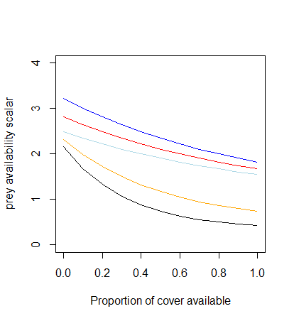
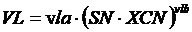
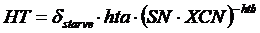

# Consumer Processes

Consumers in Atlantis are modelled as biomass pools, age-structured biomass pools or age-structured groups. The age-structured groups are typically used for vertebrates and in the text below the terms age-structured groups and vertebrates may be used interchangeably. Non-vertebrates are largely modelled as biomass pools, which in age-structured biomass pools can be explicitly subdivided into ontogenetic stages (similar to stanzas in Ecosim).

The group types FISH, MAMMAL, SHARK, BIRD and FISH_INVERT are automatically assigned to age-structured groups. Other group types that have [NumCohort]{style="color: orange;"}=1 in the *functional_groups.csv* file are modelled as biomass pools, and if [NumCohort]{style="color: orange;"}\>1 they are modelled as age-structured biomass pools, where [NumCohort]{style="color: orange;"} parameter determines how many biomass pools to model.

## **Fluxes in consumer biomass pools**

In **biomass pool or age-structured biomass pool consumers** (CP in the following equations) the only variable tracked is N (i.e. not Si or the micronutrient; although when P and C tracking is enabled then N, P and C are all tracked for consumers). The flux through a consumer biomass pool is determined by growth (*G~CP~*), natural mortality (*M~CP~*), grazing (predation) for *i* predators (*Gr~CP,i~*) and optional fishing mortality (*F~CP~*). In addition, there is an optional encystment out of the system at certain times of the year or temperatures (*Ec~out~*) and transfer back from cysts into the system when conditions are suitable (*Ec~in~*).

**Biomass pool** consumers maybe in the sediment, epibenthic layer or water column (depending on group type). A single N (P, C) pool is tracked per biomass pool age group (@tbl-feeding-parameters):

$$\frac{d(CP)}{dt} = G_{PP} - M_{PP} - \sum_{i = predators}^{}{Gr_{PP,i}} - F_{CP} - Ec_{out} + Ec_{in}$$

In **age-structured consumers** (abbreviated as CX) the nitrogen pool is partitioned into the reserve (RN) and structural (SN) nitrogen of an average individual of each age group. Atlantis also tracks the numbers (Num) of individuals per age group. As a result for each age group three state variables are tracked -- RN, SN and Num.

**Fluxes through the RN and SN pool** are determined by growth (G~CX~), proportion of G~CX~ allocated to SN versus RN (λ) and spawn (Sp~CX~), which is taken out of the RN pool on spawning (with timing defined in the *biology.prm* file, but typically once per year). Details determining λ are given in @sec-growth-energy. Note, that if respiration is included, then growth (G~CX~) can also be negative, and all energy required to cover respiration (or maintenance) costs will be taken out from the RN pool (@sec-maintenance-consumers)

$$\frac{d(RN_{CX})}{dt} = G_{CX} \cdot \lambda - Sp_{CX}$$

$$\frac{d(SN_{CX})}{dt} = G_{CX} \cdot (1 - \lambda)$$

The equations above show that RN pool can change through the year as it will suddenly decrease after the spawn. The SN pool cannot decrease.

**The flux of Num** is tracked through individuals. The number of individuals in an age group depends on recruitment or ageing into the age group (*Nm~CX-1,\ ageup~*), numbers ageing up into the next group (*Nm~CX,\ ageup~*), natural mortality (*M~CX~*), predation from *i* predators (*Gr~CX,i~*), optional migration out (*T~CXout~*) and into (*T~CXin~*) the model domain and optional fishing mortality (*F~CX~*).

$$\frac{d(Nm_{CX})}{dt} = Nm_{CX - 1,ageup} - Nm_{CX,ageup} - M_{CX} - \sum_{i = pred}^{}{Gr_{CX,i}} - F_{CX} - T_{CXout} + T_{CXin}$$

The numbers are converted to biomass as (SN + RN) · Nums.

## **Consumer feeding** 

::: {.callout-caution}
**What determines growth in consumers?** 

**Growth in biomass pool consumers** is determined by the intake or grazing (Gr) and assimilation efficiency. The consumed food or grazing term (Gr) is then assimilated according to the assimilation efficiencies for different food types (live, plant, labile detritus and refractory detritus). The unassimilated food is sent to the labile detritus, refractory detritus and ammonia pools according to the parameter determining detritus allocation (@sec-waste), whereas all assimilated food is sent to growth.

**Growth in age-structured consumers** is determined by the intake or grazing (Gr), assimilation efficiency and optional maintenance or respiration costs (Rs). The consumed food or grazing term (Gr) is then assimilated according to the assimilation efficiencies for different food types (live, plant, labile detritus and refractory detritus). The unassimilated food is sent to the labile detritus, refractory detritus and ammonia pools according to the parameter determining detritus allocation (@sec-waste). The assimilated food represents a temporary energy pool (A). This A pool is used to meet the optional maintenance or respiration costs (Rs) and all remaining energy is allocated to SN and RN, i.e. to growth. The proportion of energy going into SN and RN is determined by λ, which is calculated at each time step dynamically depending on the individual's condition and parameters determining energy allocation rules. The SN pool cannot decrease, whereas the RN pool can decrease, as it is used for reproduction and for meeting optional maintenance needs if assimilated food is insufficient.
:::

The following chapters will describe these key processes: grazing (Gr), assimilation (A), maintenance (Rs) and energy allocation to SN and RN.

### *Grazing* 

Grazing or predatory interactions are modelled in a similar way for both biomass pools and age-structured groups, except that age-structured and biomass pool groups have different options for refuge from predation. Feeding interactions are modelled through biomass, which in age-structured groups is then converted to numbers to track individual mortality. In Atlantis predatory interactions are determined by:

1)  Physical overlap -- prey and predator must be in the same cell at the same time (determined by vertical and horizontal distribution parameters), and if prey is in the sediment the predator must be able to reach it.
2)  Diet connection matrix (pPREY matrix or detailed ontogenetic diet preferences) that indicate maximum availability of prey to a predator. The actual realised consumption will depend on refuge factors, but if the value in the pPREY matrix is set to 0, no predation will occur.
3)  Gape limitation for age-structured prey -- prey that is too small or too big for the predator (either age-structured or biomass pool) will not be consumed.
4)  Habitat refuge.
5)  Environmental factors (temperature, salinity, pH) that can modify predator's feeding rates, prey's availability and nutritional content.

Throughout this chapter for brevity we will refer to both biomass pool (CP) and age-structured (CX) consumers as CX, as in many cases the processes are modelled in the same way for both groups; processes that are modelled differently will be identified throughout.

At the time of writing, Atlantis has twelve different options for modelling a predator's feeding functional response to the prey's biomass. There is a lot of theory and debate on what kind of functional response most accurately depicts predator's behaviour (e.g. Hunsicker et al. 2011) and this topic is not covered here.

Currently most Atlantis models use the modified Holling type II response, described in [Murray & Parslow (1997)](https://confluence.csiro.au/display/Atlantis/Useful+Reading?preview=/43155482/341447378/Link_et_al_2011_NEUS_tech_memo.pdf) for the Port Phillip Bay Integrated Model. The grazing term (*Gr*), or the amount of biomass of a specific prey (*prey*) consumed by a consumer CX (note, this now includes both CP and CX consumers), in the modified Holling type II response is calculated as

$$Gr_{prey} = \ \frac{B \cdot C \cdot B_{prey}^{*}}{1 + \frac{C \cdot \sum_{i}^{}\left( E_{i} \cdot B_{prey,i}^{*} \right)}{mum}}$$

where

$$B_{prey}^{*} = p_{prey,CX} \cdot \delta_{overlap} \cdot \delta_{habitat} \cdot \delta_{size} \cdot B_{prey}$$

is the available biomass of *prey* in the cell after taking into account all refuge (*δ*) options: *δ~overlap~*, *δ~habitat\ ~*and *δ~size~*. The refuge options are described in detail in the next chapter.

*B* is the feeding biomass of a consumer (predator) CX in a given cell (mgN m^-3^) -- a proportion of the consumer biomass may not be feeding if it is not active at that time of day or if it is spawning and has been identified as a group that does not feeding while spawning ([feed_while_spawnXXX]{style="color: orange;"}=0). *B~prey~* is the biomass of prey (or fisheries catch available for consumption) in that cell (mgN m^-3^), *p~prey,CX~* is the maximum availability (ranging from 0 to 1) of the *prey* to the predator CX defined in the pPREY matrix (or optional ontogenetic diet matrices), *C* is the clearance rate, similar to a search volume of the consumer CX, and *mum* is the maximum consumption rate, sometimes referred to as maximum growth rate, of the consumer CX.

The units of *C* and *mum* in CP consumers are m^3^ mgN^-1^ day^-1^ and mgN mgN ^-1^ day^-1^. In CX consumers the units depend on the [flagfishrates]{style="color: orange;"} parameter, which defines whether rates are absolute or per unit of consumer biomass. If rates are absolute ([flagfishrates]{style="color: orange;"}=0) then *C* units are m^3^ ind^-1^ day^-1^ and *mum* units are mgN ind^-1^ day^-1^. If [flagfishrates]{style="color: orange;"}=1 then *C* units are m^3^ mgN^-1^ day^-1^ and *mum* units are mgN mgN ^-1^ day^-1^.

The *E~i~* is the assimilation efficiency of consumer CX on prey group category *i,* which represents the four prey group categories defined in Atlantis: living prey and fisheries catches, plant prey, labile detritus and carrion (ie. fisheries discards) and refractory detritus. **Note that carrion is included in the labile detritus food category**, and the EDL assimilation efficiency for species that feed on carrion should be higher than what it would be if the species was feeding on labile detritus alone.

::: {.callout-caution}
**Use of assimilation efficiency *E~i~* in the grazing term** 

Even though assimilation efficiency is included in the grazing term *Gr* it **does not** define the final assimilated food, but is only used **in modified Holling feeding** responses (see @sec-food-assimlation) to scale the maximum consumption rate of a consumer. **Higher assimilation efficiencies lead to lower Gr value**, as the predator need not intake as much food as it can extract more energy from what it does consume.
:::

::: {.callout-caution}
***Should I use absolute or mass-specific C and mum rates (flagfishrates)?*** 

The [flagfishrates]{style="color: orange;"} parameter defines whether *mum* and *C* parameters are given per individual or per unit of body weight. It is important to remember that in Atlantis the realised size-at-age is dynamic and will change through time, depending on food availability. Setting [flagfishrates]{style="color: orange;"} to 0 or using absolute *C* and *mum* values means that regardless of the realised size-at-age *C* and *mum* values of an age group will stay the same throughout the simulation and Atlantis will behave more like an age-structured model. Using mass specific values ([flagfishrates]{style="color: orange;"}=1) means that *C* and *mum* will vary from year to year depending on the size of individuals in an age group, and behaviour of Atlantis will be closer to the size-structured models.

Regardless of whether absolute or mass-specific rates are used, separate *C* and *mum* parameters are required for each age group, so that [C_XXX]{style="color: orange;"} and [mum_XXX]{style="color: orange;"} strings in the *biology.prm* file contain as many values as there are groups in an age-structured functional group XXX. This means that Atlantis allows users to assume that the relationship between *C* and *mum* and body weight can change with ontogeny. 
:::

### *What are the* C *and* mum *parameters?*

Some Atlantis users have been confused about the meaning of *C* and *mum* parameters in the modified Holling representations. The *mum* parameter was initially adopted by Murray & Parslow (1997), who replaced the standard Holling Type II maximum ingestion rate parameter (inverse of handling time) with a "maximum growth rate" *mum* by scaling it by assimilation efficiency:

::: {.callout-note}
**Origin of *mum* from Murray and Paslow 1997 (page 29):**  

"In a classical paper, Holling (1966) discussed the theoretical and empirical basis of the functional response relating ingestion per consumer (G) to food density (P). He identified three functional forms:

I\) G = min (C\*P, Gmax) (bilinear), 
II\) G = C\*P / (1 + C\*P/Gmax) (rectangular hyperbola), 
III\) G = C\*P^2^ / (1 + C\*P^2^/Gmax) (sigmoid or switching). 

The parameter Gmax represents a maximum (food saturated) ingestion rate at high food densities, while C is a measure of grazing efficiency at low food densities. In Type I and II, the parameter C has units of volume cleared per grazer per unit time, and represents a maximum clearance rate. 

...   

In this model, we have used the rectangular hyperbola without thresholds, Type II, as the standard formulation. However, rather than specify the maximum ingestion rate Gmax, we have specified the maximum growth rate, \"mum\". This is related to Gmax through growth efficiency E, so that mum = Gmax\*E, or Gmax = mum/E."

The growth efficiency described above is the same as assimilation efficiency in Atlantis. 
:::

::: {.callout-caution}
**What is *C*?**

*C* is often referred to as a clearance rate and it is defined as the volume of water searched, but it is different from an often used gut clearance rate that reflects food assimilation efficiency. The *C* parameter in Atlantis has units of m^3^ ind^-1^ day^-1^ (or m^3^ mgN^-1^ day^-1^) and reflects the search or "cleared" volume. Note, however, that *C* is treated differently from true search volume ([vl_XXX]{style="color: orange;"}, [vla_XXX]{style="color: orange;"}, [vlb_XXX]{style="color: orange;"}) parameters used in predcase=5.

The true search volume parameters [vl_XXX]{style="color: orange;"} (for biomass pools) and [vla_XXX]{style="color: orange;"} and [vlb_XXX]{style="color: orange;"} (for age structured groups) are by default mass-specific and the relationship between body weight and search volume does not change. This means that only one entry is required, rather than a separate entry for each age group. 

Further, for demersal species ([flagdemXXX]{style="color: orange;"} =1 in the *biology.prm* file) the search volume is multiplied by 0.5, but this scaling is not applied to the *C* parameter.

**And what is *mum*?!** 

The *mum* parameter is only used in the modified Holling feeding responses (modified after Muray and Parslow, see above). Even though *mum* is called a maximum growth rate, it is included in the grazing (feeding) and not the growth equation, so it does not define the final growth. The consumed food will first be assimilated and the actual growth will then depend on other factors, such as respiration, reproduction and energy allocation to SN and RN.

As described in Muray and Parslow (1997) mum relates to the maximum ingestion rate (*Gmax*) as *mum = Gmax\*E*, where *E* is the assimilation efficiency. The maximum ingestion rate is in turn the inverse of a more familiar "handling time" parameter (*ht*). Hence *mum* can also be seen as an inverse of the handling time as *mum=E/ht*
:::

There is no clear consensus among currently used models as to the exact relationship between *C* and *mum* parameters. Theoretically the *mum* value should always be larger than *C*, but in some models and for some species the opposite is true. This is explored (@fig-grazing-term) which shows values of *Gr~prey~* for different prey biomass, and different *C* and *mum* rates. In general mum sets the level of the eventual asymptote -- the higher the *mum* the higher the realised feeding regardless of the *C* used. The ratio of *C* and *mum* dictates the steepness of the curve. As the ratio *C:mum* increases (i.e. the more that *C* exceeds *mum*) the gentler the curve, rising gradually in a smooth arc to the asymptote. As the ratio *C:mum* decreases (i.e. the more that *mum* exceeds *C*) the more the curve is converted to a flat rate across all but the lowest of prey biomass levels.

![The value of grazing term (*Gr*) as a function of prey biomass (ranging from 0 to 1x of the predator biomass) and different assumptions on the ratio between *C* and *mum*. Predators biomass is 1000mgN, *C* = 100 m^3^ ind^-1^ day^-1^. The calculations assume only one prey, no refuge (*δ~refuge~*=1), maximum availability p~prey,CX~ of 1, and assimilation efficiencies *E~prey,i~* of 1. Black: *mum* = *C,* [orange]{style="color: orange;"}: *mum* = *C*\*3, [blue]{style="color: blue;"}: *mum* =*C*/5.](media/image33.png){#fig-grazing-term width=5.22in height=3.57in}

::: {.callout-caution}
***Ensuring meaningful prey choice and diets*** 

Atlantis **does not** implement optimal prey choice. The clearance rate *C* is specific to each predator but identical for all prey. Once all the available prey is assessed (based on overlap, size and habitat refuge) the consumption is applied **uniformly** **across all available prey groups proportionally to the available prey biomass** (prey biomass · pPREY). This means that if the available prey includes 1000mg of clams and 1mg of fish, and the clearance rate determines that only 10% of all available biomass can be consumed for a given time step, the predator will ingest 10% of available clam biomass and 10% of available fish biomass or 100mg of clams and 0.1mg of fish. 

This has important implications for optimising the maximum available biomass p~prey,CX~ in the prey availability matrix. The availability of biomass pool and especially detritus prey should be low for predators that prefer to eat fish. Otherwise a predator, such as a seal, might entirely fill up on invertebrate prey and impose no top-down control on fishes. Note, this can happen even if the availability of invertebrates to seals is as low as 0.001, as the final proportion in the diet is determined by availability and the biomass in the box. It is of crucial importance to **carefully inspect realised diets** from *DietCheck.txt* and *DetailedDietCheck.txt* output files, which can be analysed using for example atlantistools R package or other tools described in @sec-tools.
:::

| **Parameter** | **Description** |
|:--------------|:----------------|
| **Key parameters for modified Holling Type II functional response** | |
| [predcase_XXX]{style="color: orange;"} | Flag indicating the feeding functional response to use for a predator XXX |
| [flagfishrates]{style="color: orange;"} | Flag defining whether fully age-structured C\_ and mum\_ parameters are absolute (given per individual) or mass-specific (per unit of body mass) |
| [mum_XXX_T15]{style="color: orange;"} | Maximum ingestion rate of biomass pools at 15°C |
| [C_XXX_T15]{style="color: orange;"} | Clearance rate of biomass pools at 15°C |
| [mum_XXX]{style="color: orange;"} | Age specific maximum ingestion rate for age structured groups: mgN ind^-1^ day^-1^ or mgN mgN^-1^ day^-1^ |
| [C_XXX]{style="color: orange;"} | Age specific clearance rate for age structured groups: m^3^ mgN^-1^ day^-1^ or m^3^ ind^-1^ day^-1^ |
| [pPREY1XXX1]{style="color: orange;"} [pPREY1XXX2]{style="color: orange;"} [pPREY2XXX1]{style="color: orange;"} [pPREY2XXX2]{style="color: orange;"} | Maximum availability of prey to a predator XXX (given as a vector with the column the prey group in the same order as in the *functional_groups.csv* file). Four values are given for each predator-prey combination: juv-juv, juv-ad, ad-juv, ad-ad. |
| [E_XXX]{style="color: orange;"} | Assimilation efficiency when feeding on animal prey |
| [EPlant_XXX]{style="color: orange;"} | Assimilation efficiency when feeding on plant prey |
| [EDR_XXX]{style="color: orange;"} | Assimilation efficiency when feeding on refractory detritus |
| [EDL_XXX]{style="color: orange;"} | Assimilation efficiency when feeding on labile detritus |
| **Parameters for optional further details** | |
| [flag_fine_ontogenetic_diets]{style="color: orange;"} | Flag indicating whether more refined, age-specific, prey availability should be used (so an availability value is required per predator age class rather than per stage (typically juvenile and adult)) |
| [p_split_YY]{style="color: orange;"} | Flag identifying prey groups YY for which age-specific diets should be given |
| [age_structured_prey_XXX]{style="color: orange;"} | Flag identifying predators for which age-specific diets should be given |
| [p_YYXXX]{style="color: orange;"} | A vector of maximum prey availability for each combination of prey YY and predator XXX identified in [p_split_YY]{style="color: orange;"} and [age_structured_prey_XXX]{style="color: orange;"} parameters |

: General feeding parameters and units. {#tbl-feeding-parameters tbl-colwidths=[25,75]}

### ***What determines prey biomass available for predation?***

The proportion of prey biomass available to a predator at any given time is determined dynamically as

$$B_{prey}^{*} = p_{prey,CX} \cdot \delta_{overlap} \cdot \delta_{habitat} \cdot \delta_{size} \cdot B_{prey}$$

This means that the available prey biomass depends on:

1)  Static parameter p~prey,CX~ (which can range from 0 to 1) defined in the pPREY matrix (or optional ontogenetic diet matrices)
2)  The *δ~overlap~* refuge defined by co-occurrence in the same cell at a same time step and the predator is active at that time of day. This is determined by horizontal and vertical distribution as well as activity parameters.
3)  The *δ~overlap~* refuge also defined by the predator's ability to access at least one of the habitats inhabited by prey. This is determined by the **static** [habitat_XXX]{style="color: orange;"} parameter and is activated only if a secies is habitat dependent (see below)
4)  The *δ~size~* refuge for age structured prey. This is determined by gape limitation of the predator relative to the prey size.
5)  The *δ~habitat~* refuge for infaunal (\_INF) invertebrates (CX) defining access to biomass pool prey buried in the sediment. This is determined by the depth of the oxygen layer and depth predators can dig into
6)  The optional *δ~habitat~* refuge for age structured prey. This is determined by optional habitat dependency and habitat refuge parameters.

::: {callout-caution}
**What is *p~prey,CX~*?** 

This parameter defines the maximum proportion of the prey biomass available to a consumer at a given time. If \< 1 then it means that at any given time the consumer cannot access all the prey biomass even if it can fit the prey into its mouth and the prey is not protected by a refuge.

The parameter is similar to the vulnerability parameter in EwE and is influenced by the feeding arena theory.
:::

The *δ~overlap\ ~*is dependent on the physical overlap of prey and predator. It is determined by:

1)  horizontal and vertical distribution parameters that define which cell and which distribution type (water column, sediment, epibenthic) each functional group is found in (see Distribution and Movement section below). Feeding of water column predators on sediment prey is determined by the depth consumers can dig into the sediment, whereas predators living inside the sediment cannot feed on the water column prey
2)  period of the day that a group is active (a group that is not active during that period of the day does not eat, but is available for consumption, see below),

Atlantis determines whether a prey and predator (both age structured and biomass pools) can access same habitats. If a predator **cannot access any of the habitats inhabited by the prey** (has 0 for prey habitat types), then it also cannot access any prey biomass associated with that habitat type. If a predator **can access at least one** of the habitats that the prey is associated with, then it is assumed to have **access to all of the prey biomass**.

### ***Habitat refuge***

The *δ~habitat\ ~*is the **optional prey habitat refuge** which is activated **only** when **all** of the points below are true:

1)  The general habitat dependency flag [flaghabdepend]{style="color: orange;"} is set to 1
2)  [habdepend_XXX]{style="color: orange;"} is \>0 for the specific prey age-stuctured prey group
3)  [flag_refuge_model]{style="color: orange;"} \> 0, which will activate the standard (=1) or rugosity related (=2) refuge model
4)  prey is in the bottom water column, where water is in contact with the epibenthic habitats and sediment

The habitat refuge is calculated in the *Vertebrate_Assess_Enviro()* routine in **atvertprocesses.c**

The *δ~habitat\ ~*is used to reflect the assumption that for **age-structured prey** all habitats can provide some degree of refuge even when predators can access the habitat the prey inhabits. The *δ~habitat\ ~* = 1 for prey species that are not dependent on habitat ([XXX_habdepend]{style="color: orange;"} set to 0), whereas for habitat dependent species it is defined either as a simple habitat refuge ([flag_refuge_model]{style="color: orange;"} =1) or rugosity related ([flag_refuge_model]{style="color: orange;"}=2).

A **simple habitat refuge** is calculated as:

$$\delta_{habitat} = Acov_{prey} \cdot \left( e^{\left( - K_{prey} \cdot Cover_{habitat} + Bcov_{prey} \right)} + \frac{1}{K_{prey}} \right)$$

where *Cover~habitat~* is the weighted relative cover in the cell for the prey, *Acov~prey~* ([Acov_ad_XXX]{style="color: orange;"} and [Acov_juv_XXX]{style="color: orange;"}) is a scalar of the overall habitat refuge effect for prey *i* , *Bcov~prey~* ([Bcov_ad_XXX]{style="color: orange;"} and [Bcov_juv_XXX]{style="color: orange;"}) is the habitat steepness coefficient, *K*~prey~ ([Kcov_ad_XXX]{style="color: orange;"} and [Kcov_juv_XXX]{style="color: orange;"}) is the exponent of refuge provided by the habitat.

The availability of suitable cover is calculated as

$$Cover_{habitat} = \ \left( \delta_{substrate,habdegrad} \cdot p_{substrate} + p_{biogenic} \right) \cdot \left( 1 + p_{canyon} \right)$$

where *δ ~substrate,habdegrad~* is degradation in the physical habitat due to coastal development (set by the [flagdegrade]{style="color: orange;"} flag, which also controls other habitat degradation parameters), *p~substrate~* is the proportion of the cell covered with suitable substrate types, *p~biogenic~* is the proportion of the cell covered by suitable biogenic habitats (determined by the [isCover]{style="color: orange;"} parameter in the *functional_groups.csv*), *p~canyon~* is the proportion of the cell covered by canyons. Note that canyons are treated differently to other habitats and, for species that live in canyons (set through the [habitat_XXX]{style="color: orange;"} vector) the canyon acts as an enhancement factor (multiplier), where 10% of canyon area in the cell will enhance the habitat cover to 1.1. This is because canyons are known to concentrate production, but their absence does not prevent the establishment and growth of the groups.

**Rugosity related habitat refuge** is **only** available for

1)  models that include corals or sponges and
2)  is only used for species that are dependent on (interact with) corals.

Further description of the rugosity related habitat cover is available on the wiki dealing with "Calculation of rugosity related habitat refuge" - [here](https://confluence.csiro.au/display/Atlantis/2016/09/16/Calculation+of+rugosity+related+habitat+refuge) (it cover's models by Bozec and Blackwood in detail).

If [flag_refuge_model]{style="color: orange;"}=2 but a species does not live on corals, then the simple refuge model described above is applied. Three extra parameters are needed for rugosity refuge model: [RugCover_Coefft]{style="color: orange;"}, [RugCover_Const]{style="color: orange;"}, [RugCover_Cap.]{style="color: orange;"}

::: {callout-caution}
**Calculating the amount of habitat cover available** *Cover~habitat~* 

The amount of habitat available for the species can be calculated either as a sum of total accessible habitat or as an average proportion of suitable habitats. This is controlled by [flag_rel_cover]{style="color: orange;"} parameter and will give **very different habitat cover outcomes**! For example, a cell that has three suitable habitats, covering 10%, 20% and 30% of the cell area respectively gives the following:

If [flag_rel_cover]{style="color: orange;"} is set to 0 the amount of available cover will be 0.1+0.2+0.3=0.6 

If [flag_rel_cover]{style="color: orange;"} is set to 1 the amount of available cover will be (0.1+0.2+0.3)/3=0.2 
:::

The habitat refuge can be interpreted as a scalar on the available prey biomass determined by the available suitable habitat cover in the cell.

{#fig-habitat-refuge width=4.43in height=4.25in}

**Black**: Acov=1, Bcov=0.6, Kcov=3 (parameters similar to SETas model and originally derived from a meta-analysis of prey accessibility on coral and temperate reefs)

*Effect of Kcov:*

[**Orange**]{style="color: orange;"}: Acov=1, Bcov=0.6, Kcov=2

[**Red**]{style="color: red;"}: Acov=1, Bcov=0.6, Kcov=1

*Effect of Bcov:*

[**Light blue**]{style="color: lightblue;"}: Acov=1, Bcov=0.4, Kcov=3

[**Dark blue**]{style="color: darkblue;"}: Acov=1, Bcov=0.8, Kcov=3

The Acov is a linear scalar that only affects the height of the curve along the y axis. If needed it could be used to scale prey availability to 1 when cover=0.

::: {.callout-caution}
When habitat dependency and refuge are used then the models are often parameterised so that **prey availability is upscaled (\>1) when a cell contains zero available habitat** (as prey are more exposed than normal to predators). It is assumed that normally around 0.2-0.3 of the cell will have suitable habitat, which is why prey availability scalar is \~1 at this proportion of cover available (@fig-habitat-refuge). This is based on a (now \>10 year old) meta-analysis of prey accessibility on coral and temperate reefs.
:::

::: {.callout-caution}
***Limitations of current implementation of habitat refuge***                                                   

1)  The curve of habitat refuge does not have a final inflection that would match the case where even good quality habitat has become saturated and fails to provide any refuge for a larger proportion of the total population.
2)  The curve is deterministic and time invariant so there is no explicit dynamic trade-off between predation risk and hunger-driven searching in open ground as there is in Ecosim (Walters et al 1997).
3)  This approach ignores the use of cover by predators, where improved cover can actually lead to higher predation.
:::

For **biomass pools** (CP) the *δ~habitat\ ~*refuge is available only for prey living in the **sediments** and is calculated by the depth the predators can dig into (set in KDEP_XXX) and depth of the oxygenated layer [sedoxdepth]{style="color: orange;"}, calculated and reported in the *output.nc* file, see @sec-output-physical-tracers). If [sedoxdepth]{style="color: orange;"} \< [KDEP]{style="color: orange;"} then no refuge is provided by the sediment (*δ~habitat~* = 1), if [sedoxdepth]{style="color: orange;"} \> [KDEP]{style="color: orange;"} then

*δ~habitat~* = (sedoxdepth - KDEP)/ sedoxdepth,

For example, if the oxygenated layer depth is twice as deep as the sediment penetration depth, then only half of the sediment living biomass pool will be available (and this will be further scaled by *p~prey,CX~* value). If [sedoxdepth]{style="color: orange;"}=0 a small number (1e-08) is added to avoid division by zero.

| **Parameter** | **Description** |
|:--------------|:----------------|
| [flaghabdepend]{style="color: orange;"} | Flag turning on habitat dependency routines. If it is set to 0, all habitat associations and routines are ignored. |
| [XXX_habdepend]{style="color: orange;"} | Flag identifying which age structured groups are habitat dependent |
| [habitat_XXX]{style="color: orange;"} | A vector of values identifying which of the available habitat preferences for biomass pool group XXX. Traditionally these used to be only 0 or 1 values, indicating absence or presence in each habitat. Now more resolved setting is allowed. A value > 0 indicates that the organism prefers the habitat and if < 0 it avoids it. The absolute value indicates the relative weighting, where proportion of suitable habitat is calculated as a multiplier of habitat proportion and habitat preference given in the [habitat_XXX]{style="color: orange;"} vector. |
| [juv_habitat_XXX]{style="color: orange;"} [ad_habitat_XXX]{style="color: orange;"} | Same as above but applied for age structured groups and setting available habitats for juvenile and adult life history stages separately |
| [flag_refuge_model]{style="color: orange;"} | If set to 0, no habitat refuge for age structured groups will be applied. If set to 1 the standard refuge is calculated as described above. If set to 2 the habitat refuge is rugosity related. |
| [flag_rel_cover]{style="color: orange;"} | A flag indicating whether to use cumulative habitat (0) or average relative cover (1) when interacting with predators |
| [Kcov_juv_XXX]{style="color: orange;"} [Kcov_ad_XXX]{style="color: orange;"} | Exponent of refuge provided by the habitat for age structured groups (provided for juveniles and adults) |
| [Acov_juv_XXX]{style="color: orange;"} [Acov_ad_XXX]{style="color: orange;"} | Scalar of the overall habitat refuge for age structured groups (provided for juveniles and adults) |
| [Bcov_juv_XXX]{style="color: orange;"} [Bcov_ad_XXX]{style="color: orange;"} | Habitat steepness coefficient for age structured groups (provided for juveniles and adults) |
| [KDEP_XXX]{style="color: orange;"} | Depth consumers can dig into the sediment, in meters. Used to determine habitat refuge for prey digging in the sediments |
| [isCover]{style="color: orange;"} in .csv | Which epibenthic groups also serve as a habitat |

: Parameters defining habitat associations and habitat refuge. {#tbl-habitat-parameters tbl-colwidths=[25,75]}

### ***Size refuge from predation*** {#sec-size-refuge}

The **non-optional size refuge of age-structured prey** *δ~size\ ~*is defined by gape limitation, which is used to simulated size selectivity and physical limitation of predators when feeding (i.e. what can fit in their mouth). The gape limitation can be calculated in two ways -- ***hard feeding window*** or ***smooth feeding curve*** (defined by the [UseHardFeedingWindow]{style="color: orange;"} flag)

The hard feeding window defines knife-edge size selectivity, where availability of the prey is either zero (prey not available to the predator) or one (prey available). The prey is available to the predator if its size falls within the lower and upper prey selection size limits ([KLP_XXX]{style="color: orange;"} and [KUP_XXX]{style="color: orange;"}), or gape size, of the predator. In these calculations **size is defined by structural nitrogen (SN) only**!

$$\delta_{size} = \ \left\{ \begin{array}{r}
 = 1,\ \ if\ KLP \cdot SN < SN_{prey} < KUP \cdot SN \\
 = 0,\ \ \ \ \ \ \ \ \ \ \ \ \ \ \ \ \ \ \ \ \ \ \ \ \ \ \ \ \ \ \ \ \ \ \ \ \ \ \ \ \ \ \ \ \ \ \ \ \ \ \ \ \ otherwise\ 
\end{array} \right.\ $$

In many models the lower and upper limits are 0.1% and ca 40% of the predator size respectively; so the predator of 1000mg SN could consume age structured prey with from 1 to 400mg (KUP ranges from 15 to 80%).

The smooth feeding window models a smoother transition of prey availability and is set by [UseHardFeedingWindow]{style="color: orange;"}=0. The original implementation of the smooth feeding window used a humped window calculation; now defined with an additional flag [UseHumpedFeedingWindow]{style="color: orange;"}=1. If humped window is used the availability of prey on the upper predator's size limit is calculated as

$\delta_{size} = relSize\  \cdot e^{\left( Kmax \cdot (1 - relSize) \right)}$, where

$$relSize = \frac{SN_{prey}}{SN \cdot KUP}$$

represents **relative size** of the prey compared to the predator's upper size limit (*KUP*), and *Kmax* ([Kmax_coefft_XXX]{style="color: orange;"}) is the steepness of the smooth selectivity curve.

![Prey availability scalar Size_Scalar~prey~ of different sized prey for different [Kmax_coefft]{style="color: orange;"} values for humped selectivity curve.](media/image35.png){#fig-prey-size-scalar width=4.74in height=3.76in}

[**Black**]{style="color: black;"}: *Kmax* = 2

[**Orange**]{style="color: orange;"}: *Kmax* = 1

[**Red**]{style="color: red;"}: *Kmax* = 3

[**Blue**]{style="color: blue;"}: *Kmax* = 5

Predators SN=10mg and KUP=0.4 (shown by vertical blue line). The horizontal black line shows that the maximum value of δ~size~ is set to 1 (values larger than one are capped at 1).

The humped window calculation is very sensitive to the [Kmax_coefft_XXX]{style="color: orange;"} parameter, where availability of prey at lower size limit can increase very rapidly (@fig-prey-size-scalar). An alternative formulation is now available as a logistic shaped curve to calculate δ~size~. This option is applied if [UseHardFeedingWindow]{style="color: orange;"} = 0 and [UseBiLogisticFeedingWindow]{style="color: orange;"}= 1 **and it is based on total length rather than SN of predator and prey**

$$\delta_{size} = \ \left\{ \begin{array}{r}
 = \frac{1}{1 + e^{\left( - Kmax \cdot \left( Len_{prey} - Len_{prey,50\% KLP} \right) \right)}},\ \ if\ Len_{prey} < Avail_{top} \cdot Len_{pred} \\
 = \frac{1}{1 + e^{\left( Kmax \cdot \left( Len_{prey} - Len_{prey,50\% KUP} \right) \right)}},\ \ \ \ \ \ \ \ \ \ if\ Len_{prey} > Avail_{top} \cdot Len_{pred}
\end{array} \right.\ $$

where *Kmax* is the steepness of the logistic selectivity curve ([Kmax_coefft_XXX]{style="color: orange;"}), *Len~prey,50%KLP~* and *Len~prey,50%KUP~* are midpoints of the logistic selectivity curve or length of prey at which availability is half of the maximum possible value. The *Avail~top~* is the length of prey for which availability is highest.

The *Avail~top~* is calculated as a midpoint between the KLP and KUP values, hence assuming a symmetrical selectivity curve. For example, if the KLP=0.2 and KUP=0.6, the *Avail~top~* = 0.4. Similarly the *Len~prey,50%KLP~* is the midpoint between the lower ([KLP_XXX]{style="color: orange;"}) predator size limits and the *Avail~top~*, and *Len~prey,50%KUP~* is the midpoint between the upper ([KUP_XXX]{style="color: orange;"}) predator size limits and the *Avail~top~*. In the example above the *Len~prey,50%KLP~* = 0.3 and *Len~prey,50%KUP~* = 0.5.

Note, that if the steepness of the curve (*Kmax* value) is low, the the δ~size~ in the equation above may never reach 1 (@fig-prey-bilogistic). It is NOT recommended to use Kmax values lower than 0.5 because it makes the feeding window very wide and allows feeding on almost all sizes of prey (orange line, @fig-prey-bilogistic).

The bilogistic feeding window uses length rather than SN of prey and predator, because large differences between SN (many orders of magnitude) makes the size scalar highly sensitive to the Kmax parameter.

{#fig-prey-bilogistic width=4.72in height=3.69in}

**Black**: Kmax = 1, KLP=0.2, KUP=0.6

[**Red**]{style="color: red;"}: Kmax=0.5, KLP=0.2, KUP=0.6

[**Orange**]{style="color: orange;"}: Kmax = 0.2, KLP=0.2, KUP=0.6

::: {.callout-caution}
**Calculating length in age-structured groups and biomass pools**

If length-based selectivity is selected for a fishery, it will be applied to both age-structured groups and biomass pools. The application of length-based selectivity to biomass pools is a new feature in Atlantis and it is important to get it right, or else invertebrates may not be caught by the gear (see wiki post [here](https://confluence.csiro.au/pages/viewpage.action?spaceKey=Atlantis&postingDay=2016%2F6%2F2&title=Invertebrate+size+calculations+for+use+in+size+based+selectivity))

Length of an age group in age-structured groups is calculated using length-weight conversion parameters ([li_a_XXX]{style="color: orange;"} and [li_b_XXX]{style="color: orange;"}) given in the *biology.prm* file. For this, first, the structural and reserve nitrogen (RN+SN, in mg) are added up and converted to wet weight in grams (*wgt*) as: 

$$wgt = (RN + SN) \cdot wetdry \cdot X_{CN}/1000$$  

where *wetdry* is the wet weight to ash free dry weight ratio ([k_wetdry]{style="color: orange;"} in *biology.prm*) typically set to 20 in many Atlantis parameter files, based on using C as a proxy for dry weight (but noting that in many models and literature the wet : dry ratio used is often closer to 6-8) and *X_CN* is the carbon to nitrogen Redfield ratio ([X_CN]{style="color: orange;"} in *biology.prm*) typically set to 5.7.

The *wgt* (in grams) is then converted to length (in cm) using the standard equation 

$wgt = a \cdot {length}^{b}$ or $length = \left( \frac{wgt}{a} \right)^{1/b}$ 

where *a* is [li_a_XXX]{style="color: orange;"} and *b* is [li_b_XXX]{style="color: orange;"} in the *biology.prm*. Note that these parameters could be set in such a way to return length in metres instead, but by convention it is in cm (as are any other faunal lengths).

Since for **biomass pools** only one nitrogen pool is tracked (individuals are not tracked separately), the structural nitrogen of an average individual must be given in the *biology.prm* file. This is given in the [XXX_sn]{style="color: orange;"} parameter for each consumer biomass pool group (not plants, bacteria or detrital pools). In addition to the length-based selectivity, this SN value is used in length-based feeding interactions when biomass pool predators feed on the age-structured prey (see @sec-size-refuge).

The length of an average biomass pool invertebrate is calculated in the same way as for age structured groups above. However, before the calculation the SN is converted to the SN+RN weight using the [X_RS]{style="color: orange;"} ratio parameter in the *biology.prm* file, so that 

$$wgt = \ (1.0 + X\_ RS) \cdot SN$$

hence assuming that the ratio of hypothetical RN and SN in an invertebrate is optimal. **The length-weight conversion parameters [li_a_invert]{style="color: orange;"} and [li_b_invert]{style="color: orange;"} given in the *biology.prm* are identical for all biomass pool species.**
:::

::: {.callout-caution}
**Smooth and hard feeding window** 

Applying hard feeding window (knife-edge selectivity) means that very small changes in prey's size can abruptly change their availability from 0 to 1. Although this approach is used in a range of ecological models it can lead to abrupt changes in growth or predation mortality between cohorts.

If smoother transition on size selectivity is desired, a smooth feeding window should be used. Note, however, that the "humped" implementation of the smooth feeding curve extends the availability of prey above the upper gape limit ([KUP_XXX]{style="color: orange;"}) of the predator (@fig-prey-size-scalar). The curve is also very sensitive to the [Kmax_coefft]{style="color: orange;"} parameter. Applying this smooth feeding curve might require decreasing the [KUP_XXX]{style="color: orange;"} values.

When using bilogistic curve the prey availability is generally decreased compared to the hard feeding window -- the availability is equal to that of hard feeding window only for a small size range of the prey (@fig-prey-bilogistic). This means that when changes from hard to bilogistic curve are applied, the overall prey availability may have to be increased to ensure enough food for the predator.
:::

| **Parameter** | **Description** |
|:--------------|:----------------|
| [KLP_XXX]{style="color: orange;"} | Min gape limit of the predator (age structured or biomass pool) |
| [KUP_XXX]{style="color: orange;"} | Max gape limit of the predator (age structured or biomass pool) |
| [UseHardFeedingWindow]{style="color: orange;"} | Flag setting up hard (0) or smooth (1) feeding window |
| [UseBiLogisticFeedingWindow]{style="color: orange;"} | Flag indicating whether using humped (0) or bi-logistic (1) smooth feeding window |
| [Kmax_coefft_XXX]{style="color: orange;"} | Steepness of the smooth feeding window curve of the predator |
| [XXX_sn]{style="color: orange;"} | Typical size (amount of SN) of a biomass pool consumer to determine the size of age structured prey available to it |

: Parameters defining size refuge for age structured groups. {#tbl-size-refuge-parameters tbl-colwidths=[30,70]}

### ***Availability of fisheries catches to opportunistic catch-eaters***

The availability of fisheries catches is an optional set of parameters that allow groups to access additional prey. Proportion of catch available from each fishery (set in [PropCatch_XXX]{style="color: orange;"} parameter) is added to the total available prey. No gape limitation (size refuge) is applied to fisheries catches.

| **Parameter** | **Description** |
|:--------------|:----------------|
| [isCatchGrazer]{style="color: orange;"} in .csv file | Identifies species that can feed on fisheries catches |
| [pFCXXX]{style="color: orange;"} | A vector of values (0 and 1) identifying which of the fisheries catches are available to each catch eating species identified as [isCatchGrazer]{style="color: orange;"}. The vector should be as long as there are fisheries in the *fisheries.csv* file (assumes the same order as given in the *fisheries.csv* file). |
| [PropCatch_XXX]{style="color: orange;"} | Proportion of the catch in each fishery that can be exploited by the [isCatchGrazer]{style="color: orange;"} groups |

: Parameters defining feeding on fisheries catches. {#tbl-catch-feeding-parameters tbl-colwidths=[25,75]}

### *Effect of temperature and salinity on feeding parameters* 

Feeding rates and assimilation efficiencies will be temperature dependent if a species is temperature sensitive. Salinity dependency is optional. @sec-environmental-factors for further details.

### *Effect of oxygen limitation on epibenthic invertebrate feeding rates* {#sec-o2-limitations}

Oxygen limitation affects the feeding rates of SED_EP_FF, MOB_EP_OTHER, SED_EP_OTHER, SM_INF, LG_INF, CORAL and SPONGE functional groups (applied in group routines *Epibenthic_Ivert_Process()*, *Invert_Consumer_Process()* and *Coral_Process()*). This dependency is also an option for age structured groups in newer code releases that are currently in the pipeline.

The oxygen limitation scalar *δ~O2~* is applied to clearance rate *C*. Atlantis has four options to calculate oxygen limitation scalar, set by [O2case]{style="color: orange;"} parameter. The oxygen limitation scalar is calculated by *Oxygen()* function in **[atprocess.c]{.underline}**

**1. Ambient oxygen limitation** ([O2case]{style="color: orange;"}=0) uses ambient oxygen levels O~amb~, lethal oxygen concentration ([KO2_XXX]{style="color: orange;"}, mgO2 m^-3^) and limiting oxygen concentration ([KO2lim_XXX]{style="color: orange;"}, mgO2 m^-3^) parameters. Remember that oxygen solubility in seawater at 5C and 1bar pressure is 10 mg/l or 10000 mg m^-3^.

$$
\delta_{O_2} = \begin{cases}
\dfrac{(O_{amb} - KO_2)^2}{(O_{amb} - KO_2)^2 + (KO_{2,lim} - KO_2)^2} & \text{if} \quad O_{amb} > KO_2 \quad \text{and} \quad KO_{2,lim} > KO_2 \\[1em]
1 & \text{if} \quad O_{amb} > KO_2 \quad \text{and} \quad KO_{2,lim} < KO_2 \\[1em]
0 & \text{if} \quad O_{amb} < KO_2
\end{cases}
$$

{#fig-oxygen-limitation width=4.34in height=3.10in}

**2. Depth based limitation** ([O2case]{style="color: orange;"}=1) only uses sediment depth of half oxygen mortality mD ([mD_XXX]{style="color: orange;"}, m) parameter and depth of the oxygenated sediment layer [sedoxdepth]{style="color: orange;"} (@sec-output-physical-tracers) where

δ~O2~=sedoxdepth/(sedoxdepth+mD)

This limitation only reflects reduced feeding within the sediment due to low oxygen conditions, so it is mostly relevant to epibenthic invertebrate biomass pools that can dig into sediment for food or infauna.

**3. IGBEM based limitation** (O2case=2) is modified after the ERSEM model and is calculated as:

δ~O2~=O~amb~/(KO2+O~amb~), where O~amb~ is the concentration of oxygen in the cell

**4. Quadratic limitation** (O2case=3) calculates both ambient and depth based limitation (points 1 and 2 above) and uses the larger of the two values as the oxygen scalar δ~O2~

### *Effect of space limitation on epibenthic invertebrate feeding rates* 

Space limitation can affect *C* or *mum* rates of benthic invertebrate biomass pools if:

1\) A biomass pool group XXX is infauna or a filter feeder or mobile epibenthic group (SED_EP_FF and MOB_EP_OTHER [GroupType]{style="color: orange;"}) **and** is habitat dependent ([habdependXXX]{style="color: orange;"}=1) **and** space limitation is active ([flagXXXlim]{style="color: orange;"}=1 or 2). If these three conditions are satisfied then the Crowding Effect scalar is applied to the clearance rate *C* of XXX (see @sec-growth-consumer-biomass).

2\) A biomass pool group is habitat dependent (with at least some habitat preference parameters not set to 1), benthic and [flag_benthos_sediment_link]{style="color: orange;"}=1. See @sec-growth-consumer-biomass for further details.

### *Other factors affecting feeding parameters* 

The feeding interactions described above are further dynamically modified by a range of ecological and environmental factors, such as species activity, starvation, or pH.

**Species activity**

Atlantis has an option to set whether a species is active during the day or night, or all the time. This is done using [flagXXXday]{style="color: orange;"} parameter. It is important to note that if a diurnal timestep is used (i.e. 12h or less) and if a species activity preference is set to day or night, it will not be active in the model during the other half of the day -- it will not initiate ecological processes such as eating, but can still be preyed upon.

::: {.callout-caution}
If a species is only active during the day or night ([flagXXXday]{style="color: orange;"} set to 0 or 1) it means that **no ecological routines will be initiated by this species during the period of each day that it is inactive.** 

This means that an inactive species **will not feed, move, reproduce and will not breathe**, if respiration is included in the model. This also means that even if species physically overlap and have diet connections, but a predator is not active at that time of the day, no feeding interaction will occur.

An inactive group is susceptible to fishing and predation. 
:::

**Spawning**

Species that are in the spawning period will not feed if the parameter [feed_while_spawn]{style="color: orange;"} is set to 0. The biomass of the spawning stock will subtracted when calculating the feeding biomass of a predator.

**Starvation**

Starvation has no effect on *C* and *mum* in the modified Holling functional responses ([predcase]{style="color: orange;"} 1-3) and ratio dependent feeding responses ([predcase]{style="color: orange;"} 4).

For other feeding responses handling time ([ht_XXX]{style="color: orange;"} in biomass pools and [hta_XXX]{style="color: orange;"} and [htb_XXX]{style="color: orange;"} in age-structured groups) is scaled by [KHTD]{style="color: orange;"} or [KHTI]{style="color: orange;"} scalars when the condition of an age structured group falls below a limit set in [Kthresh1]{style="color: orange;"} and [Kthresh2]{style="color: orange;"} (see box below). See @sec-starvation for further details on how starvation is determined and what it affects.

**Acidification**

Atlantis includes explicit representation of the possible effects of acidification. The model is activated with the [flagmodelPH]{style="color: orange;"}=1 in the *biology.prm* file. It allows the user to scale prey availability, assimilation efficiency, *C* and *mum* rates, mortality, recruitment and other processes. See @sec-environmental-factors for further details.

### *Other feeding functional responses* 

Twelve different feeding functional responses are currently implemented in Atlantis. They are selected using the [predcase_XXX]{style="color: orange;"} parameter, which can take values from 0 to 12 (option 3, Ecosim based feeding rate, is currently unavailable). The first three cases are for the modified Holling Type I-III responses adopted from the PPBIM. They use the *mum* parameter, as described above. Two responses -- minimum-maximum and Holling size dependent type III - are adopted from the ERSEM model (@tbl-functional-responses), but have not been used in many models. The remaining responses can be grouped into standard Holling responses (Holling type I to IV) and ratio depdenent responses (see e.g. Arditi and Ginzburg 1989 and critique of the approach by Abrams 1994). The ratio dependent responses take into account not only the prey biomass but also the ratio of prey to predator biomass. These responses don't use the *mum* parameter but a mass specific handling time ([ht_XXX]{style="color: orange;"}) parameter.

::: {.callout-caution}
***Search volume (vl) and handling time (ht) as alternative parameters to C and mum*** 

The modified Holling type functional responses use age-specific *C* and *mum* parameters. For other functional responses either one or both of these parameters are replaced with search volume ([vl_XXX]{style="color: orange;"}, [vla_XXX]{style="color: orange;"} and [vlb_XXX]{style="color: orange;"}) and handling time ([ht_XXX]{style="color: orange;"}, [hta_XXX]{style="color: orange;"} and [htb_XXX]{style="color: orange;"}).

Unlike *C* and *mum*, however, the search volume and handling time parameters are always set **based on mass specific structural ash-free dry weight** (not nitrogen!). This means that only one value is provided in the parameter file, and the age specific values for age-structured groups are calculated based on the individual's body weight. For biomass pools the units of [vl_XXX]{style="color: orange;"} are in m^3^ mgN^-1^ day^-1^. For age structured groups [vla_XXX]{style="color: orange;"} and [vlb_XXX]{style="color: orange;"} determine an allometric search volume-mass relationship, and they are converted to individual nitrogen-based values in *Determine_Fish_Feeding_Prms()* in **atvertprocesses.c** where 

 

where SN is the structural nitrogen of an age class and XCN is the C:N Redfield ratio (X_CN in the biology.prm) typically set to 5.7 used to convert nitrogen mass to total ash-free dry mass.

For demersal species (flagdem=1) the search volume VL is halved (VL=VL/2).

The handling time HT is calculated as 

where δ~starve~ is a scalar that reduces the handling time when an individual is starving (see @sec-starvation on the effects of starvation).

**Note, that only SN and not total nitrogen values are used for search volume and handling time calculations.**
:::

The equations for the 12 functional feeding response options (@tbl-functional-responses). In all the equations B denotes the predator's biomass, B\*~prey~ is the available biomass of a given prey, scaled by the optional habitat refuge, and obligatory size and availability parameters, as explained above (note that prey list also includes the available fisheries catch, if the predator is identified as catch-eater in the *functional_groups.csv* file)

$$B_{prey}^{*} = p_{prey,CX} \cdot \delta_{overlap} \cdot \delta_{habitat} \cdot \delta_{size} \cdot B_{prey}$$

and *∑B~prey,i~* is the sum of all available prey.

| **Pred case** | **Functional response** | **Equations** |
|:--------------|:------------------------|:--------------|
| 0 | Modified Holling type II, adopted from PPBIM | $Gr_{prey} = \dfrac{B \cdot C \cdot B_{prey}^{*}}{1 + \frac{C \cdot \sum_{i}\left( E_{i} \cdot B_{prey,i}^{*} \right)}{mum}}$ |
| 1 | Modified Holling type I, adopted from PPBIM.  This response has linear increase with prey density, but is capped at the maximum determined by maximum growth rate (*mum*) divided by the assimilation efficiency on live prey (which is typically highest) | if $(C \cdot B_{prey}) > (mum / E_{preyLIVE})$:  $Gr_{prey} = \dfrac{B \cdot mum \cdot B_{prey}^{*}}{E_{preyLIVE} \cdot \sum_{i} B_{prey,i}^{*}}$  else:  $Gr_{prey} = B \cdot C \cdot B_{prey}^{*}$ |
| 2 | Modified Holling type III, adopted from PPBIM.  Same as Holling type II, but prey biomasses are squared | $Gr_{prey} = \dfrac{B \cdot C \cdot B_{prey}^{*2}}{1 + \frac{C \cdot \sum_{i}\left( E_{i} \cdot B_{prey,i}^{*2} \right)}{mum}}$ |
| 4 | Minimum-maximum.  Adopted from ERSEM, where it was used to describe fish feeding. However, it is not used in ERSEM anymore, because higher trophic level predators are not currently included in ERSEM | $Gr_{prey} = \dfrac{B \cdot C \cdot mum \cdot \frac{B_{prey}^{*2}}{L + B_{prey}^{*}}}{U + \sum_{i}\frac{B_{prey,i}^{*2}}{L + B_{prey}^{*}}}$  *L* = lower prey biomass threshold for feeding by predator XX ([KL_XX]{style="color: orange;"})  *U* = half saturation coefficient for feeding by predator XX ([KU_XX]{style="color: orange;"}) |
| 5 | Holling type III — size dependent.  Adopted from ERSEM, where it was used to describe seabird and mammal feeding (it is not used in ERSEM anymore, see above) | $Gr_{prey} = \dfrac{B \cdot VL \cdot B_{prey}^{*} \cdot \sum_{i} B_{prey,i}}{1 + VL \cdot HT \cdot \sum_{i} B_{prey,i}}$  VL and HT are search volume and handling time (see above). $\sum B_{prey,i}$ is the sum of all available prey.  Remember that for demersal species ([flagdem]{style="color: orange;"}=1), the search volume is halved |
| 6 | Ratio dependent.  See Arditi and Ginzburg 1989 and text above. This approach accounts for competition among predators through ratio of predator and prey biomasses | $Gr_{prey} = \dfrac{B \cdot C \cdot B_{prey}^{*}}{1 + C \cdot HT \cdot \sum_{i} B_{prey,i} + Compet}$  *Compet* = interpredator competition. Please check the wiki for further details as this part of the code is changing based on discussion with experts in the field. |
| 7 | Standard Holling Type I.  These are the standard Holling type responses. They were added to Atlantis in 2015 | $Gr_{prey} = \dfrac{B \cdot C \cdot B_{prey}^{*}}{\sum_{i} B_{prey,i}}$ |
| 8 | Standard Holling Type II.  These are the standard Holling type responses. They were added to Atlantis in 2015 | $Gr_{prey} = \dfrac{B \cdot C \cdot B_{prey}^{*}}{1 + C \cdot HT \cdot \sum_{i} B_{prey,i}}$ |
| 9 | Standard Holling Type III.  These are the standard Holling type responses. They were added to Atlantis in 2015 | $Gr_{prey} = \dfrac{B \cdot C \cdot B_{prey}^{*2}}{1 + C \cdot HT \cdot \sum_{i} B_{prey,i}^{2}}$  As in Holling Type II but the prey and total prey biomasses are squared |
| 10 | Standard Holling Type IV.  These are the standard Holling type responses. They were added to Atlantis in 2015 | $Gr_{prey} = \dfrac{B \cdot C \cdot B_{prey}^{*}}{1 + C \cdot HT \cdot \sum_{i} B_{prey,i}^{2}}$  As in Holling Type II but the total prey biomasses are squared |
| 11 | Hassell-Varley.  This response allows for interference among predators | $Gr_{prey} = \dfrac{B \cdot C \cdot B_{prey}^{*}}{1 + C \cdot HT \cdot \sum_{i} B_{prey,i} + TP^{HVM}}$  *TP* = total predator biomass or abundance  *HVM* = coefficient of mutual interference for the top carnivores |
| 12 | Crowley-Martin.  Like Standard Holling type II but includes competition among predators as in option 6 | $Gr_{prey} = \dfrac{B \cdot C \cdot B_{prey}^{*}}{1 + C \cdot HT \cdot \sum_{i} B_{prey,i} \cdot (1.0 + Compet)}$  *Compet* = interpredator competition. Please check the wiki for further details as this part of the code is changing based on discussion with experts in the field. |

: Equations defining grazing term in the twelve currently available feeding functional responses. Some of these responses are described and compared in Fulton et al. 2003a "Mortality and predation in ecosystem models: is it important how these are expressed?" *Ecological Modelling* 169, 157–178. {#tbl-functional-responses tbl-colwidths=[8,32,60]}

Earlier when type I response was used it was important to cap the clearance rate of the predator, to ensure it does not get unrealistically high. This was done by setting [flag_satiation]=1. This approach caps the clearance rate at the value of *mum*/E~typeLIVE~ , where E~typeLIVE~ is the assimilation efficiency on live prey, which is typically the highest assimilation efficiency.

$$Gr_{prey} = \ \frac{B \cdot mum \cdot B_{prey}^{*}}{E_{typeLIVE}},\ if\ \ \ \ \ clearance > \ \frac{B \cdot mum}{E_{typeLIVE}}$$

The [flag_satiation]{style="color: orange;"} parameter is a special case and in most cases will not be required.

## **Food assimilation in consumers** {#sec-food-assimlation}

The total consumed food ∑ *Gr~prey~* is assimilated according to the consumer assimilation efficiencies of four different types of prey *i*, defined as animals (including fisheries catch), plant, labile detritus and refractory detritus. The assimilation efficiency can be further externally scaled by a scalar *gs* supplied through forcing files and used to modify growth due to factors not included in the model.

In consumer biomass pools (CP) all assimilated food is directly allocated to growth.

$G_{CP} = A_{CP} = \ \sum_{i}^{}{\left( E_{i} \cdot Gr_{prey} \right) \cdot gs}$

In age-structured consumers (CX) the assimilated food is allocated to a temporary pool *A* (called *\*growth* in Atlantis code). The energy in the pool A is used to meet optional respiration costs and the remainder then allocated to growth of SN and RN pools. Hence the *A* pool is not tracked but only used for computational purposes.

$A_{CX} = \ \sum_{i}^{}{\left( E_{i} \cdot Gr_{prey} \right) \cdot gs}$

Assimilation rate in age structured groups can be affected by temperature, salinity and pH (@sec-environmental-factors).

::: {.callout-caution}
**Accounting for maintenance costs through assimilation efficiency** 

The assimilation parameter is required for both biomass pools and age-structured groups. However, depending on whether respiration costs are explicitly included in age-structured groups, the assimilation efficiency coefficient can take a different meaning.

In Atlantis explicit mass-specific respiration is only available in age-structured groups, where size of an average individual in an age group is tracked. For biomass pools maintenance costs are assumed to be represented implicitly in assimilation (in)efficiency. Such representation assumes that temperature responses of assimilation efficiency and maintenance processes are the same. It also assumes that when assimilation (*Acx*) is zero (no food is available) then also respiration or maintenance is zero.

This has important implications for obtaining assimilation efficiency values and comparing them to other models that include maintenance explicitly. For example, in ERSEM model respiration includes two components, basal respiration that is dependent on temperature and independent of the food intake, and activity respiration that represents a fraction of the assimilated food. In Atlantis basal respiration is optional and is only included for age-structured groups. The activity respiration is not explicitly modelled but is implicitly included in the assimilation efficiency.

If respiration of age structured groups is explicitly included in the model (see below), the assimilation efficiency of age structured groups and biomass are not directly comparable and the values for biomass pools should be much lower than that for age-structured groups.
:::

## **Maintenance (respiration) in consumers** {#sec-maintenance-consumers}

In Atlantis the only explicit maintenance costs are those of respiration. Respiration is only included in fully age structured groups and is optional. The majority of existing Atlantis models do not explicitly model maintenance or respiration. The respiration or maintenance costs are assumed to be implicitly accounted for by assimilation inefficiencies (see NOTE! in @sec-food-assimlation).

Age-structured group respiration is carried out by the *Fish_Respiration()* routine in **atvertprocesses.c**

Explicit respiration in the age-structured groups represents base respiration costs and depends on body mass, temperature and condition. It is activated by setting [flagresp]{style="color: orange;"} to 1. The nitrogen used up in respiration is taken out of the temporary *A* pool (before that pool is allocated to growth) and added to the NH pool.

The nitrogen consumed for respiration is calculated as

$$Rs = \ e^{\left( Ktmp \cdot T_{H2O} \right)} \cdot KA \cdot {Wgt}^{KB}$$

where *Ktmp* ([Ktmp_fish]{style="color: orange;"}, [Ktmp_shark]{style="color: orange;"}, etc), *KA* ([KA_XXX]{style="color: orange;"}) and *KB* ([KB_XXX]{style="color: orange;"}) are parameters defined for each age structured group or larger functional groups (fish, sharks, mammals, birds) and *Wgt* is individual dry weight calculated as

*Wgt = (SN+RN) · C_XN*

The [C_XN]{style="color: orange;"} parameter represents N:C Redfield ratio, typically set to 5.7. This means that ***KA* and *KB* parameters relate to total dry weight** of an individual and **not to the nitrogen** content tracked in the model.

::: {.callout-caution}
**Should models include explicit respiration?** 

Of course, all organisms have maintenance costs and they have to breathe. The question is whether including these costs implicitly in assimilation efficiencies provides sufficient representation of the physiological-ecological dynamics.

The key difference in using explicit respiration is that it depends on body mass, temperature and condition and is independent of the food intake rate. It is therefore more accurately reflects scaling of respiration to body size and to temperature and allows for different temperature scaling of assimilation and respiration rates.

If a large proportion of the biomass of the total model is in age-structured groups with strong variation in size or environmental conditions, then explicit use of respiration ([flagresp]{style="color: orange;"}=1) is a sensible option to take. However, if there is little variation in the environment, size at age or the model is dominated by biomass pool groups then setting [flagres]{style="color: orange;"} =0 may provide sufficient representation of the system. Also, when the focus of a model is to explore temperature sensitivities or growth and size dynamics of age-structured groups, then including explicit respiration may be advisable.

One of the reasons that Atlantis was developed in place of the earlier IGBEM and ERSEM models is because the explicit physiological detail included in those models was unwieldy to use and calibrate in each new location (imagine that a model harder than Atlantis to use!!). Therefore a simpler representation that produce approximately the same dynamics was developed and implemented in Atlantis (see for example Fulton et al. 2004c). Explicit maintenance costs are excluded from many models, and their best representation remains a topic of debate (e.g. Persson et al. 2014).
:::

### ***Scaling of respiration costs depending on individual's condition***

Respiration costs are scaled by a factor KST in starving individuals (see @sec-starvation for further details on starvation).

The optimum RN to SN ratio is defined by a general [X_RS]{style="color: orange;"} parameter, which is typically set to 2.65. If the RN/SN is below the optimum, the respiration costs are scaled by a factor [KST]{style="color: orange;"}. The [Kthresh2]{style="color: orange;"} parameter controls how far below the optimum RN/SN the individual can be before the scaling of respiration costs starts.

$$if\ \frac{RN}{X_{RS}} \cdot SN < Kthresh2,\ \ \ \ \ \ \ \ \ \ \ \ \ \ $$

$$\ Rs = Rs \cdot KST\ $$

| **Parameter** | **Description** |
|:--------------|:----------------|
| [flagresp]{style="color: orange;"} | Flag turning on explicit respiration in age structured groups |
| [KA_XXX]{style="color: orange;"} | Scaling coefficient of allometric respiration-weight rate |
| [KB_XXX]{style="color: orange;"} | Exponent of allometric respiration-weight rate |
| [Ktmp_fish]{style="color: orange;"}, [Ktmp_shark]{style="color: orange;"}, [Ktmp_bird]{style="color: orange;"}, [Ktmp_mammal]{style="color: orange;"} | Parameter defining how respiration increases with temperature in the four group types FISH (and FISH_INVERT), SHARK, BIRD and MAMMAL |
| [Kthresh2]{style="color: orange;"} | Threshold relative reserve below which respiration rate is scaled by KST |
| [KST_fish]{style="color: orange;"}, [KST_shark]{style="color: orange;"}, [KST_bird]{style="color: orange;"}, [KST_mammal]{style="color: orange;"} | Scalar of respiration when relative reserve drops below [Kthresh2]{style="color: orange;"} for the four group types FISH (and FISH_INVERT), SHARK, BIRD and MAMMAL |

: Parameters defining respiration rates in age structured groups. {#tbl-respiration-parameters tbl-colwidths=[30,70]}

## **Growth** 

### ***Growth and energy allocation in age-structured groups*** {#sec-growth-energy}

Once the optional respiration costs (*Rs*) are subtracted from the temporary pool *A*, **ALL remaining** energy is allocated to RN and SN. The energy is partitioned between RN and SN depending on:

1)  the consumer's condition, defined by the current ratio of the RN and SN pool and the [X_RS]{style="color: orange;"} parameter that sets the optimal ratio of RN to SN in well fed age structured groups
2)  the consumer's preference for rebuilding of reserves over structure, defined by the [pR_XXX]{style="color: orange;"} parameter (where higher values show lower preference for allocating to RN).

The proportion of energy in consumer CX going to RN and SN is allocated as:

$$G_{RN} = \ (A - Rs) \cdot (1 - \lambda)$$

$$G_{SN} = \ (A - Rs) \cdot \lambda$$

where

$$\lambda = \ \left\{ \begin{array}{r}
\frac{\frac{1}{X\_ RS} + pR \cdot \left( \frac{RN}{pR \cdot SN} - 1 \right)}{\frac{1}{X\_ RS} + \frac{RN}{pR \cdot SN}},\ if\ (A - Rs) > 0 \\
0,\ \ \ \ \ \ \ \ \ \ \ \ \ \ \ \ \ \ \ \ \ \ \ \ \ \ \ \ \ \ \ \ \ \ \ \ \ \ \ \ \ \ \ \ \ \ \ \ \ \ \ \ \ \ \ \ \ \ otherwise\ 
\end{array} \right.\ $$

The equation above shows that if respiration costs are higher than assimilated energy at a given time step (Rs\>A), then λ=0 and no energy will be allocated to or taken out of SN. Moreover, (A-Rs) will be negative and the difference between A and Rs is taken out of RN.

Traditionally in Atlantis negative (A-Rs) was not taken out of the RN and in fact most models do not include maintenance, so (A-Rs) never gets negative. To enable negative (A-Rs) to be taken out from RN pool, set the [flag_shrinkfat]{style="color: orange;"}=1. This is **strongly recommended for model that use respiration**. If [flag_shrinkfat]{style="color: orange;"}=0 (for legacy issues) the negative (A-Rs) is converted to zero and nothing is taken out from either RN or SN. This means that the only way RN pool can decrease is through spawning, as it is not used to cover maintenance costs during starvation.

The value of λ (y axis) depending on the RN/SN (@fig-energy-allocation-sn). Until the RN/SN is close to the [X_RS]{style="color: orange;"} value, all available energy will go to rebuilding reserves (λ=0). Black and blue lines show energy allocation under two different X_RS parameters. Once RN/SN \> [X_RS]{style="color: orange;"}, the condition of the animal is considered to be good and some energy is allocated to growth of SN. Once RN is replenished, all available energy will be directed to SN. The steepness of the curve and value of RN/SN above which all energy will be sent to SN depends on the [pR_XXX]{style="color: orange;"} parameter, where **larger pR values lead to steeper curve and earlier allocation of all energy to SN**.

{#fig-energy-allocation-sn width=4.34in height=3.10in}

**Black**: X_RS=2.65, pR=3.5

[**Red**]{style="color: red;"}: X_RS=2.65, pR=5

[**Orange**]{style="color: orange;"}: X_RS=2.65, pR=10

[**Blue**]{style="color: blue;"}: X_RS=2, pR=3.5

Another option to consider when thinking about the representation of size in Atlantis is [flag_dynamicXRS]{style="color: orange;"}. This flag indicates whether to use a dynamically changing ratio between reserve and structural mass through time in Atlantis or to simply use a fixed value (as in the standard Atlantis code). This has implications for everything to do with size -- how the optimal weight of in individual is calculated, which influences reproductive capacity and allocation of material during growth. These additions are used most commonly when dealing with evolution in Atlantis.

### *When is an age-structured group starving and what does it mean?* {#sec-starvation}

Condition of an age-structured group is determined by the optimal RN to SN ratio, defined by the X_RS parameter, which is typically set to 2.65. When RN \< X_RS\*SN the age structured group is considered to be starving (or at least food deprived).

This interpretation is different from some other models (e.g. Dynamic Energy Budget approach), where even a small amount of reserve available means that an individual has reserves and is in good condition. In Atlantis RN is not treated as pure reserve, but also includes gonad weight, fat and other body parts that can be reabsorbed during starvation.

::: {.callout-caution}
If respiration is not included, the only way RN pool can decrease is through spawning. This means that a group will always have lower than optimum RN/SN ratio after a spawning event, until RN pool is replenished (even when abundant food is available). If no food is available, the RN/SN ratio will not decrease further, because no maintenance costs are required.

If respiration is included and [flag_shrinkfat]{style="color: orange;"} = 1 then RN pool will decrease at low food abundance and an age group will be "starving" as it is usually understood.
:::

There are different levels of starvation and they have increasing effects on ecological processes:

1) When RN/X_RS\*SN \< 1
\- the amount of spawn produced by an individual is reduced (see @sec-spawn).

2) When RN / X_RS\*SN \< [Kthresh1]{style="color: orange;"}
\- handling time is scaled by the [KHTD]{style="color: orange;"} parameter value. This is only applied if [predcaseXXX]{style="color: orange;"} \> 4

3) When RN / X_RS\*SN \< [Kthresh2]{style="color: orange;"}
\- handling time is scaled by the [KHTI]{style="color: orange;"} parameter value. This is only applied if [predcaseXXX]{style="color: orange;"} \> 4
\- respiration rate is scaled by the [KST]{style="color: orange;"} parameter. This is only used if [flagresp]{style="color: orange;"} = 1 (respiration used)

Additionally, starvation will lead to starvation mortality, as specified by the starvation mortality parameter, see @sec-starvation-in-age

### ***Growth in consumer biomass pools*** {#sec-growth-consumer-biomass}

No explicit respiration costs are included in biomass pools, hence all assimilated energy *A~CP~* is allocated to growth. However, in epibenthic organisms space limitation scalar *δ~space~* is applied to limit growth in crowded conditions

$$G_{CP} = \ A_{CP} \cdot \delta_{space}$$

The *δ~space~* scalar is calculated differently in different invertebrate GroupTypes, and is determined by habitat dependency and/or the [flagXXXlim]{style="color: orange;"} parameter.

::: {.callout-caution}
**Different meaning of [flagXXXlim]{style="color: orange;"} and space limitation in different invertebrate groups**

Space limitation is controlled by [flagXXXlim]{style="color: orange;"} and is applied differently for different types of invertebrates:

**For filter feeding and mobile epibenthic** **invertebrates** (**SED_EP_FF** and **MOB_EP_OTHER**) [flagXXXlim]{style="color: orange;"} space limitation will be either simple ([flagXXXlim]{style="color: orange;"}=1) or ERSEM based ([flagXXXlim]{style="color: orange;"}=2) -- called through *Epibenthic_Invert_Processes()*routine 

If [flagXXXlim]{style="color: orange;"}=0 there is no space limitation
If [flagXXXlim]{style="color: orange;"}=1 space limitation is calculated as δ~space~ scalar and applied **to the biomass**. 
If [flagXXXlim]{style="color: orange;"}=2 space limitation is calculated as Crowding effect and applied to **clearance rate** (C) 

For **infaunal** and other **sediment invertebrates and primary producers** (**SM_INF, LG_ING**, **SED_EP_OTHER, CORAL and SPONGE**) [flagXXXlim]{style="color: orange;"} means either no limitation ([flagXXXlim]{style="color: orange;"}=0) or simple limitation ([flagXXXlim]{style="color: orange;"}=1) -- called through *Invertebrate_Consumer_Process()*, *Sediment_Epi_Other_Process()* or *Coral_Process()*routines

If [flagXXXlim]{style="color: orange;"}=0 no space limitation is applied 
If [flagXXXlim]{style="color: orange;"}=1 space limitation is calculated as δ~space~ scalar and applied **to the biomass**
:::

The space limitation scalar δ~space~ is calculated as

$$\delta_{space} = \ \frac{1 - B_{CP}}{Max_{CP} \cdot habitat}$$

where *Max~CP~* is the [XXXmax]{style="color: orange;"} parameter defining maximum biomass mgN m^-2^ and *habitat* is the proportion of habitat suitable for the consumer (area of the habitat available for the species while accounting for its optional degradation). The *B~CP~* is the consumer biomass (mgN per m^2^).

The Crowding effect is applied when [flagXXXlim]{style="color: orange;"}=2. It is based on ERSEM II model (Blackford 1997) and requires three extra parameters ([XXX_low]{style="color: orange;"}, [XXX_sat]{style="color: orange;"}, [XXXthresh]{style="color: orange;"}). The Crowing effect is **applied on** **clearance rates and not on biomass**.

where *θ*~CXlow~ is the crowding lower threshold ([XXX_low]{style="color: orange;"}, mgN m^-2^), *κ*~CXsat~ is the crowding half saturation level ([XXX_sat]{style="color: orange;"}, mgN m^-2^), *κ*~CXthresh~ is the crowding threshold ([XXXthresh]{style="color: orange;"}, mgN m^-2^)

By default a consumer can only have intraspecific (intra functional group) competition. However, if [flag_competing_epiff]{style="color: orange;"}=1 then interspecies competition is included and *B~CP\ ~*is calculated as the total biomass of all corals (CORAL), sponges (SPONGE), epibenthic macrophytes (PHYTOBEN, SEAGRASS) and filter feeders (SED_EP_FF), which means that all epifauna will compete for space. When [flag_competing_epiff]{style="color: orange;"}=1 the user can also allow the maximum available habitat area to be higher than 1. This means that the epifaunal groups can grow on top of each other (as happens in complex reef structures). This option is set with the [max_available_habitat]{style="color: orange;"} parameter, which acts as a scalar on the available habitat. Only set this value to \>1 when you have good reasons to increase the habitat availability to the epifauna.

The δ~space~ space limitation scalar is applied either to the biomass or to the clearance rate parameter *C* (see NOTE! box above). If more habitat limitation is needed, the *mum* values of invertebrate **epibenthic and sediment** biomass pool consumers (SM_INF, LG_INF, SED_EP_FF, SED_EP_OTHER, MOB_EP_OTHER) can be scaled by the available habitat. This scaling is applied by setting [flag_benthos_sediment_link]{style="color: orange;"}=1. If the scaling is applied the *mum* values of the epibenthic and sediment invertebrate biomass pool consumers will be multiplied (scaled) by the proportion of the cell with the suitable habitat (accounting for degradation effects)

mum\*~CP~ = mum~CP~·*habitat*

::: {.callout-caution}
**Habitat availability for biomass pool consumers** 

Traditionally in Atlantis biomass pool consumers could only use the physically defined habitat (reef, flat, soft, canyon). These physical habitats are typically static throughout the simulation, i.e. their proportion in the cell does not change (unless degraded, see below). 

This has now been modified, so that biomass pool groups can also use and be affected by the dynamic biohabitats created by functional groups identified with the [IsCover]{style="color: orange;"} parameter in the *functional_groups.csv*. Such habitats include corals, sponges, mussel beds and similar. To allow the biomass pool to access the biohabitats set [flag_invert_biohab]{style="color: orange;"}=1
:::

::: {.callout-caution}
**Degrading the geological properties** 

The physical habitats are typically static throughout an Atlantis simulation, i.e. their proportion in the cell does not change. However, in some circumstances change is desired (e.g. representing a scenario of coastal development or dredging etc). In this case set [flagdegrade]{style="color: orange;"} to 1 and provide values for [REEFchange_max_num]{style="color: orange;"}, [FLATchange_max_num]{style="color: orange;"} and [SOFTchange_max_num.]{style="color: orange;"} Additionally the following parameters will be needed

[REEFchange_start]{style="color: orange;"} N where N is the number of changes given by [REEFchange_max_num]{style="color: orange;"}
d1 d2.... dN where d1, d2, dN etc represent the day of the run where a change begins 

[REEFchange_period]{style="color: orange;"} N where N is the number of changes given by [REEFchange_max_num]{style="color: orange;"}
p1 p2.... pN where p1, p2, pN etc represent the period in days that a change lasts

[REEFchange_mult]{style="color: orange;"} N where N is the number of changes given by [REEFchange_max_num]{style="color: orange;"}
m1 m2.... mN where m1, m2, mN etc are the multiplicative level of change

Similarly for SOFT and FLAT.

**Note, users must ensure that when multipliers are applied to habitat cover, the total cell cover of geological habitats must still sum to 1.** Otherwise, the suitable area in the cell will shrink or expand. So if a REEF habitat is degraded and, for example, a multiplier of 0.5 is applied, other habitats must have multipliers \>1 to compensate for the change.

Lastly the boxes where the change will occur will need to be identified (with the same change applied in all these boxes simultaneously)

[Box_degraded]{style="color: orange;"} N where N is the number of boxes in the model domain
0 0 0 0 1.... 0  
where there are N entries, one for each box with 1 indicating changes occur in that box.
:::

### ***Feeding on material outside the model***

During the first few months inside the model domain, salmon will stay close to shore and feed on terrestrial insects. To allow for this external input of food into salmon diet take the following steps

1.  Set [isSupplemented]{style="color: orange;"} to a value greater than 0 in *functional_groups.csv*. A value of 1 means all life history stages will consume the supplemental feed, a value of 2 is juveniles only and a value of 3 is adults only.
2.  Add a vector to the *biology.prm* file to indicate the degree of supplemental feeding occurring per box. The individual values in this vector must have values between 0 and 1 (as the value indicates for that box how much of the potential supplemental feed is actually accessed). Note the vector does not need to sum to 1.0, just that each individual value in it must be \< 1.0. For example, for group XXX in a 5 box model it would look like:

Supp_XXX 5

0.0 0.1 0.0 0.0 0.8

At present this proportional access is assumed to match across all ages undertaking supplemental feeding. If this is not the case contact the Atlantis model developers for an update to the code. Also note that supplemental feeding only occurs in surface waters.

| **Parameter** | **Description** |
|:--------------|:----------------|
| [X_RS]{style="color: orange;"} | Optimal RN to SN ratio in age-structured groups |
| [pR_XXX]{style="color: orange;"} | Parameter controlling preference of energy allocation to RN and SN (@fig-energy-allocation-sn) |
| [flag_shrinkfat]{style="color: orange;"} | If set to 1, negative energy budget at a given time step (when respiration costs exceed assimilated food intake) will be taken out of the RN pool. This is important for models that include respiration. If set to 0, negative energy budget is converted to 0. |
| [flaghomog_sp]{style="color: orange;"} | If set to 1, body condition of age-structured groups is homogenised across the entire model domain after each timestep. This means that RN and SN ratio will be the same for a functional group throughout the whole model domain. If set to 0, condition can vary among boxes depending on food availability |
| [flagXXXlim]{style="color: orange;"} | Flag defining what kind of space limitation should be applied to biomass pool consumers or benthic primary producers (see NOTE! in @sec-growth-consumer-biomass) |
| [XXXmax]{style="color: orange;"} | Maximum biomass of a biomass pool consumer (mgN m^-2^), used in simple space limitation ([flagXXXlim]{style="color: orange;"}=1) |
| [XXX_low]{style="color: orange;"} [XXX_sat]{style="color: orange;"} [XXXthresh]{style="color: orange;"} | Lower crowding threshold, crowding half saturation and crowding threshold (all in mgN m^-2^) used to calculate crowding effect in ERSEM based space limitation ([flagXXXlim]{style="color: orange;"}=2) |
| [flag_competing_epiff]{style="color: orange;"} | If set to 1, space competition will be calculated taking into account all epifaunal groups (all epifaunal groups are assumed to compete for space) rather than only intra-functional competition |
| [max_available_habitat]{style="color: orange;"} | Scalar for maximum available habitat for epifaunal groups. If > 1 epifaunal groups can grow on top of each other |
| [flag_benthos_sediment_link]{style="color: orange;"} | Flag activating additional space limitation scaling in epibenthic and sediment biomass pool consumers, where *mum* values are scaled by the available habitat in the cell |
| [flag_invert_biohab]{style="color: orange;"} | Flag allowing biomass pool consumers to access biohabitats, identified through [IsCover]{style="color: orange;"} parameter in the *functional_groups.csv* (e.g. corals, sponges, mussel beds). |
| [flagdegrade]{style="color: orange;"} | Flag initiating geological habitat (REEF, FLAT, SOFT) degradation. If set to 1, additional parameters will be required as explained in @sec-growth-consumer-biomass |
| [Supp_XXX]{style="color: orange;"} | Proportion of a group's diet coming from outside the model domain (defined as a vector with one entry per box). Only needed if [isSupplemented]{style="color: orange;"} is set to 1 in the *run.prm* file. |

: Parameters affecting growth in consumers. {#tbl-growth-parameters tbl-colwidths=[25,75]}

### ***Effect of contaminants on the growth model***

A contaminant tracer(s) is traced through the food web to allow for assessment of the accumulation of contaminants in the food chain. The handling and introduction of these contaminants follows the standard Atlantis contaminant procedures. The level of accumulated contaminants in the individual can impact its growth using the following logistic curve to set the scalar to be applied to the growth rate ([mum_XXX]{style="color: orange;"}), this again follows the same general form as for the turbidity effects:

$f(x) = \ 1 - \frac{L}{1 + e^{- a(x - b)}}$

A value must be provided per functional group per contaminant for L, a and b. In addition, the flag [flag_contamGrowthModel]{style="color: orange;"} must be set in *run.prm* to indicate how to apply the impact of contaminant on growth -- 0 = no effect, 1 = InVitro method (using a simple scalar), 2 = logistic effects model. At present the contaminant may be "metabolized" by setting the decay terms in the standard Atlantis represent.

Growth effects due to contamination can also be represented using a simple scalar -- set [flag_contamGrowthModel]{style="color: orange;"} to 1 and then for each species and each contaminant provide the following parameters in the *biology.prm* file.

\# The tissue contaminant level where growth effects start
XXX_Arsenic_GrowthThresh 10
\# The size of the growth effect (as a scalar)
XXX_Arsenic_GrowthEffect 0.9

*Contaminant Uptake*

The groups within Atlantis take up contaminants either through contact, general uptake or through consumption.

For each group the contaminant option needs to be set. There are currently two options for uptake:

1.  Linear uptake (parameter is in parts/sec):

$$C_{uptake} = \tau \cdot C$$

where *τ* is the uptake rate and C is the ambient contaminant level in the environment.

2.  Sigmoidal uptake -- this is ideal for representing interactions with a toxin that has no effect until a critical concentration is reached

$C_{uptake} = \frac{1}{dt} \cdot \left( \frac{C}{C_{in} + \left( C - C_{in} \right) \cdot e^{- \tau \cdot dt}} - C_{in} \right)$

where *C~in~* is the contaminant level within the functional group (i.e. internal level).

The following parameters need to be added to the *biology.prm* file for each contaminant (where CCCC is the name of the contaminant:

[CCC_half_life]{style="color: orange;"} - Half life in seconds
[CCC_temp_depend]{style="color: orange;"} - Flag indicating whether the contaminant effect is temperature dependent

If there is more than one contaminant in the model, then interactions between them should be noted. Functional group level parameters are also required per contaminant included (@tbl-contaminant-parameters).

Contaminants can also affect movement. There is the potential for mobile species (defined by the *VerticallyMigrates* and *HorizontallyMigrates* settings for the species in the *functional_groups.csv* file) to avoid the contaminants. It is not always appropriate biomass pool groups to show this behaviour so to turn it off set [biopools_dodge_contam]{style="color: orange;"} 0 in the *biology.prm*.

| **Parameter** | **Description** |
|:--------------|:----------------|
| [XXX_CCC_uptake_option]{style="color: orange;"} | Uptake option. 1 = linear, 2 = sigmoidal, 3 = piecewise linear |
| [XXX_CCC_uptake_rate]{style="color: orange;"} | Uptake rate in mg/m^3^ per second |
| [XXX_CCC_InstantDoseMortality]{style="color: orange;"} | Instantaneous contact mortality rate |
| [XXX_CCC_TimeToLD50]{style="color: orange;"} | The number of seconds that it takes to kill 50% of the population |
| [XXX_CCC_LD50]{style="color: orange;"} | The concentration that will kill 50% of the population |
| [XXX_CCC_LD100]{style="color: orange;"} | The concentration that will kill 100% of the population |
| [XXX_CCC_LDChronic]{style="color: orange;"} | The concentration where chronic effects persist |
| [XXX_CCC_LDslope]{style="color: orange;"} | Slope of the internal LDC relationship |
| [XXX_CCC_Cx]{style="color: orange;"} | First constant used in piecewise interpolation of mortality effects across multiple contaminants |
| [XXX_CCC_Cy]{style="color: orange;"} | Second constant used in piecewise interpolation of mortality effects across multiple contaminants |
| [XXX_CCC_spL]{style="color: orange;"} | The minimum of the growth effects curve if the logistic effects curve is used |
| [XXX_CCC_spA]{style="color: orange;"} | The curve of the growth effects curve if the logistic effects curve is used |
| [XXX_CCC_spB]{style="color: orange;"} | The midpoint of the growth effects curve if the logistic effects curve is used |
| [XXX_CCC_GrowthThresh]{style="color: orange;"} | The tissue contaminant level at which growth effects manifest if using the InVitro growth effects model |
| [XXX_CCC_EC50]{style="color: orange;"} | Exponent used in the InVitro growth effects model for primary producers and microfauna |
| [XXX_CCC_ECslope]{style="color: orange;"} | Slope of the InVitro growth effects model for primary producers and microfauna |
| [XXX_CCC_GrowthEffect]{style="color: orange;"} | The size of the growth effect (as a scalar) on consumers if using the InVitro growth effects model |
| [XXX_CCC_MoveEffect]{style="color: orange;"} | Effect on movement (as a scalar) |
| [XXX_CCC_ReprodEffect]{style="color: orange;"} | Effect on reproduction (as a scalar) |
| [XXX_CCC_sp_ContamScalar]{style="color: orange;"} | The scalar used to represent the generic effects of contaminants on other physiological parameters |

: Parameters needed for contaminant uptake model — where XXX is the functional group code and CCC the contaminant name. {#tbl-contaminant-parameters tbl-colwidths=[30,70]}

## **Mortality in consumers** 

Mortality for age-structured groups is modelled through the numbers of individuals lost, whereas for biomass-pools it is expressed as biomass lost. The general non-predation and non-fishing mortality equation is:

$$M_{xx} = \ \left( \left( mL + mQ \cdot xx + mSt + \left( 1 - \delta_{O2} \right) \cdot mO + mA + mE \right) \cdot xx \right) \cdot mortsc$$

where *mL* is linear mortality (day^-1^), *mQ* is quadratic mortality (day^-1^), *mSt***~,~** is **age-structured group only** starvation mortality (day^-1^), *mO* is **benthic invertebrate only** low oxygen mortality (day^-1^), δ~O2~ is the oxygen limitation scalar (see below), *mA* is an optional acidification mortality (day^-1^), *mE* is the optional extra mortality of **age-structured groups only** (due to seabirds and fish not included in the model) (day^-1^), *xx* is the biomass or numbers in the biomass pool or age group and *mortsc* is the optional external mortality scalar, provided through forcing files (see details [here](https://confluence.csiro.au/pages/viewpage.action?spaceKey=Atlantis&title=External+Mortality%2C+Growth+and+Recruitment+Scaling)). Below these mortality terms are discussed for age-structured and biomass pool groups separately.

Note that the oxygen mortality is assumed to only apply to benthic invertebrates as they cannot easily escape the oxygen minima, whereas fish and other vertebrates will move away (ultimately disappearing from the model if the entire domain becomes too oxygen poor and if the group is dependent on the oxygen -- [flagO2depend]{style="color: orange;"}).

### ***Mortality in age-structured groups*** {#sec-age-structured-mortality}

The natural non-predation mortality of an age-structured consumer CX (in numbers not biomass) is calculated for each age group as:

$$M_{CX} = \ \left( \left( mL + mQ \cdot Num_{CX} + mSt + mA + mE \right) \cdot Num_{CX} \right) \cdot mortsc$$

where *mL* is an stage-specific (juvenile and adult) linear mortality for CX ([mL_XXX]{style="color: orange;"}, day^-1^), *mQ* is an stage-specific quadratic mortality for CX ([mQ_XXX]{style="color: orange;"}, day^-1^), *mSt* is the starvation mortality (day^-1^, see below), *mA* is an optional acidification mortality (see below), *mS* is the optional extra mortality due to seabirds and fish not included in the model (adopted from ERSEM I, Bryant *et al*. 1995) ([mS_XXX]{style="color: orange;"}, day^-1^), *Num* is the numbers in an age group and *mortsc* is the optional external mortality scalar, provided through forcing files. See @sec-focing-files forcing file for details on extra mortality scaling.

::: {.callout-caution}
**Terminal or senescence mortality in age structured groups and age structured biomass pools** 

At the end of the lifespan the individuals (biomass) can either all die (senesce) or remain in the last cohort ("plus group" in stock assessment jargon) for as long as they survive predation or other mortality factors. The senescence mortality is activated by the parameter [flagsenesce.]{style="color: orange;"}

If [flagsenesce]{style="color: orange;"}=1 all individuals above the maximum age die. The maximum age is set as the number of calendar years in an age group ([XXX_AgeClassSize]{style="color: orange;"}) multiplied by the number of age groups ([NumCohorts]{style="color: orange;"}). If [flagsenesce]{style="color: orange;"}=0 the oldest calendar year group in the oldest age group retains all the individuals (see @sec-individual-ageing on tracking calendar years in age groups).

Terminal mortality ([mT]{style="color: orange;"}) behaves somewhat similarly for biomass pools -- indicating what proportion of the oldest age class dies due to old age.
:::

The mortality calculations are done in *Vert_Mortality()* routine in **atvertprocesses.c**

::: {.callout-caution}
**Role of linear and quadratic mortality in multi-species models** 

Linear and quadratic mortality terms are included to account for mortality factors not explicitly represented in the model -- such as disease, behaviour-based density dependence (e.g. male rivalry), predators not explicitly represented in the model and other factors. Ideally, the linear mortality terms should be as low as possible (1-e15) or even zero across the board, while quadratic mortality should be low (or zero) for lower trophic levels and of moderate size for the largest of the top predators (where unrepresented density dependent factors appear to be missing from the model as formulated).

If high linear and quadratic mortality values are used, the model will be insensitive to species interactions. High linear and quadratic mortalities mean that the species will be controlled by these terms alone and predation will have little to no effect on the group's biomass. As a result, the ecosystem model will end up being a set of parallel simulations of many single species models.

The exception is for top predators, such as mammals or seabirds, where predation mortality alone is typically too low to impose adequate control. In these cases, higher terms of quadratic mortalities are often applied. There is a good argument that for mammals and birds competition for breeding sites, disease and other factors indeed may be the main processes controlling population growth, and they should be represented via the quadratic mortality term.

Rates of linear and quadratic mortality are provided for juveniles and adults separately in age-structured groups. The age groups that belong to the juvenile versus adult stage are determined based on the [XXX_age_mat]{style="color: orange;"} parameter in the *biology.prm* file, which sets the first mature (adult) age group.
:::

### ***Starvation mortality in age-structured groups*** {#sec-starvation-in-age}

Starvation mortality is only available in age-structured groups, as the condition (ration of SN to RN) is tracked for these groups only. Starvation mortality is modelled as

$$mSt = mStarve \cdot \frac{(Kthreshm \cdot optCond - W)}{optCond}$$

where *optCond* =(1.0 + [X_RS]{style="color: orange;"})·SN, *W* is weight calculated as SN+RN, *mStarve* ([mStarve_XXX]{style="color: orange;"}, day^-1^) is starvation mortality rate, [Kthreshm]{style="color: orange;"} is a global (same for all species) parameter defining the threshold undernourishment levels when starvation mortality starts and [X_RS]{style="color: orange;"} is a global parameter that sets the optimum RN to SN ratio (typically set to 2.65).

**Note**, that weight (W) used here is the **nitrogen weight**, defined as SN+RN and is different from weight used in respiration (where AFDW is used and calculated as N multiplied by the nitrogen to carbon Redfield ratio [X_CN]{style="color: orange;"}).

The calculations for starvation mortality are done in the *Vert_Mortality()* routine in **[atvertprocesses.c]{.underline}**

![Starvation mortality (per day) for different [Kthreshm]{style="color: orange;"} and [mStarve]{style="color: orange;"} values.](media/image56.png){#fig-starvation-mortality width=4.31in height=3.46in}

[**Black**]{style="color: black;"}: Kthrem=0.9, mStarve=0.001

[**Orange**]{style="color: orange;"}: Kthrem=0.8, mStarve=0.001

[**Red**]{style="color: red;"}: Kthrem=0.7, mStarve=0.001

[**LightBlue**]{style="color: lightblue;"}: Kthrem=0.9, mStarve=0.0005

[**Blue**]{style="color: blue;"}: Kthrem=0.9, mStarve=0.01

### ***Extra mortality in age-structured groups***

The **optional** extra mortality *mS* allows users to simulate **quarterly** **age structured group** mortality by seabirds and fish (or other top predators) **not included** in the model. It is given by [mS_SBXXX]{style="color: orange;"} (seabird imposed mortality on age structured group XXX) and [mS_FDXXX]{style="color: orange;"} (fish imposed mortality on age structured group XXX) parameters, each with four values, providing mortality for each quarter of the year.

Additional parameters describe the assimilation efficiency of these top predators not included in the model; the unassimilated food is all added to the ammonia pool (see @sec-waste for further details)

Note that the extra mortality is rarely used now, because models typically resolve all important functional groups explicitly in the model. As a result this form of mortality will likely be removed in future code releases.

### ***Mortality in biomass pool consumers***

Non-predation mortality in consumers is expressed in term of the biomass lost to the biomass pool, where separate calculations are done for each pool in age-structured biomass pools.

$$M_{CP} = \ \left( \left( mL + mQ \cdot B_{CP} + \left( 1 - \delta_{O2} \right) \cdot mO + mA \right) \cdot B_{CP} \right) \cdot mortsc$$

Only one linear (*mL*) and quadratic (*mQ*) mortality parameter is provided for biomass pool groups, whereas for age-structured biomass pools separate parameters are needed for each pool. The oxygen mortality depends on the oxygen limitation scalar and the oxygen mortality rate ([mO_XXX]{style="color: orange;"}; day^-1^). The oxygen limitation mortality is determined by the *δ~O2~* oxygen scalar, described in @sec-o2-limitations.

As in age-structured groups, the age-structured biomass pools can have senescence mortality (see @sec-age-structured-mortality).

### ***Temperature and acidification effect on mortality***

Linear and quadratic mortality parameters can be temperature dependent, as described in @sec-environmental-factors. If a model includes acidification effects ([flagmodelpH]{style="color: orange;"}=1) then parameters imposing additional acidification induced mortality can be specified.

### ***Turbidity effect on mortality***

A logistic curve is applied to represent the escapement from predation due to turbidity:

$f(x) = \ 1 - \frac{L}{1 + e^{- a(x - b)}}$

The value of the escapement is a proportion (i.e. between 0 and 1). At present this escapement only modifies the availability of the prey to its predator during feeding, it does not alter the prey's habitat dependent movement (i.e. the prey species move to their preferred habitat and ignore any turbidity effects, if you want prey to take turbidity into account as cover so that it modifies their movement please let us know and we will update the code).

To activate this effect (i) [flagIsEstuary]{style="color: orange;"} must be set to 1 in the *run.prm* file so that the SED_i tracer is active in the model -- it will need to be included in the *initial_conditions.nc* file and can also be included in point source inputs (.ts files) to represent any material coming down the rivers into the model domain. The flag [turbid_refuge_XXX]{style="color: orange;"} for each species -- set it to 1 if the prey benefits from turbidity, 0 if not. Then for each predator you need to enter the following three vectors, which include one value for each stage of the functional group (as defined by [NumStages]{style="color: orange;"} in the *functional_groups.csv* file):

[XXX_turbid_L]{style="color: orange;"} which defines the minimum of the curve (per stage)
[XXX_turbid_a]{style="color: orange;"} which defines the slope of the curve (per stage)
[XXX_turbid_b]{style="color: orange;"} which defines the midpoint of the curve (per stage)

These vectors have the format like:

<pre style="display: inline-block; text-align: left; margin: 0; line-height: 1;">
[XXX_turbid_L] 2
1.0 0.8
</pre>

| **Parameter** | **Description** |
|:--------------|:----------------|
| [mL_XXX]{style="color: orange;"} | Stage-specific (juvenile and adult) linear mortality, day^-1^ |
| [mQ_XXX]{style="color: orange;"} | Stage-specific (juvenile and adult) quadratic mortality, day^-1^ |
| [mS_XXX]{style="color: orange;"} | Optional extra mortality due to seabirds and fish not included in the model, day^-1^ |
| [flagsenesce]{style="color: orange;"} | If set to 1, all individuals or biomass in age-structured groups and age-structured biomass pools that are above the maximum age die (see NOTE! in @sec-age-structured-mortality) |
| [mT]{style="color: orange;"} | Terminal senescence mortality in age-structured biomass pools (proportion of biomass that dies from senescence when above maximum age) |
| [mStarve_XXX]{style="color: orange;"} | Starvation mortality, day^-1^ |
| [mS_SBXXX]{style="color: orange;"} | Extra mortality of age-structured groups due to seabirds not included in the model, day^-1^ |
| [mS_FDXXX]{style="color: orange;"} | Extra mortality of age-structured groups due to fish not included in the model, day^-1^ |
| [mO_XXX]{style="color: orange;"} | Oxygen mortality rate of biomass pool consumers, day^-1^ |
| [Kthreshm]{style="color: orange;"} | Threshold starvation level, when starvation mortality starts (@sec-starvation-in-age) |
| [turbid_refuge_XXX]{style="color: orange;"} | Flag indicating whether a group has its mortality affected by turbidity |
| [XXX_turbid_L]{style="color: orange;"} | Defines the minimum of the turbidity effect on mortality curve (per stage) |
| [XXX_turbid_a]{style="color: orange;"} | Defines the slope of the turbidity effect on mortality curve (per stage) |
| [XXX_turbid_b]{style="color: orange;"} | Defines the midpoint of the turbidity effect on mortality curve (per stage) |

: Parameters affecting mortality in consumers. {#tbl-mortality-parameters tbl-colwidths=[25,75]}

## **Waste production** {#sec-waste}

The unassimilated food (faeces) and non-predation mortality products are sent to labile detritus (DL), refractory detritus (DR) and ammonia (NH) pools. The production of waste products by biomass pool and age structured group consumers are handled in the same way, but in the case of age structured groups the mortality terms are converted from numbers of individuals to biomass before being used in the following equations.

Flow of nitrogen from food intake to detritus and the ammonia pool can be illustrated with the flowchart (@fig-nitrogen-flow). It shows that first, the assimilation efficiency parameters determine how much of the grazed food is assimilated. The rest is sent to waste products. The waste products are then split between detritus and the ammonia fraction, where the amount of detritus is determined by the detritus proportion parameters ([FDG]{style="color: orange;"}, [FDGDL]{style="color: orange;"}, [FDGDR]{style="color: orange;"}).

{#fig-nitrogen-flow width=5.79in height=6.26in}

Production of **labile detritus (DL)** by consumer group XX is given by:

$$W_{DL} = \ \left( \left( 1 - E_{L} \right) \cdot FDG \cdot \sum_{i = type}^{}{Gr_{CX,i} + \left( 1 - E_{DL} \right) \cdot FDGDL \cdot Gr_{CX,DL} + \left( 1 - E_{DR} \right)} \cdot FDGDR \cdot Gr_{CX,DR} + FDM \cdot M_{CX} \right) \cdot FDL$$

where E~L~ is the assimilation efficiency on live prey ([E_XXX]{style="color: orange;"}) and plants ([EPlant_XXX]{style="color: orange;"}), *Gr~CX,i~* is the amount of different live prey types consumed, E~DL~ assimilation efficiency on labile detritus ([EDL_XXX]{style="color: orange;"}) and E~DR~ assimilation efficiency on refractory detritus ([EDR_XXX]{style="color: orange;"}), FDG is the proportion of the unassimilated prey (animal, plant and catch grazing) that is sent to detritus ([FDG_XXX]{style="color: orange;"}), FDGDR is proportion of unassimilated refractory detritus that is sent to detritus ([FDGDR_XXX]{style="color: orange;"}), FDGDL is proportion of unassimilated labile detritus that is sent to detritus ([FDGDL_XXX]{style="color: orange;"}), and FDM is the proportion of mortality products assigned to detritus ([FDM_XXX]{style="color: orange;"}). FDL determines the allocation of detritus between labile and refractory pools and is defined not by species but by four types of groups: fish and sharks ([FDL_fish]{style="color: orange;"}), birds and mammals ([FDL_top]{style="color: orange;"}), water column biomass pools except CEP and PWN ([FDL_wc]{style="color: orange;"}), other non-vertebrate biomass pools ([FDL_benth]{style="color: orange;"} -- note that this includes CEP and PWN not just the true benthic invertebrate groups).

Production of **refractory detritus (DR)** uses the same equation, except that:

1)  the final multiplication is done not by the FDL parameter but by (1-FDL)
2)  detritus produced from **all** unassimilated food consumed by optional seabirds and fish NOT explicitly represented in the model is added to DR (@fig-nitrogen-flow)

$$W_{DR} = \ \left( \left( 1 - E_{L} \right) \cdot FDG \cdot \sum_{i = type}^{}{Gr_{CX,i} + \left( 1 - E_{DL} \right) \cdot FDGDL \cdot Gr_{CX,DL} + \left( 1 - E_{DR} \right)} \cdot FDGDR \cdot Gr_{CX,DR} + FDM \cdot M_{CX} \right) \cdot (1 - FDL) + FFSB \cdot M_{S}$$

Here *M~S~* represents the optional extra age structured group mortality by predators NOT included in the model (modelled through the [mS_XXX]{style="color: orange;"} parameter), and FFSB is the assimilation **inefficiency** of these age structured groups. The assimilation inefficiency of **seabirds NOT** included in the model is specific for each age structured group consumed and is set in parameters [FSBDR_XXX]{style="color: orange;"} where XXX is the age-structured group eaten. The assimilation inefficiency of **fish NOT** included in the model is same for all prey species and is set in parameter [FFDDR]{style="color: orange;"}.

::: {.callout-caution}
**Assimilation (in)efficiency of predators included and not included in the model** 

For **predators included in the model** (normal grazing term) assimilation efficiencies E (E, EPlant, EDL and EDR parameters) show the **proportion of assimilated food**. Fraction of unassimilated food then equals (1-E).

For optional **predators NOT included in the model** (represented through extra age structured group mortality terms mS) assimilation parameters FSBDR and FFDDR show the **proportion of unassimilated food**. This proportion of the optional extra mortality term is sent to the refractory detritus pool and the remaining fraction is **taken out of the model**.

It only makes sense to include non-zero parameters for [FSBDR_XXX]{style="color: orange;"} and [FFDDR]{style="color: orange;"} when extra mortality due to seabirds and fish NOT included in the model is represented through [mS_SBXXX]{style="color: orange;"} and [mS_FDXXX]{style="color: orange;"} arrays.
:::

The remaining fraction of the mortality products (1-FDM) and unassimilated food (1-FDG, 1-FDGDL and 1-FDGDR) and nitrogen used up in respiration is sent to the **ammonia pool**.

| **Parameter** | **Description** |
|:--------------|:----------------|
| [E_XXX]{style="color: orange;"} [EPlant_XXX]{style="color: orange;"} [EDR_XXX]{style="color: orange;"} [EDL_XXX]{style="color: orange;"} | Assimilation efficiency of consumer XXX when feeding on: animal prey (and catch), plant prey, refractory detritus and labile detritus |
| [FDG_XXX]{style="color: orange;"} | Proportion of unassimilated animal and plant food (faeces) by consumer XXX that becomes detritus |
| [FDGDL_XXX]{style="color: orange;"} | Proportion of unassimilated labile detrital food (faeces) by consumer XXX that becomes detritus |
| [FDGDR_XXX]{style="color: orange;"} | Proportion of unassimilated refractory detrital food (faeces) by consumer XXX that becomes detritus |
| [FDM_XXX]{style="color: orange;"} | Proportion of mortality products of group XXX that is assigned to detritus |
| [FDL_fish]{style="color: orange;"} [FDL_top]{style="color: orange;"} [FDL_wc]{style="color: orange;"} [FDL_benth]{style="color: orange;"} | Proportion of labile detritus of all detritus produced by each of the four groups: fish and sharks (fish), birds and mammals (top), water column biomass pools except CEP and PWN (wc) and other non-vertebrate biomass pools including CEP and PWN (benth) |
| [FSBDR_XXX]{style="color: orange;"} | Assimilation inefficiency of seabirds not included in the model that feed on a functional group XXX. This proportion is sent to refractory detritus pool |
| [FFDDR]{style="color: orange;"} | Assimilation inefficiency of fish not included in the model (same for all functional groups preyed upon). This proportion is sent to refractory detritus pool |

: Parameters determining waste production processes. {#tbl-waste-production-parameters tbl-colwidths=[25,75]}

## **Spawn** {#sec-spawn}

Spawning and recruitment is only explicitly modelled in age structured groups and age-structured biomass pools. They are handled by multiple routines in the **atdemography.c** file. In simple biomass pools reproduction is implicitly included in the growth term.

### *Sexual maturation in age-structured groups*

Maturation in age-structured groups is determined by two parameters. First, a fraction of each age class that is sexually mature is set in the [FSPB_XXX]{style="color: orange;"} parameter (ogive), with an option for gradual external change in this parameter through forcing files. Second, an optional minimum length (where the allometric length/weight conversion parameters [li_a_XXX]{style="color: orange;"} and [li_b_XXX]{style="color: orange;"} are used to get length) required for sexual maturation is set in [min_li_mat_XXX.]{style="color: orange;"} If this parameter is \> 0 then the no maturation will occur in an age class if it is below the maturation length even if FSPB parameter for that age class is \> 0.

::: {.callout-caution}
**Juveniles, adults (life history stages) and sexual maturation (or spawning contributions)**

Atlantis does not assume that the age of sexual maturation aligns with the ontogenetic shift in the use of habitats and prey. Sexual maturation (or the contribution to spawning in any one year by members of each age class) is given by the spawning ogive [FSPB_XXX]{style="color: orange;"} or the [min_li_mat_XXX]{style="color: orange;"} maturation length.

In contrast the age at which individuals switch from juvenile behaviour (in terms of feeding, habitat use, prey) to adult behaviour is given by [XXX_age_mat.]{style="color: orange;"} This is the first age group where adult behaviour is expressed and is modelled as a hard transition point with all individuals switching to adult behaviour at once.
:::

### ***Spawning in age-structured groups***

The number of times an age-structured group spawn per year is given by [NumSpawns]{style="color: orange;"} in the *functional_groups.csv* file, although it is typically 1 (more frequent spawning is new functionality so let us know if you are having issues with it). When spawning occurs all spawn is produced in one time step. The day of the year that a species XXX spawns is set by the parameter [XXX_Time_Spawn]{style="color: orange;"} (if more than one spawning event occurs per year a vector of values is required). Although there is a parameter called [XXX_spawn_period]{style="color: orange;"} in the *biology.prm* file, it does not control the spawn period, but is just used to calculate recruitment delays (see below).

For each age group the amount of actual spawn produced is determined according to the condition of individuals in the age group at the time of spawning. The optimum spawning weight (*Wsp*~i~) of an age group *i* is calculated as

$$Wsp_{i} = (1 + XRS) \cdot SN_{i}$$

where [X_RS]{style="color: orange;"} is a parameter defining the optimum ratio of RN to SN in well fed age structured groups (typically set to 2.65) and *SN~i~* is SN of an age group *i*

The amount of spawn (*Sp*, mgN) produced by an age group is calculated as

$$Sp = \left( \left( W_{sp} \cdot FSP - KSPA \right) - \left( W_{sp} - W \right) \right) \cdot Num \cdot FSPB$$

where (W~sp~ --W) is the weight difference between the optimal weight for spawn and the actual nitrogen based weight of an individual (W=SN+RN), *FSP* is the proportion of weight-for-spawn used for spawn ([FSP_XXX]{style="color: orange;"}; typically ranging between 0.25 to 0.42), *KSPA* is a constant used by the spawning formulation ([KSPA_XXX]{style="color: orange;"}), *Nm* is the number of individuals in an age group, and *FSBP* is the proportion of mature reproducing individuals in the age group ([FSPB_XXX]{style="color: orange;"}). For those groups where not every adult reproduces ever year this value should be set \<1 even for fully mature age classes. Note, that if individual's weight is smaller than the ideal weight at given age (defined by X_RS ratio), then the amount of spawn produced is decreased by the weight deficit (W~sp~ --W) is subtracted from the spawn that would be produced in case of ideal weight.

The *KSPA* accounts for costs of reproduction or the amount of N taken out of weight but not included in the produced spawn. It is tuned during the parameterisation, and represents the base investment needed to build gonads and other reproductive materials. It is not however cohort specific, so the same cost is applied to each cohort.

Vertebrate spawn is calculated by the *Ecology_Age_Structured_Spawn()* routine in **atdemography.c**. This routine is called from two other routines: *Ecology_Do_Internal_Age_Structured_Spawning()* and *Ecology_Do_External_Age_Structured_Spawning()*, both in **atdemography.c**. The latter two routines convert individual spawn to spawn produced by a species in the model (or individuals that migrated outside the model domain), summing spawn over age groups to get the total spawn produced by the group.

### ***Maturation and spawn in age-structured biomass pools***

In age-structured biomass pools the proportion of mature biomass in an age pool is set by the FSPB_XXX parameter. The amount of spawn (mgN) produced by an age biomass pool *i* is then calculated as

$$Sp_{i} = B_{i} \cdot FSP \cdot FSPB_{i}$$

where *B~i~* is the biomass of the age pool (mgN), FSPB is the proportion of the mature biomass in the pool *i* ([FSBP_XXX]{style="color: orange;"}), and FSP is the proportion of spawning biomass in the mature biomass ([FSP_XXX]{style="color: orange;"})

**The amount of nitrogen taken from the biomass pool after spawning is not necessarily equal to the spawn produced (Sp), but is set by the parameter [prop_spawn_lost_XXX]{style="color: orange;"}.** This lost biomass represents semelparous reproduction and is used to represent the mortality of exhausted adults or can be set = 1 for full semelparity (all individuals die after reproduction, as in some squid species). The lost biomass is treated as normal mortality and sent to DL, DR and NH3 pools.

Reproduction of age structured biomass pools is done in the *Invertebrate_Reproduction()* routine in **atdemography.c**

| **Parameter** | **Description** |
|:--------------|:----------------|
| [FSPB_XXX]{style="color: orange;"} | A fraction of each age class in an age-structured group or age-structured biomass pool that is sexually mature |
| [min_li_mat_XXX]{style="color: orange;"} | Minimum length required for sexual maturation in age-structured groups (calculated using length-weight conversion parameters [li_a_XXX]{style="color: orange;"} and [li_b_XXX]{style="color: orange;"}) |
| [XXX_age_mat]{style="color: orange;"} | The first age group where adult behaviour is expressed in distribution, feeding, prey availability. It is modelled as a hard transition and can be different from sexual maturation defined by [FSPB_XXX]{style="color: orange;"} parameters |
| [XXX_Time_Spawn]{style="color: orange;"} | Day of the year that a species XXX spawns (all spawn occurs at once) |
| [FSP_XXX]{style="color: orange;"} | Proportion of ideal weight for spawn that is used for spawn |
| [KSPA_XXX]{style="color: orange;"} | Constant used by the spawning formulation; it represents reproductive costs and does not contribute to spawn |
| [prop_spawn_lost_XXX]{style="color: orange;"} | Amount of nitrogen taken from age-structured biomass pool after spawning. Used to represent both nitrogen lost to spawn and reproduction related mortality |

: Parameters determining maturation and spawn. {#tbl-maturation-spawn-parameters tbl-colwidths=[25,75]}

## **Recruitment and ageing**

Atlantis does not currently model the larval period explicitly. In fully age-structured groups and age-structured biomass pools nitrogen produced as spawn is temporarily taken out of the model and is returned as recruits after a set larval period. In simple (non-age structured) biomass pools reproduction is not modelled explicitly. The larval period is set as

XXX_larval_period = [XXX_Recruit_Time]{style="color: orange;"} + [XXX_Spawn_Period]{style="color: orange;"} + optional_small_scale_random_variation

After this time recruits start "arriving" into the model throughout the period set in [Recruit_Period_XXX.]{style="color: orange;"} Nineteen different recruitment options are currently available for converting the base spawn amount into the biomass and numbers of recruits. The most common function applied for fish species is the Beverton-Holt (BH) function, dependent on both spawn produced and biomass of the species. For mammals, birds and some sharks a constant recruit production per adult is often used.

Some of the recruitment options ignore the spawn altogether, others ignore both spawn and species biomass, others use random number generation and others allow for scaling of recruitment by plankton production. In most cases the amount of nitrogen in spawn is not equal to the amount of nitrogen in recruits. Recruitment is modelled in the same way in age-structured groups and in age-structured biomass pools, but in age-structured groups the recruited biomass is subsequently converted to numbers, using the SN and RN values of recruits provided by the user ([KWSR_XXX]{style="color: orange;"} and [KWRR_XXX]{style="color: orange;"} respectively).

The amount of recruits produced can be influenced by one or several of these factors, and none of them are obligatory:

1)  amount of spawn produced
2)  stock biomass
3)  phytoplankton
4)  zooplankton
5)  external recruitment forcing

Recruited individuals are attributed to the first year of the first age group. The day before the recruits "arrive", all other individuals age one year up, and can be allocated into a different age group depending on the number of years in each age group. Ageing is done in one time step, regardless of whether recruits arrive all at once or during a certain period of time.

### ***Routines used to calculate recruitment in age-structured groups***

Several routines in Atlantis are involved in obtaining the final number of recruits. For age-structured groups (vertebrates), the total spawn produced by a species (calculated in the routines above, in @sec-spawn) is passed to:

1)  The *Ecology_Find_Embryos()* routine, which applies environmental scalars, such as scaling by plankton production. It also applies external recruitment forcing, for cases where recruitment time series are supplied. In the case of Beverton-Holt or Ricker recruitment, which are dependent on the spawn or species biomass, nothing is done in this routine.
2)  The value above is then passed to the *Get_Recruits()* routine which calculates the recruitment (*Rs*) depending on the chosen recruitment option.
3)  Next, two routines ***--** Get_Vertical_Recruit_Position()* and *Find_Final_Recruit_Distribtuion() **--***determine the horizontal and vertical distribution of new recruits, depending on the distribution parameters provided by the user, whether the group has maternal care, set as [flagmotherXXX]{style="color: orange;"} or bear live young, set as [flagbearliveXXX]{style="color: orange;"} (in which case the recruits arrive where the adults are), and any optional environmental limitations (salinity, temperature, oxygen). The [flagmotherXXX]{style="color: orange;"} parameter allows users to set semelparous reproduction, where value of \<0 kills reproducing ([FSPB_XXX]{style="color: orange;"} proportion) adults after reproduction.
4)  Next, the routine *Get_Settlers()* distributes the recruits on the temporal scale, depending on the length recruitment period and shape of the recruitment distribution.
5)  Finally, immediately before the recruits arrive, all other age groups age one year up. This is done in *Update_Ageing_Numbers()* and a few other routines in the **[atdem]{.underline}ography.c** (which track the relative proportions per annual age class per age group)

Next we will give details on how Atlantis calculates recruitment (*Rs*) from spawn (*Sp*) for different recruitment options. Equations below combine calculations done in both *Ecology_Find_Embryos()* and *Get_Recruits()* routines.

### ***Stock-recruitment options***

The most common Beverton-Holt recruitment (selected as [flagrecruitXXX]{style="color: orange;"}=3) is implemented as:

$$Rc = \ \frac{Sp \cdot BHa}{Biom + BHb}$$

where *BHa* and *BHb* are species-specific Beverton-Holt alpha and Beverton-Holt beta parameters ([BHalpha_XXX]{style="color: orange;"} and [Bhbeta_XXX]{style="color: orange;"}, mgN), *Sp* is the spawn produced (mgN, see @sec-spawn) and *Biom* is the species total biomass. Note that because this *Rc* is dealing with nitrogen and not recruits entering a fishery, the obtained values will not match those given in stock assessment models.

::: {.callout-caution}
**Converting recruit biomass *Rc* to numbers** 

The *Rc* is calculated in nitrogen biomass. For age-structured groups it is then converted to numbers using the recruit SN and RN values provided by the user as KWSR_XXX and KWRR_XXX parameters .
:::

Other recruitment options are:

**1) Constant recruitment [flagrecruitXXX]{style="color: orange;"}=1**

Recruitment is constant through time and is independent on the stock size. The [KDENR_XXX]{style="color: orange;"} parameter in *biology.prm* file gives the number of "arriving" each year.

$$Rc = \ KDENR$$

This is a useful representation if recruitment is dictated by a large external stock not represented in the model.

**2) Recruitment determined by chlA concentration** **[flagrecruitXXX]{style="color: orange;"}=2**

**Recruitment is calculated separately in each cell**. It is determined by the amount of chlA in the cell, species specific PP_XXX parameter relating recruitment to primary production and a [ref_chl]{style="color: orange;"} parameter providing the reference ChlA level (from both LG_PHY and SM_PHY)

$$Rc = PP \cdot \ \frac{chlA}{ref_{chl}}$$

**3) Beverton-Holt spawn and species biomass dependent recruitment [flagrecruitXXX]{style="color: orange;"}=3**

This is the most commonly applied recruitment option for fish and is described above.

**4) Random lognormal recruitment [flagrecruitXXX]{style="color: orange;"}=4**

In this option recruitment is completely random and does not depend either on the spawn produced or on the biomass of the species. The centre and variation of the lognormal distribution curve (δ~lonorm~), from which the recruitment is sampled, is set by the [lognorm_mu]{style="color: orange;"} and [lognorm_sigma]{style="color: orange;"} parameter respectively. Further, each species has a specific recruitment multiplier [XXX_log_mult]{style="color: orange;"} *(l_multiplier* in the equation below) converting the lognormal value, which is typically in the range from 0 to 1 (depending on [lognorm_mu]{style="color: orange;"} and [lognorm_sigma]{style="color: orange;"} values) to the actual number of recruits.

$$Rc = \ \delta_{lonorm} \cdot l_{multiplier}$$

Note, that even though Atlantis is fundamentally a deterministic model (the same results are obtained with same sets of conditions and parameters) the lognormal recruitment option would generate different results for each simulation, adding some stochasticity to Atlantis simulation outcomes.

**5)** **Recruitment determined by phyto- and zooplankton abundance [flagrecruitXXX]{style="color: orange;"}=5**

Recruitment is calculated similarly to the case 2, but now depends not on ChlA concentration but on the sum of the large phytoplankton and small zooplankton biomass, such that

*plankton*=LG_PHY+LG_ZOO+MED_ZOO+SM_ZOO

The same two parameters [PP_XXX]{style="color: orange;"} and [ref_chl]{style="color: orange;"} used in the primary production based option are also used here to relate plankton levels to recruitment. Note that in ChlA or plankton dependent recruitment, spawn or species biomass is not taken into account. **SM_PHY is not included here** because it is not believed to be an important fish larvae food source.

$$Rc = PP \cdot \ \frac{plankton}{ref_{chl}}$$

**6)** **Beverton-Holt recruitment with lognormal variation and plankton dependency [flagrecruitXXX]{style="color: orange;"}=6**

This recruitment option combines options 3, 4 and 5. Recruitment depends on spawn and species biomass, as in option 3, plankton levels as in option 5, and is also modified with a lognormal scalar δ~lonorm~ calculated based on [lognorm_mu]{style="color: orange;"} and [lognorm_sigma]{style="color: orange;"} parameters, as described in option 4.

$$Rc = \delta_{lonorm} \cdot \frac{Sp \cdot BHa}{Biom + BHb} \cdot \ \frac{plankton}{ref_{chl}}$$

**7)** **Beverton-Holt recruitment with encouraged recovery [flagrecruitXXX]{style="color: orange;"}=7**

Recruitment is calculated as in option 3, but a species-specific recruitment encouragement multiplier [recover_mult_XXX]{style="color: orange;"} is applied to *Rc* if a species biomass is below a threshold set in the [recover_trigger]{style="color: orange;"} parameter. This threshold levels shows a proportion of the initial stock biomass below which the recruitment multiplier is applied. The recruitment multiplier is applied for the number of years given in [recover_subseq]{style="color: orange;"} parameter. Moreover, the recruitment multiplier will only kick-in after a set period of days after the threshold stock proportion has been reached. This lag between low stock levels and encouraged recruitment is set in [recover_span]{style="color: orange;"} parameter. This recruitment option represents adaptive stocking or density dependent processes that only activate at low recruit levels.

**8)** **Beverton-Holt recruitment with prescribed recovery [flagrecruitXXX]{style="color: orange;"}=8**

Same as above, but the recruitment encouragement multiplier recover_mult_XXX is applied to *Rc* regardless of the stock levels for the period set in recover_span and recover_subseq parameters (potentially represented a period where an unknown environmental or ecological driver facilitated recruitment).

**9)** **Ricker recruitment [flagrecruitXXX]{style="color: orange;"}=9**

Ricker recruitment is not dependent on the spawn produced, but is based on biomass and the two parameters [Ralpha_XXX]{style="color: orange;"} and [Rbeta_XXX.]{style="color: orange;"} The *Rc* is calculated as

$$Rc = Biom \cdot e^{Ralpha \cdot \left( 1 - \frac{Biom}{Rbeta} \right)}$$

The Ricker recruitment parameter Ralpha and Rbeta are sometimes interpreted as r or intrinsic population growth and K or carrying capacity (see [here](https://en.wikipedia.org/wiki/Ricker_model) for example)

**10) Beverton-Holt recruitment based only on species biomass [flagrecruitXXX]{style="color: orange;"}=10**

Calculated similarly to option 3, but instead of spawn (Sp), only **total species** biomass is used.

$$Rc = \ \frac{Biom \cdot BHa}{Biom + BHb}$$

**11) Recruitment is equal to spawn [flagrecruitXXX]{style="color: orange;"}=11**

This is the simplest recruitment option, where the nitrogen in recruits is simply equals the nitrogen spawned.

$$Rc = \ Sp$$

**12) Fixed number of offspring per individual [flagrecruitXXX]{style="color: orange;"}=12**

In this option the [KDENR_XXX]{style="color: orange;"} parameter provides the number of offspring per individual. This recruitment option is often applied for mammals, birds and viviparous sharks. When setting this option remember that Atlantis models an average individual, hence the actual number of offspring per female may need to be halved in a population of equal sex ratio or reduced if there is in utero dynamics (such as siblicide in sharks), or if mortality sources outside the model domain (e.g. land-based predation of turtle eggs) needs to be implicitly represented.

In this case, recruitment produced by an age group is calculated as

$$Rc = \ KDENR \cdot FSPB \cdot Num$$

where *FSPB* is the proportion of mature individuals in the age group ([FSPB_XXX]{style="color: orange;"}) and *Num* is the total number of individuals in the age group. Note, that for this recruitment option spawn will still be calculated and taken out of the model, but recruitment will only be determined by the number of offspring per individual multiplied by the number of spawning individuals.

**13) Recruitment forced from time series file [flagrecruitXXX]{style="color: orange;"}=13**

In this option the recruitment value Rc is taken from externally forced time series files. The name of the recruitment time series file must be provided in the *force.prm* file. In this option, spawn will still be calculated and taken out of the model, but recruitment will only be determined by external forcing.

**14) Larval recruitment --** This option leaves space for explicit larval recruitment to be tracked, but it is currently not available in Atlantis.

**15) Jacknife recruitment [flagrecruitXXX]{style="color: orange;"}=15**

This option allows two levels of recruitment depending on the spawning stock biomass (SSB), calculated as the wet weight in tonnes (not nitrogen weight!) of spawning individuals and a set threshold *B~jack~*, calculated as a fraction of total biomass:

$$B_{jack} = jack_{b} \cdot Biom$$

If SSB \< *B~jack~*

$$Rc = jack_{a} \cdot SSB$$

If SSB ≥ *B~jack~*

$$Rc = jack_{a} \cdot B_{jack}$$

The [jack_a_XXX]{style="color: orange;"} is interpreted as slope of recruitment, usually set as biomass of recruits / SSB. The [jack_b_XXX]{style="color: orange;"} is empirical proxy for a relationship with the carrying capacity (in the North Sea they used 0.3 \* long term average total biomass). This recruitment relationship is taken from the North Sea stock assessment - see a more detailed description on the [wiki](https://confluence.csiro.au/display/Atlantis/2013/04/23/Jackknife+recruitment)

**16) Coral recruitment [flagrecruitXXX]{style="color: orange;"}=16**

Coral (and sponge) recruitment is determined by three specific coral recruitment parameters [CrecruitA_XXX]{style="color: orange;"}, [CrecruitB_XXX]{style="color: orange;"} and [CrecruitC_XXX]{style="color: orange;"} and a [KDENR_XXX]{style="color: orange;"} parameter setting a total number of recruits.

The recruitment is calculated as

$$Rc = KDENR + CrecA \cdot max\left( 0,\left( CrecB - e^{- CrecC \cdot B^{*}} \right) \right)$$

where B\* is the spawning biomass (if corals are modelled as age-structured biomass pools the spawning biomass will be determined by the FSPB parameter).

**17) Baltic Sea version of the Ricker recruitment [flagrecruitXXX]{style="color: orange;"}=17**

The Baltic Sea version of the Ricker recruitment uses wet weight (not nitrogen based!) biomass B~WW~ in **thousands of tonnes** and calculates Rc as:

$$Rc = 1000 \cdot Biom_{WW} \cdot Ralpha \cdot e^{- 1 \cdot Rbeta \cdot Biom_{WW}}$$

**18) Multiple time series of recruitment -- specific forcing in separate boxes [flagrecruitXXX]{style="color: orange;"}=18**

This option allows forcing of recruitment from specific boxes. Numbers of recruits are forced by external forcing files and they only arrive in boxes specified in the forcing files. The horizontal and vertical distribution of these recruits is then determined according to the general rules, described in the next chapter below. See further description on Atlantis [wiki](https://confluence.csiro.au/display/Atlantis/2014/05/12/Multiple+recruitment+time+series+turning+up+in+different+boxes).

**19) Beverton-Holt recruitment based only on spawn only [flagrecruitXXX]{style="color: orange;"}=19**

Calculated similarly to option 3, but instead of biomass, only species spawn (*Sp*) is used.

$$Rc = \ \frac{Sp \cdot BHa}{Sp + BHb}$$

Finally, in addition to the recruitment options above, it is also possible to supplement recruits with external stocking. This is used to imitate, for example, supplementary stocking of salmon. Recruit stocking for a species XXX is set setting [flagstockingXXX]{style="color: orange;"}=1 and providing details on recruit stocking files. These files, and the code the recruit stocking triggers, are the same used to apply multiple time series of recruitment ([flagrecruitXXX]{style="color: orange;"}=18). See [this](https://confluence.csiro.au/display/Atlantis/2015/03/24/Recruit+stocking) post on the wiki for further details.

**20)** **Ricker recruitment using SSB [flagrecruitXXX]{style="color: orange;"}=20**

As for option 9, but in this case SSB not total population biomass, with *Rc* calculated as

$$Rc = SBB \cdot e^{Ralpha \cdot \left( 1 - \frac{SSB}{Rbeta} \right)}$$

::: {.callout-caution}
**Interspecies dependency scalar** 

It is possible in Atlantis to scale recruitment by the biomass of another species Y. This could be used to simulate, for example, consumption of cod eggs by sprat in the Baltic Sea. The interspecies dependency of species XXX recruitment is set with a flag [intersp_depend_recruit_XXX]{style="color: orange;"}, where 1 means linear scaling and 2 is inverse scaling. Parameter [intersp_depend_sp_XXX]{style="color: orange;"} gives the ID number of species Y (from the functional_groups.csv file). The [intersp_depend_scale_XXX]{style="color: orange;"} is a scalar to apply to recruitment, showing the influence of the biomass of species group Y on the recruitment of XXX.

If recruitment of species XXX is dependent of species Y, and [intersp_depend_recruit_XXX]{style="color: orange;"}=1 recruitment Rc of XXX is calculated as 

Rc=Rc\*[intersp_depend_scale]{style="color: orange;"}\*biomassY

If [intersp_depend_recruit_XXX]{style="color: orange;"}=2

Rc=Rc\*[intersp_depend_scale]{style="color: orange;"}/biomassY 
:::

::: {.callout-caution}
**Calculating recruitment for different stocks**

If several stocks per species are used (identified with [NumStocks]{style="color: orange;"} parameter in the functional\_ group.csv file) the procedures described above calculate recruitment for each stock separately, using the biomass of that stock rather than the total species biomass. The user also has an option to use stock specific recruitment scalars [recSTOCK_XXX]{style="color: orange;"} to upscale or downscale recruitment in different stocks.
:::

### ***Environmental, habitat and external recruitment scalars*** {#sec-envio-habitat-recruitment}

The recruitment value *Rc* calculated above can be further modified by habitat availability, biomass of other species, environmental conditions, and additional recruit supplementing (stocking). All of these factors are optional and will be applied as multipliers on the base recruitment. Most of them affect recruitment in a negative way. When several scalars are applied (pH, temperature, contaminants), the user must be careful about the multiplicative nature of all these scalars, as they can drastically reduce recruitment.

The pH, temperature, salinity, contaminant and external time series scalars are calculated in *Get_Enviro_Recruit_Forcing()* routine. They use pHcorr, Tcorr and Scorr values that are applied to different physiological processes of a species and calculated in relevant pH and temperature routines (see @sec-environmental-factors).

**1. pH scalar**

If a species is sensitive to pH ([flagfecundsensitive_XXX]{style="color: orange;"}=1) its recruitment will be scaled by a pH scalar, based on the pHcorr scalar calculated in the pH related routines (see below). The scalar is calculated as

pHscalar=1/pHcorr

as it assumes that pH effect on recruitment will be negative (scalar will be \<1)

**2. Temperature scalar**

To activate temperature dependent recruitment for any species set [flagtempdepend_reprod]{style="color: orange;"} to 1 and then set species parameters to indicate how the dependency is expressed. If a species is sensitive to temperature ([flagtempsensitiveXXX]{style="color: orange;"}) **with the kind of effect dictated by the recruitment temperature dependency** ([flagq10receffXXX]{style="color: orange;"}=1 or 2 -- 1 for poorer when cooler, 2 if poorer when warmer, 0 indicates no actual effect regardless of [flagtempsensitiveXXX]{style="color: orange;"} setting) then recruitment is scaled by a multiplicative effect of pH and temperature (pHscalar\*Tcorr). The pH effect will be 1 if a species is only sensitive to temperature and not pH. If species is temperature insensitive ([flagq10receffXXX]{style="color: orange;"}=0) only the pHscalar on recruitment is applied. If the pHscalar·Tcorr \> 1 then the inverse is applied to scale the recruitment (1/(pHscalar·Tcorr)) as the model assumes that effect of temperature and pH on recruitment will be negative

The **effect of temperature** on recruitment of temperature sensitive species ([flagtempsensitiveXXX]{style="color: orange;"}=1) is also simulated through minimum and maximum spawn temperatures ([XXX_min_spawn_temp]{style="color: orange;"} and [XXX_max_spawn_temp]{style="color: orange;"}). If temperature in the cell is outside these ranges, then the scalar is set to 0 and recruitment **in that cell** will be zero.

**3. Salinity scalar**

If a species is sensitive to salinity ([flagSaltSensitive_XXX]{style="color: orange;"}=1) the recruitment is first scaled by the Scorr scalar, and second, the models checks whether the salinity conditions in the cell are within the minimum and maximum spawn salinity ranges ([XXX_min_spawn_salt]{style="color: orange;"} and [XXX_max_spawn_salt]{style="color: orange;"}). If salinity in the cell is outside these ranges, then the scalar is set to 0 and recruitment **in that cell** will be zero.

**4. Contaminant scalar**

If the model tracks contaminants, then a scalar on recruitment due to contaminants is also calculated and applied.

**5. Externally forced scalar**

Users can supply external recruitment forcing scalar through time series files, listed in the *force.prm* file (see @sec-force-parameters). The external scalar will act as a multiplier on all other scalars calculated above. To indicate that external environmental recruitment forcing will be used set [flagtsforcerecruit]{style="color: orange;"}=1 in the *biology.prm* file. If this flag is set to 1, but no external forcing is provided then Atlantis will quit. This forcing represents environmental influence on recruitment (such as El Nino etc) and is called from *Get_Enviro_Recruit_Forcing()*.

On top of these scalars an additional external forcing can be applied to recruitment, in the same way as forcing is applied to growth, mortality or other processes. This recruitment forcing is done separately to allow further representation of external processes, such as for example contaminant spill. This final kind of *force.prm* recruitment scalar is applied within the *Get_Final_Distribution()* routine and is called from *Ecology_Get_Recruitment_Scalar()*.

**6. Habitat scalar**

Habitat scalar on recruitment acts as an additional multiplier on all environmental scalars above. It is applied if species recruitment is habitat dependent ([XXX_rec_HabDepend]{style="color: orange;"}=1). The habitat scalar is calculated as a proportion of suitable habitat in the cell.

### ***Spatial distribution of recruits***

Once the recruitment biomass and/or numbers are calculated Atlantis will first define their vertical and then horizontal distribution. This is done in two routines *Get_Vertical_Recruit_Position()* and *Find_Final_Recruit_Distribtuion()*. The first routine uses the [XXX_recruit_vdistrib]{style="color: orange;"} parameters. This parameter provides entries for a maximum number of water layers so the routine rescales the vertical recruit distribution in each box depending on how many layers it has and weighs the vertical distribution towards the bottom or surface depending on whether a species is identified as demersal ([flagdemXXX]{style="color: orange;"}=1) or not.

Next, the routine *Find_Final_Recruit_Distribtuion()* determines the final spatial distribution of recruits.
If [enviro_independ_larvae]{style="color: orange;"} is set to 0 then all the scalars calculated above (including the environmental scalars) are applied to find the final recruit number for each box and layer given the vertical and horizontal distribution parameters. If [enviro_independ_larvae]{style="color: orange;"} is set to 1 then environmental scalars calculated above are not applied to the [recruit_hdistrib]{style="color: orange;"} and will only apply once the settlers (juveniles) have arrived. Also note the point in the larval period when environmental effects are calculated is set using [flag_recruit_effect]{style="color: orange;"} -- set to 1 for the environmental effects to be calculated at the time the recruits settle (i.e. effects are on older larve or very small juveniles) or 0 if the environmental effects are to be calculated around the time of spawning (i.e. very young larvae effected). If any other period of time for the effect is needed contact the developers.

The base horizontal distribution, just like the vertical distribution is given by the user in [XXX_recruit_hdistrib]{style="color: orange;"} parameter, which simply gives proportional number of recruits allocated in each box. This potential distribution is modified based on whether the recruits actually recruit to the same location as the adults ([RecruitType]{style="color: orange;"} is set to 1 in the *functional_groups.csv* file) and whether local temperature, salinity, habitat conditions are suitable (if [enviro_independ_larvae]{style="color: orange;"} is set to 0).

The final number of recruits in a cell is then given as

Recruits_in_cell = AllRecruits · All_scalars · Vertical_distribution · Horizontal_distribution

It is also possible to apply an externally forced larval dispersal matrix (if [RecruitType]{style="color: orange;"} is set to 3 in the *functional_groups.csv* file) to modify the horizontal and vertical distribution of the recruits. This is described further [here](https://confluence.csiro.au/pages/viewpage.action?spaceKey=Atlantis&title=Recruitment+Options).

It is possible that the sum of the final Recruits_in_cell may not sum to 1.0. If this final non-normalised value is desired set the flag [norm_larval_distrib]{style="color: orange;"} to 0 (i.e. to have it sum to 1.0 set the flag to 1). It may be desirable to have a non-normalised value if the desires is to capture variation in recruitment due to environmental conditions and dispersal (e.g. if environmental conditions are such that many cells have become unsuitable or if habitat conditions more larvae than would have normally survived under the assumed stock recruit relationship survive).

::: {.callout-caution}
**Minimum and maximum salinity and temperature can greatly reduce recruitment**

It is important to realise that **minimum and maximum spawn temperature and salinity act as scalars on recruitment in a box**. Unlike the way in which settled individuals will contract away from unsuitable conditions during movement, recruit distributions **do not** contract to the boxes with suitable conditions but rather **kill all the recruits** that end up in unsuitable boxes. This means that if many boxes have conditions that are outside the suitable recruitment values the total recruitment in the model can be greatly reduced.
:::

### ***Factors defining temporal arrival of recruits***

Once the total number of recruits to arrive in each cell is calculated using the procedures above, their arrival is spread throughout the [Recruit_Period_XXX.]{style="color: orange;"} This is done by the *Get_Settlers()* routine. Two options are available for this, controlled with a global (applied to all species) [flagtrecruitdistrib]{style="color: orange;"} parameter. The recruit arrival can be flat, so that same number of recruits arrive every day ([flagtrecruitdistrib]{style="color: orange;"}=1) or it can be humped (lognormal) ([flagtrecruitdistrib]{style="color: orange;"}=0).

If a lognormal distribution is used the user should also provide [rec_m]{style="color: orange;"} and [rec_sigma]{style="color: orange;"} parameters, determining the shape of the lognormally shaped curve (the same number of recruits will arrive, but not evenly spread through time).

Also note that there is an additional parameter [XXX_cohort_recruit_entry]{style="color: orange;"} that identifies which cohort recruits enter in. Typically, this is zero, but for multi-year and complicated migration patterns this may be set to a value of one or more.

### ***Modifying size at recruitment*** {#sec-age-at-recruit}

Representing differential survival can be done in two ways, both of which use a time series file. To activate these set [flag_modify_KWSR]{style="color: orange;"} in the *biology.prm* file to a value greater than 0.

In both cases KWRR will be reset so that it is KWSR \* X_RS.

If [flag_modify_KWSR]{style="color: orange;"} is set to 1 then the model will load a time series of multipliers to apply to the constant KWSR supplied for the group in the *biology.prm* file. If [flag_modify_KWSR]{style="color: orange;"} is set to 2 then the model will load a time series file of values to use for KWSR. In both cases the file for KWSR is supplied in *force.prm* as follows

[KWSR_forcing]{style="color: orange;"} *KWSR_filename.ts*

The format of the *KWSR_filename.ts* is as follows for the scalar ([flag_modify_KWSR]{style="color: orange;"} set to 1) option (shown for 1 species, if multiple species are being forced in this way add an additional column for each species)

\# Scalar for structural sizes of recruits
\#
\# COLUMNS 2
\#
\# COLUMN1.name Time
\# COLUMN1.long_name Time
\# COLUMN1.units days since 2000-01-01 00:00:00 +10
\# COLUMN1.missing_value 0
\#
\# COLUMN2.name XXX
\# COLUMN2.long_name XXX
\# COLUMN2.units scalar
\# COLUMN2.missing_value 0.0
1 0.8
2 2.0

If the absolute value case ([flag_modify_KWSR]{style="color: orange;"} set to 2) is being used then the file format is as follows

\# Structural sizes of recruits
\#
\# COLUMNS 2
\#
\# COLUMN1.name Time
\# COLUMN1.long_name Time
\# COLUMN1.units days since 2000-01-01 00:00:00 +10
\# COLUMN1.missing_value 0
\#
\# COLUMN2.name XXX
\# COLUMN2.long_name XXX
\# COLUMN2.units mg N
\# COLUMN2.missing_value 0.0
1 110.8
2 112.1

### ***Stochastic variation around mean recruitment***

It is possible to use all of the above to set the level of recruitment and then add normally distributed random fluctuations around that value. To do this set [XXX_flag_recruit_stochastic]{style="color: orange;"} to 1 in the *biology.prm* file and then set the sigma for the normal distribution for that species group using [XXX_norm_sigma.]{style="color: orange;"} It will use the calculated level of recruitment as the "mean" of the distribution.

### ***Ageing of individuals*** {#sec-individual-ageing}

As recruits "arrive" they enter the first age group of a species. For species that have more than one calendar year per age group they are entered into the first year of the first age group.

::: {.callout-caution}
**Tracking calendar years within Atlantis age groups** 

Although some species have several calendar years in one age group for the purposes of simplifying the ecological processes, for aging Atlantis actually tracks individuals of each calendar year within age group separately. This is illustrated in the left @fig-calendar-year-tracking below where three calendar years (bars of the same colour) are tracked in each of the four age groups (AG1-AG4). The ageing routines move the individuals from one calendar year to the next (solid line arrows).
:::

All individuals in one age group AG are assumed to be identical for predation, reproduction, fishing and other processes. Mortality can be proportionally allocated across annual age cohorts within an age class. However, it is also possible to dampen strong year classes during the ageing process and equalise their relative abundance. This assumes that the most abundant year classes will be more affected by predation and fishing that less abundant ones and that through time the relative abundance of year classes will even out. The figure on the right (@fig-calendar-year-tracking) shows that the abundant youngest year class in year t becomes less abundant in year t+1, while the relative abundance of the other two year classes in that age group increases (shown with bold outlines). In the year t+1, the newly arrived year class is shown in green, and the oldest year class from age group 1 is now in the age group 2.

::: {#fig-calendar-year-tracking layout-ncol=2}

{#fig-calendar-years-ag width=2.58in height=2.88in}

{#fig-calendar-years-dampening width=2.71in height=2.71in}

Tracking of calendar years in Atlantis age groups. Left: three calendar years for each of the four age groups (AG1–AG4) illustrated. Right: dampening of strong year classes through time.
:::

Dampening of strong year classes during ageing routines is controlled by the [flagrecpeakXXX]{style="color: orange;"} parameter used in the *Update_Age_Distrib()* routine. If [flagrecpeakXXX]{style="color: orange;"}=0 then dampening of strong year classes will use the [recruitRangeFlat]{style="color: orange;"} multiplier, and if the [flagrecpeakXXX]{style="color: orange;"}=1 then dampening of strong year classes will use the [recruitRange]{style="color: orange;"} multiplier. By setting the values for [recruitRangeFlat]{style="color: orange;"} and [recruitRange]{style="color: orange;"} the user can control how much dampening will occur. If no dampening is wanted set the values to 1.

The dampening effect and the related parameters described above are **irrelevant for species that only have one calendar year in an age group**.