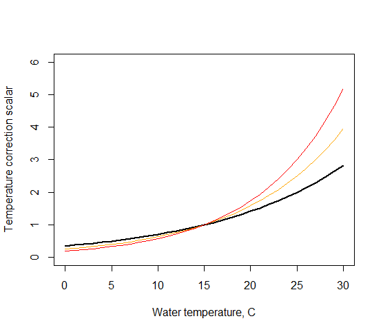

# Influence of Environmental Factors on Ecological Processes {#sec-environmental-factors}

## **Temperature: two methods to get temperature scalar** 

Temperature can have a large influence on many biogeochemical and ecological processes, but in Atlantis the user has an option to turn the temperature effects off, by setting [flagq10]{style="color: orange;"}=0 (NOT recommended given the fundamental temperature dependence of most physiological processes). Temperature effects are mostly applied through the Tcorr scalar calculated in the *Get_Tcorr()* routine. Setting [flagq10]{style="color: orange;"}=0 means that Tcorr scalar will be set to 1.

There are two ways to calculate the Tcorr scalar and different methods can be applied for different species, selected with the [q10_method_XXX]{style="color: orange;"} parameter. Some details on the calculations are given [here](https://confluence.csiro.au/display/Atlantis/Effect+of+temperature+on+functional+groups).

If the [q10_method_XXX]{style="color: orange;"}=0 then a simple Q10 based correction scalar is calculated, using the reference temperature of 15C:

$$T_{scalar} = {q10}^{\frac{\left( T_{H2O} - 15 \right)}{10}}$$

where q10 is a species-specific parameter provided in the [q10_XXX]{style="color: orange;"} and is typically set to 2. The effect of different [q10_XXX]{style="color: orange;"} values (@fig-temperature-scalar)

{#fig-temperature-scalar width=4.35in height=3.28in}

**Black**: q10=2

[**Orange**]{style="color: orange;"}: q10=2.5

[**Red**]{style="color: red;"}: q10=3

A more complicated six parameter function is used if [q10_method_XXX]{style="color: orange;"}=1 (based on Gary Griffiths PhD thesis)

$$Tcorr = ln(2) \cdot \phi_{A} \cdot {Cons}_{B}^{Temp} \cdot \text{exp}\left( - \phi_{C} \cdot \frac{\left| Temp - {Temp}_{OPT} \right|^{Cons}}{\phi_{corr}} \right)$$

where *ø~A~* is a species-specific coefficient ([temp_coefftA_XXX]{style="color: orange;"}), *Cons~B~* is the global coefficient ([temp_coeffB]{style="color: orange;"}), *Temp* is ambient water temperature*, Temp~OPT~* is a species-specific optimum temperature ([q10_optimal_temp_XXX]{style="color: orange;"}), *ø~C\ ~*is the global coefficient ([temp_coeffC]{style="color: orange;"}), *Cons* is a global exponent parameter ([temp_exp]{style="color: orange;"}), and *ø~corr~* is a species q10 correction parameter ([q10_correction_XXX]{style="color: orange;"}).

This function aims to imitate a humped response, where rates are highest at optimum temperature levels and decrease when the temperature is below or above the optimum. The function is very sensitive to changes in parameters and before applying it the users should carefully explore the shape of the function for the chosen parameter values (@fig-humped-temperature-response). The black line shows the shape of the response curve for the original parameter values, except for *Temp~OPT~* which was chosen to be 19C

ø~A~ (temp_coefftA_XXX) =0.85
Cons~B~ (temp_coeffB) = 1.06
Temp~OPT~ (q10_optimal_temp_XXX) = 19C
ø~C~ (temp_coeffC) = 1
Cons (temp_exp) = 3
ø~corr~ (q10_correction_XXX) = 1000

![A humped temperature response used when [q10_method_XXX]{style="color: orange;"}=1.](media/image61.png){#fig-humped-temperature-response width=5.05in height=3.47in}

**Black**: original values as shown in parentheses below

[**Grey**]{style="color: grey;"}: Temp~OPT~ = 12C (19C)

[**Green**]{style="color: green;"}: ø~A~= 0.95 (0.85)

[**Orange**]{style="color: orange;"}: Cons~B~ = 1.1 (1.06)

[**Blue**]{style="color: blue;"}: ø~C~ = 1.1 (1.0)

[**Pink**]{style="color: pink;"}: Cons = 2.5 (3.0)

[**Purple**]{style="color: purple;"}: ø~corr~ = 100 (1000)

## **Temperature: effects on feeding parameters and assimilation efficiency** {#sec-temp-feeding-params}

Once the Tcorr scalar has been calculated for the species and its ambient temperature in the cell using one of the two methods above, it is applied as a scalar to a range of processes. Typically, parameters that are scaled by Tcorr are indicated with T15, but this is not always the case.

*A) Primary producers*

In all primary producers the Tcorr scalar is applied to the light saturation ([KI_XXX_T15]{style="color: orange;"}) and maximum growth rate parameter ([mum_XXX_T15]{style="color: orange;"})

*B) Consumer feeding parameters*

For ***biomass pools*** the [C\_]{style="color: orange;"} and [mum\_]{style="color: orange;"} values in the biological parameter file are given as rates at 15C and they are **always** scaled (multiplied) by Tcorr scalar for a given water temperature in a cell.

For **age structured groups** the search volume ([vl_a]{style="color: orange;"}) is always scaled by Tcorr, but the temperature scaling of [C\_]{style="color: orange;"} and [mum\_]{style="color: orange;"} is applied **only** if [flagtempsensitiveXXX]{style="color: orange;"} is set to 1. This is an inherited convention form the models the approaches were taken from and may change in the future.

*C) Consumer assimilation efficiency -- optional*

Atlantis has an option to set improved or decreased assimilation efficiency depending on the temperature. There is no clear consensus in the ecological community on how temperature affects assimilation efficiency (it appears to be taxa specific); hence the user can decide whether to use this option.

To allow for temperature effect on assimilation efficiency set [flagq10effXXX]{style="color: orange;"} to 1

When **[flagq10effXXX]{style="color: orange;"} = 1** the **efficiency is poorer in cooler water** and the Tcorr scalar (@fig-humped-temperature-response) is applied **only** if water temperature is lower than the optimum or reference level (depending on the [q10_method_XXX]{style="color: orange;"} used).

If **[flagq10effXXX]{style="color: orange;"}= 2** the **efficiency is poorer in warmer water** and the Tcorr scalar (@fig-humped-temperature-response) is applied **only** if water temperature is higher than the optimum or reference level (depending on the [q10_method_XXX]{style="color: orange;"} used).

In the calculations above if the Tcorr is \>1 then the Tcorr=1/T_scalar. This means that Tcorr is always \<1, which ensures that efficiency is decreased when correcting for temperature effects.

*D) Mortality*

For all species the linear mortality ([mL]{style="color: orange;"}), quadrating mortality ([mQ]{style="color: orange;"}) and extra mortality ([mS]{style="color: orange;"}) values are scaled by Tcorr.

*E) Physical parameters*

Parameters that determine the rate of breakdown are all scaled by the Tcorr scalar. They include:

[r_DL_T15]{style="color: orange;"} -- rate of labile detritus breakdown (day^-1^)
[r_DC_T15]{style="color: orange;"} -- rate of carrion breakdown (day^-1^)
[r_DR_T15]{style="color: orange;"} -- rate of refractory detritus breakdown (day^-1^)
[r_DON_T15]{style="color: orange;"} -- rate of dissolved organic nitrogen breakdown (day^-1^)
[r_DSi_T15]{style="color: orange;"} -- rate of detrital silica breakdown (day^-1^)
[K_nit_T15]{style="color: orange;"} -- rate of nitrification by free bacteria (mgN day^-1^)

## **Salinity** 

The **salinity** effects on **biomass pool and age structured group** physiological processes are modelled through an optional Scorr, designed to reflect the sensitivity of physiological processes to salinity conditions. The Scorr scalar is not calculated dynamically, but supplied by the user in [salt_correction_XXX]{style="color: orange;"} parameter. The Scorr scalar is applied only if:

1\) an organism is identified as sensitive to salinity, with [flagSaltSensitive_XXX]{style="color: orange;"}
2\) an organism an outside the salinity limits defined with [XXX_min_salt]{style="color: orange;"} and [XXX_max_salt]{style="color: orange;"}

**The Scorr scalar is applied in the same way as for the Tcorr scalar described above. For age structured groups the Scorr cannot be applied alone without applying the Tcorr scalar.** This means that if a species is identified as sensitive to salinity, but NOT sensitive to temperature, the Scorr scalar will not be applied to the physiological processes that have optional temperature scaling. This is not the case for biomass pool groups, where Scorr is applied regardless.

## **Acidification** 

Atlantis has an option to include effects of acidification on different physiological processes, predatory interactions and non-predation mortality. The pH effects are activated by setting [flagmodelpH]{style="color: orange;"} to 1 and [flagpHsensitive_XXX]{style="color: orange;"} to 1.

The calculation of the pH correction scalar (pHCorr) is described in detail on wiki [here](https://confluence.csiro.au/display/Atlantis/2012/10/19/Handling+effects+of+acidification).

Briefly, depending on the [pH_sensitivity_model]{style="color: orange;"} selected, Atlantis will calculate the pHCorr using monodynamic, non-linear, linear, piecewise or quadratic approaches (see link above for details). The scalar will be \<1 at decreasing pH values. It can be based on the pH values of ∆ \[H+\] (set [flag_use_deltaH]{style="color: orange;"} to 1 to use ∆ \[H+\]).

As for the Scorr scalar, **for age structured groups** the pHCorr will be applied to the processes affected by temperature (feeding rates, assimilation efficiency, mortality), **only if a species is sensitive to pH** ([flagpHsensitive_XXX]{style="color: orange;"}=1) **and sensitive to temperature.**

The pH can also affect other processes, as listed in @tbl-pH-effects.

| What is affected | How to activate | How is it applied |
|:-----------------|:----------------|:------------------|
| **Processes for which pHCorr scalar is applied at the same time as the Tcorr scalar, described in @sec-temp-feeding-params** | | |
| Growth and non-predation mortality rates | [flagpHsensitive_XXX]{style="color: orange;"}=1  For age structured groups it is applied only if:  [flagtempsensitiveXXX]{style="color: orange;"}=1 | Growth and non-predation mortality are affected in opposite ways by pH. The unmodified [C]{style="color: orange;"} and [mum]{style="color: orange;"} will be multiplied by pHCorr (and decrease as a result) and the unmodified [mL]{style="color: orange;"} and [mQ]{style="color: orange;"} multiplied by 1.0/pHCorr (and increase) |
| Search volume (if [predcase]{style="color: orange;"}=5) | [flagpHsensitive_XXX]{style="color: orange;"}=1 | The [vla_T15]{style="color: orange;"} is multiplied by pHCorr (and decreases)  This is only applied for age structured groups |
| Assimilation efficiency | [flagpHsensitive_XXX]{style="color: orange;"}=1  [flagtempsensitiveXXX]{style="color: orange;"}=1  [flagq10eff_XXX]{style="color: orange;"}=1 or 2 | Four assimilation efficiencies are multiplied by pHCorr (and decrease) |
| **Processes for which pHCorr scalar is applied differently from Tcorr scalar** | | |
| Availability of prey to predators | [flagpHsensitive_XXX]{style="color: orange;"}=1  [flagpredavaileffect_XXX]{style="color: orange;"}=1 | For **biomass pool prey**, availability to predators (defined in [pPREY]{style="color: orange;"} or ontogenetic diet matrices) is **increased** by multiplying by 1.0/pHCorr  For **age structured group prey**, availability to predators (defined in [pPREY]{style="color: orange;"} or ontogenetic diet matrices) is **decreased** by multiplying by pHCorr |
| Nutritional content of a species to its predators; mostly intended to simulate nutritional content of primary producers | [flagpHsensitive_XXX]{style="color: orange;"}=1  [flagnutvaleffect_XXX]{style="color: orange;"}=1 | The amount of prey biomass available to a predator (defined in [pPREY]{style="color: orange;"} or ontogenetic diet matrices) is further multiplied by pHCorr (to represent that more must be eaten to get the same nutritional content) and in this way decreased, reflecting lower nutritional content |
| Reduced larval survival before recruitment | [flagpHsensitive_XXX]{style="color: orange;"}=1  [flagfecundsensitive_XXX]{style="color: orange;"}=1 | The number of recruits is multiplied by pHCorr and therefore decreased |
| Modifying thermal tolerance of a species | [flagpHsensitive_XXX]{style="color: orange;"}=1  [flagcontract_tol_XXX]{style="color: orange;"}=1 | The thermal tolerance decreases according to [contract_tol_XXX]{style="color: orange;"} parameter, which defines the number of degrees to contract the temperature tolerances by as pH drops |
| Additional mortality | [flagpHsensitive_XXX]{style="color: orange;"}=1  [flagPHmortcase]{style="color: orange;"} > 0 | Extra mortality applied for ALL groups |
| Extra mortality | [flagpHsensitive_XXX]{style="color: orange;"}=1  [pHmortstart]{style="color: orange;"}=1 | Another logistic extra mortality term is added, see details [here](https://confluence.csiro.au/display/Atlantis/2015/05/14/Acidification+induced+mortality) |

: Effects of pH on physiological and ecological processes. See detailed description [here](https://confluence.csiro.au/display/Atlantis/2012/10/19/Handling+effects+of+acidification). {#tbl-pH-effects tbl-colwidths=[25,25,50]}

## **Oxygen** 

The oxygen dependency is modelled differently from the temperature, salinity and pH effects described above. The oxygen content of the water does not affect the physiological processes, but recruitment and distributions. It also can lead to oxygen stress induced mortality of biomass pool groups.

The effect of oxygen limitation on feeding rates and linear mortality of biomass pool groups is non-optional and is modelled with [O2case]{style="color: orange;"}, [mO_XXX]{style="color: orange;"}, [mD_XXX]{style="color: orange;"}, [KO2_XXX]{style="color: orange;"} and [KO2LIM_XXX]{style="color: orange;"} parameters

The sensitivity of distributions and recruitment on oxygen concentration is optional. It is applied to both age structured groups and biomass pools and is activated by a global [flagO2depend]{style="color: orange;"} parameter and species-specific minimum oxygen concentrations [XXX_min_O2]{style="color: orange;"} parameter, setting the minimum tolerated oxygen level. If this option is used then species distribution will contract to areas above the minimum oxygen level. Further, the recruits that arrive into cells with oxygen concentrations lower than the minimum will be killed (not contracted!, see @sec-envio-habitat-recruitment).