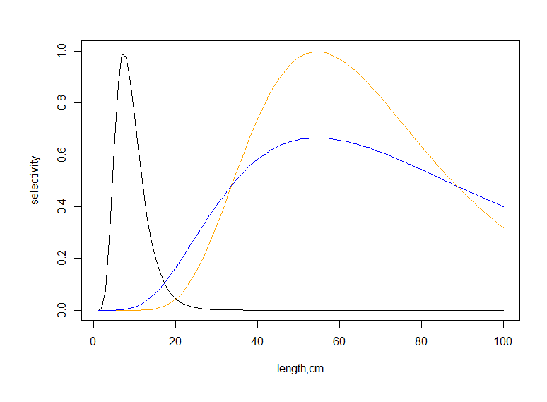

## **15.1 General description of the fishing mortality** 

Atlantis currently has three main ways to apply fishing mortality:

1\) imposed catches forced through time series files, providing catch biomass that should be taken from a stock;

2\) user set a fisheries induced mortality rate, defining a proportion of biomass to be harvested per day;

3\) dynamic fishing based on an effort matrix (days of fishing per fishery) provided by the user and modified according to a range of management and economics options.

Only one of the three options can be applied for a given functional group - fishery combination. However, one species can be harvested through all three options, if they are operated by different fisheries.

The first option of imposed catches is executed via externally provided catch files (a form of forcing file). The content of these time series files are created from information on realised catches collected by fisheries scientists. The fishing mortality these catches represent is dynamically calculated in Atlantis based on the standing stock, fisheries parameters (and in some cases aspects of the life history of the groups involved) which define the distribution of catches across ages and boxes, and possible management actions (further details are provided in the following section). In principle fisheries discards or fishing based on dynamic effort can also be imposed using similar forcing files. In practice, however, imposed catches are usually used with historical catch time series.

The other two options for determining fishing mortality do not use external catch forcing files, but produce realised catch biomass as an output. This output can then be compared with the existing data during the model calibration stage. The main difference between the user set fishing mortality and dynamic fishing is in the final mortality level applied for a group. For option 2 the fishing mortality (e.g. 40% of biomass per year) is set by the user, and the actual catch biomass will depend on the species abundance and fishing parameters. In dynamic fishing the user does not set the fishing mortality but effort (in days) applied by each fishery in each box (or the economic rules that in turn dictate the realised effort applied). There are many ways to allocate this effort to fisheries, starting from simple prescribed effort per quarter to dynamic economically based effort allocations that simulate fisher behaviour. Once the effort per fishery is calculated the biomass of each species caught will depend on the parameters defining swept area by the fishing gear, fish catchability, selectivity of the gear, as well as vertical and horizontal overlap. These additional parameters (catchability, selectivity etc) are required in the effort model, but some of them can also be used in other fishing options too. For example, a selectivity curve could be used in conjunction with the user defined fishing mortality rate (option 2).

In addition, for aquaculture species (defined as isCultured is *functional_groups.csv* file) Atlantis runs specialised aquaculture harvesting routines, which are almost identical to the user defined fishing mortality option.

The routines calculating catch and discards are called from the *Water_Column_Box()* and *Epibenthic_Box()* routines before the execution of ecological processes (this means groups that live in the sediment layers deeper than the surface layer can not currently be directly harvested). **The harvest routines are called only** **if a species (functional group) is identified as isImpacted (=1)** in the *functional_groups.csv* file. The main routine that controls fisheries is *Harvest_Do_Fishing_And_ByCatch()* in **atHarvest.c**, which then calls two specific routines to get catch *Get_Catch()* in atHarvestCatch.c and discards *Get_Discards()* in atHarvestDiscards.c

::: {.callout-caution}
**What kind of fishing mortality to use?**                                       

When data on catches is available, modellers often use imposed catch to aid the model parameterisation. If the main question is to understand the ecosystem dynamics given the specified catch biomass that the fisheries want to take, then the imposed catch option may be the best way to go. 

he choice between the user defined fishing mortality and dynamic fishing is determined by whether the user is mostly interested in the biological dynamics given a set fishing pressure, or whether fishery development and socio-economic aspects are of more interest. Of course, the actual fishery is never just a fixed annual pressure and biological dynamics will be determined by complex fisher behaviour and a range of socio-economic aspects that will determine the actual fishing pressure. Yet, all models are just a simplified version of reality and the level of simplification is determined by the questions that are to be addressed.
:::

+-------------------------------------+------------------------------------------------------------------------------------------------------------------------------------------------------------------------------------------------------------------------------------------------------------------------------------------------------------------------------------------------------------------------------------------------------------------------------------------------------+
| **Parameter**                       | **Description**                                                                                                                                                                                                                                                                                                                                                                                                                                      |
+=====================================+======================================================================================================================================================================================================================================================================================================================================================================================================================================================+
| flag_fisheries_on in run.prm        | Flag indicating that the Harvest submodel should be loaded. Must be set to 1 when applying fisheries                                                                                                                                                                                                                                                                                                                                                 |
+-------------------------------------+------------------------------------------------------------------------------------------------------------------------------------------------------------------------------------------------------------------------------------------------------------------------------------------------------------------------------------------------------------------------------------------------------------------------------------------------------+
| isImpacted in functional_groups.csv | Flag indicated that the group is impacted by fisheries and other human activities. Must be set to 1 for any group that can be impacted through fishing, bycatch or incidental fishing mortality (e.g. where benthic habitat is crushed by fishing gear)                                                                                                                                                                                              |
+-------------------------------------+------------------------------------------------------------------------------------------------------------------------------------------------------------------------------------------------------------------------------------------------------------------------------------------------------------------------------------------------------------------------------------------------------------------------------------------------------+
| YYY_tStart                          | Day of the model run when a fishery YYY starts operating                                                                                                                                                                                                                                                                                                                                                                                             |
+-------------------------------------+------------------------------------------------------------------------------------------------------------------------------------------------------------------------------------------------------------------------------------------------------------------------------------------------------------------------------------------------------------------------------------------------------------------------------------------------------+
| YYY_tEnd                            | Day of the model run when a fishery YYY ends operations                                                                                                                                                                                                                                                                                                                                                                                              |
+-------------------------------------+------------------------------------------------------------------------------------------------------------------------------------------------------------------------------------------------------------------------------------------------------------------------------------------------------------------------------------------------------------------------------------------------------------------------------------------------------+
| flagYYYday                          | Period of activity in fisheries YYY. 0 -- fishery only operates at night, 1 -- fishery operates during the day, 2 -- fishery operates all the time. Note, this has implications for scaling of imposed catch (see chapter 15.2.1).                                                                                                                                                                                                                   |
|                                     |                                                                                                                                                                                                                                                                                                                                                                                                                                                      |
|                                     | Species activity (set in flagXXXday in *biology.prm*) files does not affect its availability to fisheries -- an inactive species will still be fished.                                                                                                                                                                                                                                                                                               |
+-------------------------------------+------------------------------------------------------------------------------------------------------------------------------------------------------------------------------------------------------------------------------------------------------------------------------------------------------------------------------------------------------------------------------------------------------------------------------------------------------+
| flagfishXXX                         | Flag indicating whether a species XXX is actively fished. This flag is similar to isImpacted in the .csv file, and is partly the legacy of earlier development. Currently flagfishXXX indicates that a species is directly affected by fishing, whereas isImpacted includes also other impacts, such as bycatch or incidental mortality. The flagfishXXX should be set to 1 for all fished species.                                                  |
+-------------------------------------+------------------------------------------------------------------------------------------------------------------------------------------------------------------------------------------------------------------------------------------------------------------------------------------------------------------------------------------------------------------------------------------------------------------------------------------------------+
| flagfinfish                         | A global flag indicating that fisheries are operating.                                                                                                                                                                                                                                                                                                                                                                                               |
|                                     |                                                                                                                                                                                                                                                                                                                                                                                                                                                      |
|                                     | Turning on fisheries through flag_fisheries_on in *run.prm* means that Atlantis will apply either direct fishing (flagfinfish=1) or incidental mortality (flagincidmort=1). So if flagfinfish =0, incidental mortality can still occur through bycatch if flagincidmort=1, meaning a species might still be affected by fishing activities.                                                                                                          |
+-------------------------------------+------------------------------------------------------------------------------------------------------------------------------------------------------------------------------------------------------------------------------------------------------------------------------------------------------------------------------------------------------------------------------------------------------------------------------------------------------+
| flagincidmort                       | A flag indicating whether fisheries can cause incidental mortality through bycatch. The bycatch will be determined depending on how a fishery is set: if imposed catches are used or user defined fishing mortality is set species in the model then bycatch of other species can be generated with the FCcocatchXXX parameter; whereas in dynamic fishing bycatch is determined by a range of parameters.                                           |
+-------------------------------------+------------------------------------------------------------------------------------------------------------------------------------------------------------------------------------------------------------------------------------------------------------------------------------------------------------------------------------------------------------------------------------------------------------------------------------------------------+
| flag_access_thru_wc_XXX             | Whether a fishery has access to fish in the entire water column (e.g. do trawl doors remain open as the gear moves up/down through the water column there by interacting with species who do not live at the depth the trawl is most actively being towed)                                                                                                                                                                                           |
+-------------------------------------+------------------------------------------------------------------------------------------------------------------------------------------------------------------------------------------------------------------------------------------------------------------------------------------------------------------------------------------------------------------------------------------------------------------------------------------------------+
| flaghabitat_XXX                     | Vectors indicate which habitat patchiness equation to use when undertaking dynamic fishing. 0=standard % overlap, 1=Ellis and Pantus based subgrid scale model                                                                                                                                                                                                                                                                                       |
+-------------------------------------+------------------------------------------------------------------------------------------------------------------------------------------------------------------------------------------------------------------------------------------------------------------------------------------------------------------------------------------------------------------------------------------------------------------------------------------------------+
| YYY_flagdempelfishery               | This sets the flag for each group and fishery to show whether it is benthic or pelagic. 0 = pelagic, 1 = demersal. This will influence the vertical distribution scalar in dynamic fishing when the box is in shallow water (so there are less than the maximum number of layers); in this case the vertical distribution is contracted with a bias to bottom water column layers if defined as demersal or to surface layers if defined as pelagic. |
+-------------------------------------+------------------------------------------------------------------------------------------------------------------------------------------------------------------------------------------------------------------------------------------------------------------------------------------------------------------------------------------------------------------------------------------------------------------------------------------------------+
| k_mismatch                          | Reduction in effectiveness of gear due to mismatch in water column distribution of gear and vertebrates. This positional scalar downscales the availability of target species if they are marked as demersal (pelagic) and the gear is marked as pelagic (demersal).                                                                                                                                                                                 |
+-------------------------------------+------------------------------------------------------------------------------------------------------------------------------------------------------------------------------------------------------------------------------------------------------------------------------------------------------------------------------------------------------------------------------------------------------------------------------------------------------+
| habitat_YYY                         | Array of values indicating if fishery is excluded from certain habitats (0)                                                                                                                                                                                                                                                                                                                                                                          |
+-------------------------------------+------------------------------------------------------------------------------------------------------------------------------------------------------------------------------------------------------------------------------------------------------------------------------------------------------------------------------------------------------------------------------------------------------------------------------------------------------+
| YYY_mindepth                        | Minimum seafloor depths fishery will act over (so if won\'t fish shallower than 1500m put 1500 here)                                                                                                                                                                                                                                                                                                                                                 |
+-------------------------------------+------------------------------------------------------------------------------------------------------------------------------------------------------------------------------------------------------------------------------------------------------------------------------------------------------------------------------------------------------------------------------------------------------------------------------------------------------+
| YYY_maxdepth                        | Maximum seafloor depths fishery will act over (so if won\'t fish deeper than 1500m put 1500 here)                                                                                                                                                                                                                                                                                                                                                    |
+-------------------------------------+------------------------------------------------------------------------------------------------------------------------------------------------------------------------------------------------------------------------------------------------------------------------------------------------------------------------------------------------------------------------------------------------------------------------------------------------------+

: []{#_Toc498434971 .anchor}**Table 1.** General fisheries parameters

## **15.2. Setting up fishing mortality through imposed catch**

The imposed catch is handled by the *Get_Imposed_Catch()* routine in **atHarvestImposedCatch.c**

The imposed catch requires externally provided catch time series (in TS files, see chapter 8) and is activated when flagimposeglobal in *harvest.prm* is set to a value \> 0 (value of 0 means no imposed catch) and flagimposecatch_XXX is \> 0 for at least one species-fishery combination. The parameter flagimposecatch_XXX is entered as a vector per species (XXX) with as many entries as there are fisheries in the *fisheries.csv* file; the assumed order of fisheries in the vector matches the order defined in the *fisheries.csv* file. Any value \> 0 indicates which fishery has imposed catch. To date, for simplicity, all models have imposed catch for one fishery (which represents the aggregate catch over all fishery sectors being imposed in this way), which means that only one catch forcing file is required. In theory, Atlantis can apply different imposed catches for different fisheries, in which case the user should provide separate catch forcing files for each box and each fishery. However, this has not been applied in practice yet (so please contact the model developers if you want to try and use this multi-file option).

For age-structured groups and age-structured biomass pools the imposed catch will be age-specific. The value in the forcing file represents the total imposed catch and then the proportion of this forced catch to be taken from each age group is given by the CatchTS_agedistribXXX parameter vector, which has as many values as there are age group in species XXX (these values must sum to 1).

It is possible to apply imposed catch only for a certain time period of the model run. For example, the user might apply imposed catch for the first 10 years and then use other fishing options from year 11 on. The time period for the imposed catch is specified in imposecatchstart_XXX and imposecatchend\_ XXX. These parameters are entered as vectors, which have as many values as there are fisheries, and indicate the day of the model run that the imposed catch starts/ends for each species-fishery combination.

The flagimposeglobal and flagimposecatch_XXX can have **four different options,** which specify how the catch will be imposed:

**1. Only global catch is imposed** (flagimposeglobal = 1 and flagimposecatch_XXX = 1)

This option means that imposed catch provided in the single TS forcing files is the total catch per day for the entire distributional area of a species; and the catch imposed in any specific box is proportional to the biomass of the harvested species in that box versus the entire model domain. Note that in this case the *force.prm* file should still indicate one specific box for the imposed catch to facilitate read-in (see chapter 8), however it will not simply be used in that box but will inform catches in every non-boundary model box.

**2. Imposed catch is box-specific** (flagimposeglobal = 2 and flagimposecatch_XXX = 2)

This option requires a catch time series be provided for every box in the model where catch is to be extracted (if you want to be particularly careful and make sure that there is a time series supplied for every box then supply a time series of zeroes for any box where there is no fishing). Imposed catch is taken only from the boxes specified in the *force.prm* file. If the biomass of the species in the box is insufficient in the specified box, Atlantis will attempt to get the missing catch from other age groups of that species in the box (see Note! below). Any catch not taken is rolled over to the next day, then it is added to the forced catch (as defined by the forcing file) to be extracted on that day. If insufficient is available on that day it is rolled over to the next and so on until years end.

**3. Imposed catch is box-specific but is allowed to take missing catch from the same stock** (flagimposeglobal = 3 and flagimposecatch_XXX = 3)

This option is applied in the same way as the option 2 above, but if the biomass of the targeted species age-groups is insufficient in the specified box, Atlantis will take catch from other boxes inhabited by the same stock. Note, that first Atlantis will attempt to get the required catch by sampling other age groups in the specified box and only then go to other boxes. The orders of the boxes to be harvested for the missing catch corresponds to the box ID order, e.g. if not enough biomass is available in box 4, Atlantis will look in box 5, then in box 6 and so on, as long as these boxes have the same stock of the species, indicated in the XXX_stock_struct parameter in the *biology.prm* file. This sequential use of boxes to be harvested when attempting to make up the difference means the actual box fished for the extra may differ at each time step -- for example, if after one month insufficient biomass is left in box 5 to supply the shortfall, then box 6 will be harvested until it is depleted and so on (assuming imposed catch remains higher than the biomass of harvested species in the specified box).

If, after all boxes have been fished for the extra, there is still insufficient biomass to take the catch then any remaining is rolled over to the next day, as for option 2.

**4. Imposed catch is box-specific but is allowed to take missing catch from adjacent boxes** (flagimposeglobal = 4 and flagimposecatch_XXX = 4)

This is applied as the option 3 above, but the missing catch is taken only from the neighbouring boxes. The orders of the boxes to be harvested for the missing catch corresponds to the order defined in the *ibox* vector for the box in the BGM file, e.g.

box2.nconn 8

box2.iface 5 6 78 76 75 74 73 4

box2.ibox 187 3 26 25 1 301 299 300

In this case the 8 neighbours of box 2 would be checked in the order box 187, 3, 26, 25, 1, 301, 299 and 300.

If, after all the neighbouring boxes have been fished for the extra, there is still insufficient biomass to take the catch then any remaining is rolled over to the next day, as for option 2.

::: {.callout-caution}
**How Atlantis supplements missing imposed catch from different age groups of a species** 

The CatchTS_agedistribXXX parameter provides proportions of imposed catch to be taken from each age group (e.g. 0 0.1 0.2 0.3 0.4 for a species with five age groups). This means that 40% of imposed catch is taken from age group 5, 30% from age group 4 and so on). 

If insufficient biomass is available in a box to get the required imposed catch using the age distribution as stated, Atlantis will first attempt to get the outstanding catch by increasing the proportion it takes from the oldest age groups. It will first start by increasing the proportion of the catch taken from the oldest age groups (by rescaling the value given by CatchTS_agedistribXXX) and, if sufficient biomass still cannot be caught, then incrementally move down the age groups to the youngest fished age group (if an age group is marked as zero it will never be harvested as the rescaled proportion will still be 0).
:::

Regardless of the options (1-4) used for imposed catch, if, at the end of the year, Atlantis has outstanding catch it could not take (i.e. any accumulated rollovers), it will give a warning message in the *log.txt* file about the size of the mismatch between the imposed catch time series for the year and what could actually be taken (i.e. the outstanding amount) and will the zero all the missing catch and begin again for the new year, i.e. **it will not carry over missing catch into the next year.**

The imposed catch given in the TS files can be **further modified** to account for **underreporting, adaptive management** actions, **marine protected areas** (MPAs) and **fisheries activity** (day, night, both).

1\. The **underreporting** implies that the actual catch is higher than what is known by the fisheries and provided in the forced catch files. The scale for underreporting by different fisheries for different species is provided in the reportscale_XXX parameter. It must have as many entries as there are fisheries, giving scalar values of underreporting for each fishery. If no underreporting is assumed then the value for the fishery should be set to 1.

2\. A simple **adaptive management** scalar is applied if a fishery YYY is identified as managed, by setting YYY_flagmanage=1. The management of the fishery YYY starts on the day given in the YYY_start_manage and ends on the day given in YYY_end_manage parameters. It is therefore possible to only start the management in the middle of the model run. For example, if imposed catch is used for the first 10 years and then dynamic fishery start in year 11, the user may only want to apply management actions from the year 11. In this way the forced catch time series data will not be modified by the management scalars.

The management of the fisheries can many options (total allowable catch, or fisheries reference points), which are described in chapter 16. Briefly, all of these options return a scalar (typically ≤1) that will be applied to the original effort or imposed catch to calculate the actual catch taken and landed. Many of these alternative management options require YYY_flagmanage to be set to a value \>1.

3\. **MPA** or spatial management applies to a fishery YYY, set with YYY_flagmpa \>0 and a global flag flagmpa=1. There are eight different options to apply spatial management, described in chapter 16.4, but briefly all of them will return a scalar for each box depending on whether the presence of an MPA in the box affects the fishing activity. The base spatial management scalar for each fishery in each box is set in MPAYYY, but it can be modified depending on the MPA options chosen. The MPA scalar is typically ≤1, with the value representing the fractional area of the box open to fishing. The value can be set to \>1 for cases where spatial management actually leads to increased fishing activity (e.g. around the edge of an MPA). Infringement of spatial management is also possible - see 15.3.3.

4\. Finally the imposed catch will be scaled by 0.5 if the fishery operates all the time rather than only during day or night (see box below).

::: {.callout-caution}
**Scaling of imposed catch due to fisheries diurnal activities**

The imposed catch values assume that the fishery only operates for half of the day, i.e. during the day or night. This is set using the flagYYYday parameter (1if active by day or 0 if active by night). If the fishery has no preference, which means that it operates constantly then set flagYYYday=2 -- in which case the imposed catch given in the times series file in mg s^-1^ will be halved.
:::

If the scalars listed above are applied then it is likely that the actual catch taken from the box will be different from the imposed catch in the TS forcing files. The user should carefully think whether this is a desired outcome. If the user only aims to parameterise the model given the known catches in each box, or observe ecological dynamics given the imposed catch, then the management options should be turned off. On the other hand, by activating an MPA or management scalar it is possible to explore, for example, what the stock biomass might have been if certain management actions had been in place and modified the historic catches accordingly.

For the imposed catch the final catch *H* (mgN day^-1^) to be taken by fishery Y from species CX age group *i* in a specific box *j* is calculated as

$$H_{CX,Y,i,j} = m_{CX,Y,j} \cdot {p\_ age}_{i} \cdot {repsc}_{CX,Y} \cdot {managesc}_{Y} \cdot {mpasc}_{Y,j} \cdot {activesc}_{Y}$$

where *m~CX,Y,j~* is the total biomass (over all age groups) to be taken out from the box given in the forcing files (mgN day^-1^); *p_age~i~* is the distribution of forced catch over the age groups of species XXX (CatchTS_agedistribXXX); *repsc~CX,Y~* is the scalar for underreporting (reportscale_XXX) by fishery Y on species CX; *managsc~Y~* is the optional adaptive management scalar for the fishery Y (when YYY_flagmanage \> 0, see chapter 16); *mpasc~Y,j~* is the optional scalar due to MPA presence in the box *j* (when YYY_flagmpa \>0, see chapter 16.4); and *activesc~Y~* is the activity scalar (set to 0.5 if fishery YY is active during the day and night (flagYYYday=2 )).

+--------------------------------------------------------------------------------------------------------------------------------------------------------------------------------------------------------------------------------------------------------------------------------------------------------------------------------------------------------------------------------------------------+
| **Example of the box-specific catch forcing TS file for two species**                                                                                                                                                                                                                                                                                                                            |
|                                                                                                                                                                                                                                                                                                                                                                                                  |
| \# Historical catch time series file until 2000 for box 2                                                                                                                                                                                                                                                                                                                                        |
|                                                                                                                                                                                                                                                                                                                                                                                                  |
| \#                                                                                                                                                                                                                                                                                                                                                                                               |
|                                                                                                                                                                                                                                                                                                                                                                                                  |
| \## COLUMNS 3                                                                                                                                                                                                                                                                                                                                                                                    |
|                                                                                                                                                                                                                                                                                                                                                                                                  |
| \##                                                                                                                                                                                                                                                                                                                                                                                              |
|                                                                                                                                                                                                                                                                                                                                                                                                  |
| \## COLUMN1.name Time                                                                                                                                                                                                                                                                                                                                                                            |
|                                                                                                                                                                                                                                                                                                                                                                                                  |
| \## COLUMN1.long_name Time                                                                                                                                                                                                                                                                                                                                                                       |
|                                                                                                                                                                                                                                                                                                                                                                                                  |
| \## COLUMN1.units days since 1910-01-01 00:00:00 +10                                                                                                                                                                                                                                                                                                                                             |
|                                                                                                                                                                                                                                                                                                                                                                                                  |
| \## COLUMN1.missing_value 0                                                                                                                                                                                                                                                                                                                                                                      |
|                                                                                                                                                                                                                                                                                                                                                                                                  |
| \##                                                                                                                                                                                                                                                                                                                                                                                              |
|                                                                                                                                                                                                                                                                                                                                                                                                  |
| \## COLUMN2.name FPL                                                                                                                                                                                                                                                                                                                                                                             |
|                                                                                                                                                                                                                                                                                                                                                                                                  |
| \## COLUMN2.long_name FPL                                                                                                                                                                                                                                                                                                                                                                        |
|                                                                                                                                                                                                                                                                                                                                                                                                  |
| \## COLUMN2.units mg s-1                                                                                                                                                                                                                                                                                                                                                                         |
|                                                                                                                                                                                                                                                                                                                                                                                                  |
| \## COLUMN2.missing_value 0                                                                                                                                                                                                                                                                                                                                                                      |
|                                                                                                                                                                                                                                                                                                                                                                                                  |
| \##                                                                                                                                                                                                                                                                                                                                                                                              |
|                                                                                                                                                                                                                                                                                                                                                                                                  |
| \## COLUMN3.name FPO                                                                                                                                                                                                                                                                                                                                                                             |
|                                                                                                                                                                                                                                                                                                                                                                                                  |
| \## COLUMN3.long_name FPO                                                                                                                                                                                                                                                                                                                                                                        |
|                                                                                                                                                                                                                                                                                                                                                                                                  |
| \## COLUMN3.units mg s-1                                                                                                                                                                                                                                                                                                                                                                         |
|                                                                                                                                                                                                                                                                                                                                                                                                  |
| \## COLUMN3.missing_value 0                                                                                                                                                                                                                                                                                                                                                                      |
|                                                                                                                                                                                                                                                                                                                                                                                                  |
| \##                                                                                                                                                                                                                                                                                                                                                                                              |
|                                                                                                                                                                                                                                                                                                                                                                                                  |
| 0 0.000000e+000 0.000000e+000                                                                                                                                                                                                                                                                                                                                                                    |
|                                                                                                                                                                                                                                                                                                                                                                                                  |
| 1 0.000000e+000 0.000000e+000                                                                                                                                                                                                                                                                                                                                                                    |
|                                                                                                                                                                                                                                                                                                                                                                                                  |
| 2 0.000000e+000 0.000000e+000                                                                                                                                                                                                                                                                                                                                                                    |
|                                                                                                                                                                                                                                                                                                                                                                                                  |
| 3 0.000000e+000 0.000000e+000                                                                                                                                                                                                                                                                                                                                                                    |
|                                                                                                                                                                                                                                                                                                                                                                                                  |
| 4 0.000000e+000 0.000000e+000                                                                                                                                                                                                                                                                                                                                                                    |
|                                                                                                                                                                                                                                                                                                                                                                                                  |
| 5 0.000000e+000 0.000000e+000                                                                                                                                                                                                                                                                                                                                                                    |
|                                                                                                                                                                                                                                                                                                                                                                                                  |
| 6 0.000000e+000 0.000000e+000                                                                                                                                                                                                                                                                                                                                                                    |
|                                                                                                                                                                                                                                                                                                                                                                                                  |
| ... list days of the run and the catch imposed                                                                                                                                                                                                                                                                                                                                                   |
|                                                                                                                                                                                                                                                                                                                                                                                                  |
| 14654 5.886416e-004 5.316763e-004                                                                                                                                                                                                                                                                                                                                                                |
|                                                                                                                                                                                                                                                                                                                                                                                                  |
| 14655 5.886416e-004 5.316763e-004                                                                                                                                                                                                                                                                                                                                                                |
|                                                                                                                                                                                                                                                                                                                                                                                                  |
| 14656 5.886416e-004 5.316763e-004                                                                                                                                                                                                                                                                                                                                                                |
|                                                                                                                                                                                                                                                                                                                                                                                                  |
| 14657 5.886416e-004 5.316763e-004                                                                                                                                                                                                                                                                                                                                                                |
|                                                                                                                                                                                                                                                                                                                                                                                                  |
| 14658 5.886416e-004 5.316763e-004                                                                                                                                                                                                                                                                                                                                                                |
|                                                                                                                                                                                                                                                                                                                                                                                                  |
| 14659 7.443469e-004 5.316763e-004                                                                                                                                                                                                                                                                                                                                                                |
|                                                                                                                                                                                                                                                                                                                                                                                                  |
| 14660 7.443469e-004 5.316763e-004                                                                                                                                                                                                                                                                                                                                                                |
|                                                                                                                                                                                                                                                                                                                                                                                                  |
| ... and so on                                                                                                                                                                                                                                                                                                                                                                                    |
|                                                                                                                                                                                                                                                                                                                                                                                                  |
| Note that this file gives the **total catch per box in mg per secon**d over all age groups of a species. The age distribution of the imposed catch is given separately in the CatchTS_agedistribXXX parameter.                                                                                                                                                                                   |
|                                                                                                                                                                                                                                                                                                                                                                                                  |
| It is not necessary to give catch for each day. The user can give data for set time periods (every month or every year) and then indicate via the typeCatchts parameter in *force.prm* whether to use the last valid value (typeCatchts set to 1) or to interpolate between the two provided values (typeCatchts set to 0). See "Format of the time series (TS) forcing files" box in Chapter 8. |
+==================================================================================================================================================================================================================================================================================================================================================================================================+

+-----------------------+----------------------------------------------------------------------------------------------------------------------------------------------------------------------------------------------------------------------------------------------------------------------------------------------------------------------------------------+
| **Parameter**         | **Description**                                                                                                                                                                                                                                                                                                                        |
+=======================+========================================================================================================================================================================================================================================================================================================================================+
| flagimposeglobal      | If \>0 imposed catches are applied for at least one species-fishery combination and a forcing TS file must be supplied (or else Atlantis will quit). Values of 1 to 4 indicate which option of imposed catch to use                                                                                                                    |
+-----------------------+----------------------------------------------------------------------------------------------------------------------------------------------------------------------------------------------------------------------------------------------------------------------------------------------------------------------------------------+
| flagimposecatch_XXX   | A vector with as many values as there are fisheries (with the order assumed to match the order in the *fisheries.csv* file).                                                                                                                                                                                                           |
|                       |                                                                                                                                                                                                                                                                                                                                        |
|                       | If \>0 imposed catch is applied for species XXX for that fishery. Values of 1 to 4 indicate which option of imposed catch to use                                                                                                                                                                                                       |
+-----------------------+----------------------------------------------------------------------------------------------------------------------------------------------------------------------------------------------------------------------------------------------------------------------------------------------------------------------------------------+
| CatchTS_agedistribXXX | Proportion of the imposed catch to take from the age group (if there is sufficient biomass over all fished age classes to cover the imposed catch). A vector should have as many values as there are age groups in the species XXX and should sum to 1.0.                                                                              |
+-----------------------+----------------------------------------------------------------------------------------------------------------------------------------------------------------------------------------------------------------------------------------------------------------------------------------------------------------------------------------+
| imposecatchstart_XXX  | A vector with as many value as there are fisheries                                                                                                                                                                                                                                                                                     |
|                       |                                                                                                                                                                                                                                                                                                                                        |
|                       | Day of the model run that the imposed catch starts for a species XXX and the specified fishery                                                                                                                                                                                                                                         |
+-----------------------+----------------------------------------------------------------------------------------------------------------------------------------------------------------------------------------------------------------------------------------------------------------------------------------------------------------------------------------+
| imposecatchend_XXX    | A vector with as many value as there are fisheries                                                                                                                                                                                                                                                                                     |
|                       |                                                                                                                                                                                                                                                                                                                                        |
|                       | Day of the model run that the imposed catch ends for a species XXX and the specified fishery                                                                                                                                                                                                                                           |
+-----------------------+----------------------------------------------------------------------------------------------------------------------------------------------------------------------------------------------------------------------------------------------------------------------------------------------------------------------------------------+
| reportscale_XXX       | A vector with as many value as there are fisheries                                                                                                                                                                                                                                                                                     |
|                       |                                                                                                                                                                                                                                                                                                                                        |
|                       | A scalar for imposed catches to scale from reported catches to total catches when accounting for misreporting by each fishery. For example if there was an additional 25% of the catch that was not reported, so that total catch was equal to 125% of official reported catch, then the scalar should be set to 1.25 for that fishery |
+-----------------------+----------------------------------------------------------------------------------------------------------------------------------------------------------------------------------------------------------------------------------------------------------------------------------------------------------------------------------------+
| YYY_flagmanage        | If \>0, management options will be applied to the fishery YYY and imposed catch may be scaled by a management scalar.                                                                                                                                                                                                                  |
+-----------------------+----------------------------------------------------------------------------------------------------------------------------------------------------------------------------------------------------------------------------------------------------------------------------------------------------------------------------------------+
| YYY_flagmpa           | If \>0, the fishery YYY will be affected by MPAs and imposed catch will be scaled by the MPA scalar.                                                                                                                                                                                                                                   |
+-----------------------+----------------------------------------------------------------------------------------------------------------------------------------------------------------------------------------------------------------------------------------------------------------------------------------------------------------------------------------+

: []{#_Toc498434972 .anchor}**Table 2.** Parameters required for imposed catch setup

## **15.3. Setting up fishing mortality through user defined non-dynamic fishing mortality**

An alternative way of providing fishing mortality values (and resulting catches) is to set fixed fishing mortalities (i.e. provide the rates as parameters). This is handled by the *Get_Fishing_Mortality()* routine in **atHarvestCatch.c**

This option will apply a fix mortality rate for each species identified with flagF_XXX and mFC_XXX parameters, with the user set options for distributing the mortality across age groups and/or sizes.

The general equation to calculate catch/harvest (mgN day^-1^) of species CX age group *i* to be taken by fishery Y in a box *j* is then calculated as

$$H_{CX,Y,i,j} = {mFC}_{CX,Y} \cdot {Biom}_{CX,i,j} \cdot {sel}_{Y,i} \cdot {managesc}_{Y} \cdot {mpasc}_{Y,j} \cdot {brok}_{Y}$$

where *mFC~CX,Y~* is the fishing mortality rate (as a proportion of biomass day^-1^) that fishery Y applies to species CX, *Biom~CX,i,j~* is the biomass of age group *i* in a box *j* (mgN); *sel~Y,i~* is the selectivity of fishery Y on age group *i* which can be defined as size based selectivity (where values will range from 0 to 1), or simply a minimum size that is caught (any individuals smaller than this will have *sel~Y,i~* set to 0 and any individuals larger then the minimum size will have *sel~Y,i~* set to 1); *managsc~Y~* is the TAC management scalar for the fishery Y, which takes a value of 1 if the relevant TAC has not been reached and 0 if the TAC has been reached (or exceeded) and flag_stop_F_tac =1; *mpasc~Y,j~* is the optional MPA scalar applied to fishery Y in a box *j* (when YYY_flagmpa \>0, see above and chapter 15.6); and *brokst~Y~* is the optional broken stick management scalar for the fishery Y (see below).

### ***15.3.1. Defining the fishing mortality level*** 

To select the option for fishing mortality for species XXX set flagF_XXX to 1 for at least one fishery (the parameter vector must have as many values as there are fisheries) and give a daily mortality rate for species XXX for that fishery in the mFC_XXX parameter vector. The fishing mortality values given in the mFC_XXX apply to the whole species, which means that the same proportion of biomass will be harvested in each box where the species is found (subject to spatial management options noted below).

::: {.callout-caution}
**Setting up the fishing mortality mFC_XXX parameter**  

The mFC_XXX parameter in the *harvest.prm* file must provide the daily probability of being caught -- in effect the proportion of biomass to be harvested in one day. To set these values correctly it is important to understand the difference between the **harvest rate** and the **probability of being caught**. In fisheries, these two options are referred to as **instantaneous fishing mortality rate F** over the time period *t* (where t is usually one year) and the **discrete exploitation rate µ** (which is the proportion of population harvested over the time *t*).

The instantaneous rate F over the time period *t* can be \>1 and is NOT the same as the proportion of the population harvested (µ). They relate to each other as

$$F = - (1/t)ln(1-µ)$$ 
$$µ = 1-e^{-Ft}$$

The discrete rate µ can only range from 0 to 1. The corresponding annual harvest rate F ranges from 0 to a very large number. Over a single year (t=1), if µ=0.5 then F=0.7, if µ=0.99 then F=4.6. 

In Atlantis, the mFC value in the parameter file is treated as a **daily probability of being caught** (daily µ). When parameterising this, many people look to annual F rates, which are often available from stock assessments and can be translated to a daily mFC value (to be entered in the mFC_XXX parameter) as 

$$mFC =1-e^{-F/365}$$ w

Where F/365 refers to daily F value. So if the user wants to apply an annual fishing mortality F=1.5 $year^{-1}$, it means the daily value is 

$$mFC=1-e^{-1.5/365} = 0.004101$$ 

Alternatively if the user has annual harvest probability values µ (which can only range from 0 to 1), the daily probability to be entered is 

$$mFC=1-(1-µ)^{1/365}$$ 

This is derived assuming that mFC is the daily mortality probability, which means that (1-mFC) is the daily survival probability, and $(1-mFC)^{365}$ is the annual survival probability. This leads to the annual catch (death) probability being $µ = 1-(1-mFC)^{365}$ 

In the case of the example above, the value of F=1.5 $year^{-1}$ corresponds to µ=0.77687 $year^{-1}$ and the daily value to be provided to Atlantis is 

$p=1-(1-0.77687)^{1/365} = 0.004101$ 

Finally, in Atlantis the **mFC_XXX value refers to the probability of the entire age group of a species being caught.** The actual proportion caught will be smaller or even zero once selectivity or minimum age restrictions are applied. This is different from the F value in stock assessments which typically indicate harvest rate of individuals that are already recruited to the fishery, or the harvest rate of fish after applying fisheries selectivity.
:::

### ***15.3.2. Age or size selectivity when using a specified fishing mortality***

The distribution of catch **across age groups** can be controlled in **two exclusive ways** (only one of them can be chosen):

1)  **Set** up the **minimum and maximum ages at which fishing pressure applies**. This can be done only for age-structured groups and age-structured biomass pools and is applied using the XXX_mFC_startage and XXX_mFC_endage parameters, which gives the youngest and oldest age group of species XXX for which fishing pressure applies. Once the minimum and maximum age group is set, the **same fishing mortality rate is the applied to all age groups that are older than this minimum age and younger than this maximum age.**

::: {.callout-caution}
**When setting parameters defining the first age group remember that Atlantis counts from 0**

The value in the parameter file should reflect the fact that Atlantis (or C++) counts from 0. This means that if the user wants fishing to affect the third and older age groups, the correct setting for XXX_mFC_startage is 2. The same applies to other parameters, such as maturation age set in the *biology.prm*.
:::

2)  **Size based selectivity**, applied by setting flag_sel_with_mFC=1. The shape of the selectivity curve to be used by each fishery is set by the YYY_selcurve parameter - see chapter 15.8 for details on the different selectivity curve options. Depending on the selectivity curve chosen, the user will have to provide relevant parameters defining the shape of the curve (see chapter 15.8).

::: {.callout-caution}
**Selecting the correct form of size selectivity for different species**         

Only one selectivity curve can be applied for a given fishery (there is no way to currently allow for different selectivity curves per species captured by a fishery). This curve is indicated by the YYY_selcurve parameter. It is important to remember that if a fishery with a specified selectivity curve targets different species of different sizes (i.e. has non zero flagF_XXX parameters for multiple species), some of the species may not actually be caught if they are too small (i.e. if the selectivity curve for returns a selectivity of zero for fish of that size), for example. For cases where fishing mortalities are applied through the mFC_XXX parameter and the use of the size selectivity option (flag_sel_with_mFC=1) is leading to biomasses much less than intended (due to selectivity issues) then it may be a good idea to split this single fishery into multiple parts -- effectively using different fisheries for harvesting species of different sizes and making sure that the selectivity function chosen is reasonable for those size fish.
:::

### ***15.3.3. Other optional factors that can affect user defined fishing mortality rates***

The fishing mortality can be further modified (typically reduced) if **total allowable catch (TAC)** management is applied, **MPAs are present** or/and a **broken stick management scalar** is applied:

1)  The **TAC and weekly catch limit management**

The initial values for the TAC per fishery for a species XXX are set in the TAC_XXX parameter (in **tonnes** of catch per year).

**When flag_stop_F_tac is set to 1, the fishing completely stops once the TAC is exceeded OR weekly catch limit is reached -- regardless of any management options in place!** If the flag_stop_F_tac = 0, the fishing continues even after exceeding TAC and weekly catch limits, and management options determine what to do with the catch that exceeds these limits. If there no management in place or a fishery is not managed through TACs (YYY_flagmanage \< 2) the catch above the TAC will be retained as normal catch. Alternatively, if management is in place and a fishery is managed through TACs (YYY_flagmanage \> 1), all catch above TAC will be discarded. Likewise, flag_stop_F_tac = 0, all catch above the weekly catch limit will be discarded. If you do not want any TAC related restrictions make sure you set TAC_XXX to 10^12^, TripLimit_XXX to 10^12^ and flag_stop_F_tac = 0. If management is in place and a fishery is managed through TACs (YYY_flagmanage \> 1), then the TAC values will be updated dynamically depending on the management options (see chapter 16).

The values for the weekly catch limit are set in TripLimit_XXX parameter (**kilograms** of catch per week). These values are not updated dynamically through management.

If TAC_XXX or TripLimit_XXX for a given species-fishery combination are set to 10^12^ then Atlantis treats this species as no quota and no trip limit species for this fishery.

2)  The **presence of MPAs** is applied in the same way as for imposed catch. First, set flags for appropriate fisheries YYY_flagmpa \>0 and a global flag flagmpa=1. There are eight different options to apply spatial management, described in chapter 16.4, but briefly all of them will return a scalar for each box depending on how the presence of the MPA affects the fishing activity. Further the user can apply MPA infringement, set by the global flaginfringe=1 parameter and YYY_infringe parameters, defining the proportion of the total box area (not MPA area!) that will be fished due to MPA infringement.

::: {.callout-caution}
**Meaning of YYY_infringe parameter**  

It is important to understand the meaning of the MPA infringement parameter, as it has different meaning in different fisheries settings. For imposed catches or the case where a user defined fishing mortality is being used, if the YYY_infringe value is higher than the MPA scalar given in the box-specific MPAYYY parameter, the MPA scalar for that box is replaced with the YYY_infringe value (the infringe values are not box specific!). This means that the YYY_infringe scalar for the fishing mortality option does NOT represent the proportion of MPA to be infringed, but the proportion of the total box area to be affected by fishing.

So for example, the MPAYYY for a box is set to 0.5, meaning that half of the box is closed to fishing. If no infringement is applied, the fishing mortality in that box is scaled by 0.5. If infringement is allowed, however, and YYY_infringe is set to 0.6, for example, then the fishing mortality in this box is instead scaled by 0.6.
:::

3)  The **broken stick scalar** is applied if broken stick management action option is used. The broken stick scalar applies Australian-style harvest control rules where fishing mortality is scaled down or completely closed if a stock goes below a reference limit point; this option is applied only if management is applied to a fishery that operates under the user defined fishing mortality option (YYY_flagmanage=1) and is further explained in chapter 16.3.

### ***15.3.4. Temporal changes in the user defined fishing mortality*** 

The user defined fishing mortality set through mFC parameter can **change during the simulation**. This is triggered by setting the global parameter flagchangeF=1 and setting flagFchange_XXX to 1 for the species and fishery combinations where changes in the F values are desired.

If changes in F are required for a specific species and fishery combination, then the number of changes for that species-fishery combination is given in XXX_mFC_changes. Note that while XXX_mFC_changes are at present specified per species-fishery combination, the actual specifics of each change (timing and magnitude) are only specified at the species level and so all the changes are applied to ALL fisheries that catch species XXX using the fishing mortality option and have XXX_mFC_changes \> 1. If you require the changes to be specific to both the species and fishery please contact the Atlantis developers.

The day(s) of the model run at which the change(s) in F start is set in mFCchange_start_XXX parameter. This parameter should have as many entries as there are number of changes given in the XXX_mFC_changes parameter. The time period over which the change will occur is set using the mFCchange_period_XXX parameter, which again must have as many values as there are changes. This means that the change will not be instant but will be applied slowly (linearly interpolating from the original value to the new value) through the number of days indicated in mFCchange_period_XXX. Once the change period is finished the scalar on F does not return to the original value but is applied for the rest of the simulation unless another change is applied. The multiplier by which the ORIGINAL fishing mortality should be multiplied for each of the implemented changes is given in the mFCchange_mult_XXX parameter. This multiplier determines the factor that the original mFC value will be multiplied by to give the new (changed) F. If you are making multiple changes remember that these values multiply fishing by the original mFC value, not by whatever the fishing pressure was after the previous change.

**\**

  ------------------------------------------------------------------------------------------------------------------------------------------------------------------------------------------------------------------------------------------------------------------------------------------------------------------------------------------------------------------------------------------------------------------------------------
  **Parameter**          **Description**
  ---------------------- -------------------------------------------------------------------------------------------------------------------------------------------------------------------------------------------------------------------------------------------------------------------------------------------------------------------------------------------------------------------------------------------------------------
  flagF_XXX              Vector indicating which fishery (set as 1) should apply a fishing mortality for species XXX

  mFC_XXX                Fishing mortality rate for species XXX (per day). See note above on how to set correct rates

  XXX_mFC_startage       First age class (counting from 0) of species XXX for which the fishing mortality should be applied

  XXX_mFC_endage         Age class of species XXX where mFC is set back to zero.

  flag_sel_with_mFC      Whether the fishing mortality should use size based selectivity (if yes set to 1). If the size based selectivity option is selected here, it will apply to **ALL** fisheries-species combinations operating through a fishing mortality (i.e. all fisheries-species combinations with flagF \> 0 and mFC \> 0 will have selectivity applied)

  YYY_selcurve           Which size based selectivity curve the fishery YYY should use (see chapter 15.7)

  flag_stop_F_tac        If set to 1, the fishing will stop if the TAC is reached. If set to 0, all catch above the TAC is discarded. Note, that for the fishing mortality case, if flag_stop_F_tac is set to 1 then the TAC and weekly Trip Limits will be applied irrespective of the YYY_flagmanage settings! If no quota limits are wanted, then both TAC and TripLimit parameters should be set to 10^12^ (see chapter 15.9.1).

  flaginfringe           If set to 1, some fisheries will infringe MPAs. This flag is only relevant if MPAs have been setup through flagmpa and the YYY_flagmpa parameter, see chapter 15.6

  YYY_infringe           The level of MPA infringement by fishery YYY (sets the minimum proportion of the box that is accessible, if an MPA is more restrictive than that then infringement occurs)

  flagchangeF            Flag indicating whether mFC values will change for at least one fishery during the simulation

  flagFchange_XXX        Which species and fishery combination for which F values change

  XXX_mFC_changes        Number of changes for a species-fishery combination

  mFCchange_start_XXX    Vector indicating when each change in fishing mortality begins in days of the model run. There should be as many entries as there are number of changes given in the XXX_mFC_changes

  mFCchange_period_XXX   Period in days over which the change in fishing mortality will occur. There should be as many entries as there are number of changes given in the XXX_mFC_changes

  mFCchange_mult_XXX     The multiplier by which the ORIGINAL fishing mortality is rescaled to obtain the new (changed) mortality rate. There should be as many entries as there are number of changes given in the XXX_mFC_changes See further details on the [wiki](https://confluence.csiro.au/display/Atlantis/Applying+and+changing+constant+fishing+pressure).
  ------------------------------------------------------------------------------------------------------------------------------------------------------------------------------------------------------------------------------------------------------------------------------------------------------------------------------------------------------------------------------------------------------------------------------------

  : []{#_Toc498434973 .anchor}**Table 3.** Parameters required to setup a user defined fishing mortality rate.

## **15.4. General introduction to dynamic fishing**

For simple questions on fishing-induced ecosystem changes, imposed catches or user defined fishing mortality serves as a good representation of the fishing pressure. However, many modellers want to explore the interaction between fishing and the ecosystem dynamically. In real life fishing is not constant through time, but changes in response to species abundance, distribution, fisher behaviour and fish price. Some of these options are available through dynamic fishing options in Atlantis. The dynamic fishing is based around the concept of fishing effort, how time and resources a given fishery is going to spend fishing in a given box. This imitates real fisher behaviour, where they cannot target specific species or exact fishing mortality, but only have control over the place of fishing and time spent fishing.

The fishing effort can be defined in a number of ways, ranging from simple constant (prescribed) effort levels to complex economically driven effort dynamics.

The definition of **fishing effort** and factors defining it **are different** from the **management rules** and are implemented independently. The goal of the fishing effort routines is to determine the amount of time each fishery (and its sub-fleets, if a fishery has several sub-fleets) will spend in each box of the model. The actual catch will then depend on the gear used by the fishery and its selectivity, fish abundance, distribution and catchability. Management in turn can limit this effort if some triggers, such as stock biomass or total allowable catch, have been reached. However, application of management is optional and does not affect the original definition of fishing effort.

The key aspect of dynamic fishing is in setting up the effort applied by different fisheries. There are many ways to define the effort, but they all return a matrix of days that each fishery will operate in each box. Once this matrix is available, the actual catch will be determined by the gear parameters (area swept and selectivity), vertical and horizontal overlap between the species and the fishery, and species parameters (catchability and escapement).

A general equation for the catch (mgN day^-1^ harvest) of a species CX caught by the fishery YY in a box *j* using the dynamic fishing option is:

$$H_{CX,Y,i,j} = \left( {Eff}_{Y,j} \cdot {gear}_{Y} \cdot {sel}_{CX,Y,i} \right) \cdot a_{Y,j} \cdot \left( \delta_{depth,CX,i}^{Y}{\cdot \delta}_{pos,CX,i}^{Y} \right) \cdot \left( \delta_{habitat,CX,i}^{Y} \middle| q_{CX,Y} \right) \cdot \left( {Biom}_{CX,i.j} \cdot \left( 1 - {p\_ esc}_{CX,Y} \right) \right)$$

where *mEff~YY,j~* is the effort applied by the fishery YYY in the box j (days day^-1^) (with 14 different options available to set it up, see chapter 15.5); *gear~YY~* is the swept area of by gear of fishery YYY calculated as proportion of total volume of the cell (YYY_sweptarea) (day^-1^) the fishery can "sweep" (for static gear that just sits on the bottom, such as lobster pots, this does not represent active movement by the gear but animals moving to and envountering the gear); *sel~i~* is the selectivity of fishery YYY on age group *i* of species CX (ranging from 0 to 1, see chapter 15.8); *a~YY,j~* is the optional management scalar on fishery YYY in box *j* that can apply temporary or permanent reductions in effort (see chaper 16); *δ~depth.CX,i\ ~*is the depth (vertical) overlap between the species CX age group *i* and fishery YY; *δ~pos,CX,i\ ~*is the postitional availability scalar that accounts for an optional mismatch between the pelagic and demersal distribution of species and the fishery (see below); *δ~habitat.CX,i\ ~*is the habitat overlap between the species CX age group *i* and fishery YY (see below); *Biom~CX,i,j~* is the biomass of the species CX age group *i* in a box *j* (mgN); *q*~CX,YY~ is the catchability of species CX by the fishery YYY (0 to 1) conditional on the habitat refuge scalar used (see chapter XYX); and *p_esc~,CX,YY~* is the proportion of biomass of species CX in the swept area that escapes the fishery YY (0 to 1, see below).

The first three terms in the equation describe fisheries parameters, the *a~YY,j~* is the management term, the further three terms describe the spatial overlap, and the last term describes species parameters.

The **proportion of biomass escaping the fishery** set in flagescapement_XXX for each fishery can be either zero (flagescapement_XXX=0), constant (flagescapement_XXX =1 and proportions given in p_escape_XXX), or size-based (flagescapement_XXX =2). Constant escapement just gives a proportion of escapement applied uniformly for each age class. The size based escapement is determined by the length of the age group or a species (see NOTE! below on how length is calculated in vertebrates and non-vertebrates) and parameters Ka_escape_XXX and Kb_escape_XXX (giving values for each fishery, so different escapement options can be set up for each fishery). In the size based escapement option the proportion of individuals in an age group escaping a fishery is calculated as

$${p\_ esc}_{CX,Y} = Ka_{esc,CX,Y} \cdot {Length}_{i,CX} + Kb_{esc.CX,Y}$$

Where Ka~esc,CX,Y~ and Kb~esc,CX,Y~ are Ka_escape_XXX and Kb_escape_XXX values for each species and fishery combination.

+----------------------------------------------------------------------------------------------------------------------------------------------------------------------------------------------------------------------------------------------------------------------------------------------------------------------------------------------------------------------------------------------------------------------------------------------------------------------------------------------------------------------------------------------------------------------------------------------------------------------------------------------------------------------------------------------------------------------------------------------------------------------------------------------------------------------------------------------------------------------------------------------------------------------------------------------------------------------------------------------------------------------+
| **NOTE!**                                                                                                                                                                                                                                                                                                                                                                                                                                                                                                                                                                                                                                                                                                                                                                                                                                                                                                                                                                                                            |
|                                                                                                                                                                                                                                                                                                                                                                                                                                                                                                                                                                                                                                                                                                                                                                                                                                                                                                                                                                                                                      |
| **How is catch calculated in dynamic fishing?**                                                                                                                                                                                                                                                                                                                                                                                                                                                                                                                                                                                                                                                                                                                                                                                                                                                                                                                                                                      |
|                                                                                                                                                                                                                                                                                                                                                                                                                                                                                                                                                                                                                                                                                                                                                                                                                                                                                                                                                                                                                      |
| It is recommended users look at the *Get_Dynamic_Catch()* routine in the **atHarvestCatch.c** to familiarise themselves with the dynamic catch algorithm. The text below gives the general overview of it.                                                                                                                                                                                                                                                                                                                                                                                                                                                                                                                                                                                                                                                                                                                                                                                                           |
|                                                                                                                                                                                                                                                                                                                                                                                                                                                                                                                                                                                                                                                                                                                                                                                                                                                                                                                                                                                                                      |
| When dynamic fishing is used, the amount of biomass that will be caught at each timestep is determined by the volume of a cell (one layer in a box) swept by the fishery gear and the biomass of the species in this cell that can be caught by the gear, given its selectivity.                                                                                                                                                                                                                                                                                                                                                                                                                                                                                                                                                                                                                                                                                                                                     |
|                                                                                                                                                                                                                                                                                                                                                                                                                                                                                                                                                                                                                                                                                                                                                                                                                                                                                                                                                                                                                      |
| If the fishery does not cause incidental mortality (flagincidmort=0), i.e. it does not take bycatch or cause habitat damage and only catches target species, then only the target species of a fishery (set in target_YYY) will be caught from the swept volume of the cell. If incidental mortality occurs, then the fishery will catch both target species and bycatch species available to that fishery (where the vector incidmort_XXX indicates which fisheries will catch species XXX as bycatch).                                                                                                                                                                                                                                                                                                                                                                                                                                                                                                             |
|                                                                                                                                                                                                                                                                                                                                                                                                                                                                                                                                                                                                                                                                                                                                                                                                                                                                                                                                                                                                                      |
| The volume of the cell swept depends on the fishing effort in the cell (calculated in one of the 14 options and measured in days of effort per day), depth (vertical) distribution of the effort (Effort_vdistribYYY), habitats that the fishery can access (proportion of the cell available to the fishery), positional availability and swept area of the gear (m^3^ of water swept per one day of effort). So, for example, if 50% of the cell volume is available and being swept in each time step, then 50% of the biomass of all the target and bycatch species that happen to be in that cell can be caught. This proportion will be modified by the catchability (q_XXX), escapement (flagescapement_XXX) and gear selectivity (sel_XXX and YYY_selcurve).                                                                                                                                                                                                                                                 |
|                                                                                                                                                                                                                                                                                                                                                                                                                                                                                                                                                                                                                                                                                                                                                                                                                                                                                                                                                                                                                      |
| The **catchability** sets a proportion of the biomass (constant across all age groups, but potentially different between genetic stocks) of a species XXX that can be caught by each fishery. As the catchability is included in the habitat scalar calculations, if the "Ellis and Pantus" habitat scalar sub-models is used (flagbabitat_XXX=1) then it is also dependent on the other patchiness parameters used in the habitat scalar (see chapter 15.7.3). In case of a standard habitat scalar (flaghabitat_XXX=0) the catchability is a simple multiplier. In the example above, if the catchability of the species is 0.5 then the fishery will only have access to half of the available biomass. So instead of 50% of its cell selected biomass, it will only catch 25% of it. The catchability parameter aims to account for fish behaviour and other factors that help fish to avoid fishing gear. It is NOT size or age dependent and works as a simple scalar on the biomass available to the fishery. |
|                                                                                                                                                                                                                                                                                                                                                                                                                                                                                                                                                                                                                                                                                                                                                                                                                                                                                                                                                                                                                      |
| The proportion of caught biomass can be further modified by the **escapement**. All fish that escape the gear are assumed to survive in perfect health, they are not damaged by the gear in any way. In contrast to catchability, the escapement can be age or length specific. This allows the user to give different escapement probabilities and, for example, improve the survival of the largest individuals. In the example above, if the escapement of a selected age group is set to 50%, it means that only 12.5% of that age group will be caught in the cell.                                                                                                                                                                                                                                                                                                                                                                                                                                             |
|                                                                                                                                                                                                                                                                                                                                                                                                                                                                                                                                                                                                                                                                                                                                                                                                                                                                                                                                                                                                                      |
| Finally the caught biomass will also be modified by the **selectivity**. The selectivity can be constant or length dependent. The selectivity will act as a further scalar reducing the biomass caught. In the example above, constant selectivity of 0.5 would mean that the final catch is further scaled and only 6.25% of the biomass or age group (depending on how selectivity is set) is caught in the cell.                                                                                                                                                                                                                                                                                                                                                                                                                                                                                                                                                                                                  |
|                                                                                                                                                                                                                                                                                                                                                                                                                                                                                                                                                                                                                                                                                                                                                                                                                                                                                                                                                                                                                      |
| It might be easier to track the fishing outcomes if catchability or escapement are modified one at a time. So, for example, the catchability can be set to 1, but escapement can be set to a different age or length specific proportion. Alternatively, the user might want no escapement and modify the available biomass through catchability only. Finally, the simplest option would include no escapement and 100% catchability; then the available biomass of the target and bycatch species of fishery YYY, in the swept volume of the cell, would only be limited by the fishery's gear selectivity.                                                                                                                                                                                                                                                                                                                                                                                                        |
+======================================================================================================================================================================================================================================================================================================================================================================================================================================================================================================================================================================================================================================================================================================================================================================================================================================================================================================================================================================================================================+

## **15.5. Defining effort in dynamic fishing**

There are 14 different ways to set the amount of effort each fishery will allocate to each box. The effort is measures in days of effort that the entire fishery will fish per day (but for recreational fishery it is set as days per day by one fisher). Some options set effort as a constant through time, others allow the effort spatial distribution to change dynamically through time in response to catch per unit effort (CPUE), while one option sets effort on the basis of economic and market parameters, calculated in a separate Economics submodel. The effort options are selected with the parameter YYY_effortmodel and can be set differently for different fisheries. Note that the sequence number of the options does not necessarily reflect their complexity, but the order in which they were implemented in Atlantis. Therefore below they are not necessarily listed in the increasing order.

The fishing effort term *Eff~YY,j~* is calculated in *Allocate_Immediate_Effort()* in **atManage.c.** This routines returns the effort per cell, which can then be scaled down in response to different management options (endangered species, MPAs, and so on, see chapter 16).

### ***15.5.1. Constant effort per season (quarter) in each box (efformodel=0)***

This option is set with YYY_effortmodel=0. It is based on two parameters that give the total annual effort across the entire model domain for each fishery (YYY_Effort, given in days per day per entire fishery), and the quarterly scalar of this average effort defining the seasonal (quarterly) changes (mEff_YYY, no units). This total effort is evenly distributed across boxes without **accounting for the area of the box.**

In this option the effort by the fishery Y in a cell j (*Eff~Y,j~* in days day^-1^) in a given timestep is calculated as

$${Eff}_{Y,j} = \frac{{TotEff}_{Y} \cdot \left( \varepsilon \cdot \left( {Eff}_{Q + 1,Y} - {Eff}_{Q,Y} \right) + {Eff}_{Q,Y} \right)}{Nbox}$$

where *ɛ* is the proportion of the quarter that has passed; *Eff~Q,Y~* and *Eff~Q+1,Y~* are the seasonal scalars of the total effort of the fishery Y (mEff_YYY, unitless); *TotEff ~Y~* is the total average daily effort (days per day) of the fishery Y (YYY_Effort, days per day); and *Nbox* is the number of dynamic (non-boundary) boxes in the model domain (both boundary and dynamic boxes!). Note that if Q is the last quarter of the year, then Q+1 is the first quarter of the next year.

### ***15.5.2. Constant effort per season adjusted by the relative box area (efformodel=1)***

This option is set with YYY_effortmodel=1. It is calculated as above, but the distribution of total effort for each fishery across boxes (in days per day) is adjusted based on the relative area of the box.

$${Eff}_{Y,j} = \frac{{TotEff}_{Y} \cdot \left( \varepsilon \cdot \left( {Eff}_{Q + 1,Y} - {Eff}_{Q,Y} \right) + {Eff}_{Q,Y} \right) \cdot {Area}_{j}}{\sum_{j}^{}{Area}_{j}}$$

Here *Area~j~* is the area of a box *j* and the denominator is the total area of the model domain (not counting boundary or land boxes).

### ***15.5.3. Constant effort given by prescribed spatial effort matrices (effortmodel=3)***

This option is set with YYY_effortmodel=3 and the user must prescribe both temporal (quarterly) and spatial (per box) relative effort distribution (i.e. proportion of the daily effort allocated to that box in that quarter).

The effort by the fishery Y in a cell j (*Eff~Y,j~* in days day^-1^) in a given timestep is calculated as

$${Eff}_{Y,j} = {TotEff}_{Y} \cdot \left( \varepsilon \cdot \left( {hEff}_{Q + 1,Y,j} - {hEff}_{Q,Y,j} \right) + {hEff}_{Q,Y,j} \right) \cdot \left( \varepsilon \cdot \left( {Eff}_{Q + 1,Y,j} - {Eff}_{Q,Y,j} \right) + {Eff}_{Q,Y,j} \right)$$

where *ɛ* is the proportion of the quarter of the year that has passed; *hEff~Q,Y~* and *hEff~Q+1,Y~* are the box-specific season-specific proportional effort of the fishery Y in quarter Q and Q+1 provided by the user (Effort_hdistribYYY); *Eff~Q,Y~* and *Eff~Q+1,Y~* are the seasonal scalars of the total effort of the fishery Y (mEff_YYY, unitless); and *TotEff ~Y~* is the total average daily effort (days day^-1^) of the fishery Y (YYY_Effort, days per day). The box-specific effort proportions must sum to 1 for each quarter of the year. The proportional effort is the season-specific scalar on the total yearly effort. The quarterly distributions and scalars are interpolated linearly through the year, in the same way as it is done in the prescribed vertebrate spatial distributions (see chapter 11.1).

### ***15.5.4. Human population-based recreational fishing (efformodel=6, effortmodel=12)***

This option is set with YYY_effortmodel=6 or 12 and is designed to capture **recreational fishing by people living in ports.** The recreational fisheries are setup in the same way as commercial fisheries and all recreational fishing should be pooled into one fishery. The recreational fishing option requires prescribed box specific season specific proportional effort matrices (Effort_hdistribYYY), like the effortmodel=3 case described in chapter 15.5.3; but it also requires the total average daily effort (YYY_Effort, days day^-1^) of the fishery.

However, in contrast to the effortmodel=3 option, the YYY_Effort parameter **sets the average effort not by the entire fishery, but by one recreational fisher!** This is very important, because the final effort is multiplied by the number of people who fish in each location (port).

The YYY_effortmodel=6 will use port populations provided by the user (including any applied port population changes) and total effort *TotEff ~Y~* from the *harvest.prm* file (YYY_Effort). The YYY_effortmodel=12 will get both the port population and total effort from the Economics submodel, where population and effort can change in response to a range of economics drivers (see chapter 17 on Economics). This means that if the Economics submodel is applied and a recreational fishery is used, it is best to apply YYY_effortmodel =12 to describe it.

The effort by a recreational fishery Y in a cell j (*Eff~Y,j~* in days day^-1^) in a given timestep is calculated as

$${Eff}_{Y,j} = \sum_{Z}^{}\frac{{FPop}_{z} \cdot {Speed}_{Y} \cdot dt}{{distance}_{Z,j}}{\cdot TotEff}_{Y} \cdot \left( \varepsilon \cdot \left( {hEff}_{Q + 1,Y,j} - {hEff}_{Q,Y,j} \right) + {hEff}_{Q,Y,j} \right)$$

where *ɛ* is the proportion of the quarter of the year that has passed; *hEff~Q,Y\ ~*and *hEff~Q+1,Y~* are the quarterly box-specific proportion of total effort of the fishery Y allocated to the box in quarter Q and Q+1 as provided by the user (Effort_hdistribYYY); *TotEff ~Y~* is the total average daily effort (days per day) by **one fisher** (YYY_Effort, days day^-1^); *FPop~Z~* is the number of people in port Z that fish recreationally, calculated as a multiplier of population in each port (ports_pop giving values for each port) and proportion of the population that fish recreationally (k_proprecfish, global parameter applied to all ports); *Speed~Y~* is the boat speed of recreational fishers (Speed_recboat); *dt* is the timestep of the model in hours; and *distance~Z~* is the distance from port Z to the box *j*.

**The population of ports can change during the model simulation.** The ports for which population changes are given in the ports_popchange vector (where 1 indicates that population of a port changes) and the number of changes is given in the ports_popnumchange vector (both parameters must have as many entries as there are ports). The start of each change in each port is given in the PortPopChange_start_PortZ vector, which must have as many entries as there are changes in port Z. The period over which the port population change is given in the PortPopChange \_period_PortZ parameter, which again must have as many entries as there are changes in port Z. Finally the multiplier for the final port population (to be reached at the end of the change period) is given in the PortPopChange_mult_PortZ. It must have as many entries as there are changes in port Z.

### ***15.5.5. Constant or dynamic effort with spatial distribution based on the relative CPUE in the box (efformodel=2, effortmodel=10)***

This option is calculated as in the option YYY_effortmodel=1 described above using mEff_YYY and YYY_Effort parameters, but the effort for each box is not weighted by the relative area of the box but by the relative catch per unit effort (CPUE) in that box over the "**memory" period**. This aims to imitate the situation where fishers return to areas where earlier catch has been good.

The "memory" period over which the CPUE is calculated is given in the K_num_catchqueue parameter in the *run.prm* file. It is often set to one day, which means that the CPUE effort matrices are updated every day, but it can be set for longer periods.

+-------------------------------------------------------------------------------------------------------------------------------------------------------------------------------------------------------------------------------------------------------------------------------------------------------------------------------------------------------------------------------------------------------------------------------------------------------------------------------------------------------------------------------------------------------------------------------------------------------+
| **NOTE!**                                                                                                                                                                                                                                                                                                                                                                                                                                                                                                                                                                                             |
|                                                                                                                                                                                                                                                                                                                                                                                                                                                                                                                                                                                                       |
| **How is CPUE calculated in Atlantis?**                                                                                                                                                                                                                                                                                                                                                                                                                                                                                                                                                               |
|                                                                                                                                                                                                                                                                                                                                                                                                                                                                                                                                                                                                       |
| Catch per unit effort (CPUE) is calculated based on the catch and effort over the "memory" period. For a fishery YYY the CPUE can be calculated either based on all catch (set as YYY_flaguseall=1) or only on catch of target species (YYY_flaguseall=0). The calculation of CPUE based on target species only assumes that non target species are of no value and fishers don't base their future effort allocation decisions on their catch. The target species of a fishery YYY are listed in the target_YYY parameter (where 1 indicates a target species and 0 indicates a non-target species). |
|                                                                                                                                                                                                                                                                                                                                                                                                                                                                                                                                                                                                       |
| Recreational fishing is not handled in the same way as commercial fishing, which means that CPUE for recreational fishing will be very overstated, as catch is lumped for invertebrates, as well as pelagic and demersal species, but is counted in the CPUE for each component species. This was done for ease of computation and is acceptable as long as dynamic effort allocation is **NOT** used for the recreational fishing. A warning to this effect has been added to the model initialisation code.                                                                                         |
|                                                                                                                                                                                                                                                                                                                                                                                                                                                                                                                                                                                                       |
| It is also possible to calculate shot by shot CPUE, which is used when trying to consider how to correct for changes in targeting and fishing behaviour through time. See the description [here](https://confluence.csiro.au/display/Atlantis/2014/07/28/Shot+by+shot+CPUE+generation)                                                                                                                                                                                                                                                                                                                |
+=======================================================================================================================================================================================================================================================================================================================================================================================================================================================================================================================================================================================================+

There are two ways to apply the CPUE scaling. The first one applies constant effort through time and is set through YYY_effortmodel=2. In this option the relative scaling of effort per box is multiplied by the user provided total effort *TotEff~Y~* (YYY_Effort) to get the actual effort per box:

$${Eff}_{Y,j} = {TotEff}_{Y} \cdot \left( \varepsilon \cdot \left( {Eff}_{Q + 1,Y} - {Eff}_{Q,Y} \right) + {Eff}_{Q,Y} \right) \cdot \frac{{cpue}_{Y,j}}{\sum_{j}^{}{cpue}_{Y,j}}$$

*TotEff~Y~* can be altered through the course of the run via scenarios of changing effort. This option is selected through YYY_effortmodel=10 is quite similar, but allows for a more dynamic calculation of the total effort, which can change throughout the simulation in response to potential management restrictions not just enforced effort changes. This means that the relative scaling of effort per box is multiplied not by the user provided constant effort but by the total effort in the previous time step (which includes all the applied effort scalars).

$${Eff}_{Y,j} = {TotEff}_{Y,t - 1} \cdot \left( \varepsilon \cdot \left( {Eff}_{Q + 1,Y} - {Eff}_{Q,Y} \right) + {Eff}_{Q,Y} \right) \cdot \frac{{cpue}_{Y,j}}{\sum_{j}^{}{cpue}_{Y,j}}$$

Here *TotEff~Y-1~* is calculated dynamically; *cpue~Y,j~* is the CPUE of fishery Y in box *j* during the last "memory" period (mg day^-1^); and ∑ *cpue~Y,j~* is the total CPUE of the fishery Y over the entire model domain during the same time period.

Note that for the burn-in period of the simulation (set using the tburn parameter in the *run.prm* file), the previous day's CPUE is not known and the effort still needs to be set with the effort spatial distribution parameters (Effort_hdistribYYY and YYY_Effort), as described in the chapter 15.5.3.

+--------------------------------------------------------------------------------------------------------------------------------------------------------------------------------------------------------------------------------------------------------------------------------------------------------------------------------------------------------------------------------------------------------------------------------------------------------------------------------------------------------------------------------------------------------------------------------------------------------------------------------------------------------------------------------------------------------------------------------------------------------------+
| **NOTE!**                                                                                                                                                                                                                                                                                                                                                                                                                                                                                                                                                                                                                                                                                                                                                    |
|                                                                                                                                                                                                                                                                                                                                                                                                                                                                                                                                                                                                                                                                                                                                                              |
| **Exploratory fishing is important when effort is scaled by CPUE**                                                                                                                                                                                                                                                                                                                                                                                                                                                                                                                                                                                                                                                                                           |
|                                                                                                                                                                                                                                                                                                                                                                                                                                                                                                                                                                                                                                                                                                                                                              |
| This scaling of effort based on the previous CPUE means that spatial distribution of the fishery can change a lot through time. In particular, once no catch has been obtained in a specific box, the relative CPUE of that box will be 0, and the **fishery will not come to this box again**, as all subsequent scaling of effort for that box will be multiplied by 0. This means that a fishery will contract to a smaller area of the model. Such spatial contraction of the fishing effort is corrected once per year, if exploratory fishing is allowed, set as YYY_explore = 1. Exploratory fishing means that some effort is allocated to every box of the model domain, and the CPUE matrix is reset.                                              |
|                                                                                                                                                                                                                                                                                                                                                                                                                                                                                                                                                                                                                                                                                                                                                              |
| Exploratory fishing will only be done in boxes where the minimum and maximum depth are within the depth that a fishery can operate (YYY_maxdepth and YYY_mindepth parameters). The amount of fishing effort allocated in each box during exploratory fishing is set in the YYY_mEff_testfish parameter (days day^-1^), which sets the same amount of fishing effort for each box. However, this effort is only applied if a fishery is open and allowed to operate (due to management rules). In a fishery is closed due to quota limits (for example) or other management factors (see chapter 16), on the reopening of the fishery, the exploratory fishing in a box where the fishery has not operated is set at a default level of 1 effort day per day. |
|                                                                                                                                                                                                                                                                                                                                                                                                                                                                                                                                                                                                                                                                                                                                                              |
| Exploratory fishing is only carried out if no normal fishing is allocated to that box.                                                                                                                                                                                                                                                                                                                                                                                                                                                                                                                                                                                                                                                                       |
+==============================================================================================================================================================================================================================================================================================================================================================================================================================================================================================================================================================================================================================================================================================================================================================+

+-------------------------------------------------------------------------------------------------------------------------------------------------------------------------------------------------------------------------------------------------------------------------------------------------------------------------------------------------------------------------------------+
| **NOTE!**                                                                                                                                                                                                                                                                                                                                                                           |
|                                                                                                                                                                                                                                                                                                                                                                                     |
| **The role of the target species parameter target_YYY**                                                                                                                                                                                                                                                                                                                             |
|                                                                                                                                                                                                                                                                                                                                                                                     |
| To set the dynamic fishing option the users first have to identify target species for each fishery, set in the target_YYY vector.                                                                                                                                                                                                                                                   |
|                                                                                                                                                                                                                                                                                                                                                                                     |
| The target_YYY and flagincidmort parameters determine which species in the cell are available to a fishery (see NOTE! in chapter 15.4).                                                                                                                                                                                                                                             |
|                                                                                                                                                                                                                                                                                                                                                                                     |
| The target_YYY will also determine whether a fishery will be closed when exceeding the total allowable catch -- if only one species is targeted, then it will be closed as soon as its TAC has been reached. However, if a fishery has several target species, it will be closed only when it has reached TAC for the number of target species set in the YYY_num_max_sp parameter. |
|                                                                                                                                                                                                                                                                                                                                                                                     |
| The catch and prices of the species identified as target species in target_YYY will also be used to **calculate CPUE** and in deciding where to concentrate the effort in dynamic effort allocations (prices are used only in the effort models that apply economics parameters).                                                                                                   |
|                                                                                                                                                                                                                                                                                                                                                                                     |
| The relative box biomass of target species is also used when setting up relative spatial effort in the case for YYY_efformodel=9.                                                                                                                                                                                                                                                   |
+=====================================================================================================================================================================================================================================================================================================================================================================================+

### ***15.5.6. Constant effort based on ideal knowledge of target fish distributions* (effortmodel=9)***

This is a simple option which assumes that the fishers know the fish distribution and can allocate the effort proportionally to the relative biomass of target species (identified in the target_YYY parameter) available in each box.

In this option **the spatial distribution of relative effort for the box j at each time step is set anew and is equal to the average relative biomass of all target species in the box j**.

${Eff}_{Y,j} = {TotEff}_{Y} \cdot \sum_{n}^{}{\frac{{Biom}_{CX,j}}{\sum_{j}^{}{Biom}_{CX,j}} \cdot \frac{1}{n}}$

The total effort is given by the user in the YYY_Effort parameter (days per day); and n is the number of target species for the fishery YYY (target_YYY).

For the burn-in period of the simulation (set using the tburn parameter in the *run.prm* file) the effort will be set according to the prescribed effort spatial distribution parameters (Effort_hdistribYYY and YYY_Effort), as described in the chapter 15.5.3. This is done to ensure first, that the initial allocation of effort is not dependent on the relative biomasses in the initial conditions file, and second, to alert users that these two parameters must be set to reasonable values, because they will be used if all target species are fished out. If, for whatever reason, no target species are available in a model domain, the fishery will not close but the fishing effort will continue according to these prescribed paramaters (Effort_hdistribYYY and YYY_Effort). This assumes that even if all target species have been fished out the fishers will continue fishing and switch to other species.

While exploratory fishing is allowed for with this option (as in other cases it is only done if YYY_explore = 1), it does not currently expand the spatial distribution of the fishery through time (as that is only ever dictated by the target species or the prescribed distributions if no target species persist). It does allow for a small amount of fishing beyond the standard grounds, but little else. This could be modified in the future, on request, so exploratory fishing could update the Effort_hdistribYYY parameters dynamically. This would, for instance, be required in cases where fisheries operate based on effort quota rather than catch quota.

### ***15.5.7. Effort read from forced time series files* (effortmodel=11)***

In this option the fishing effort per timestep per box per fishery is read from the forcing files. See Table 12 in chapter 8 on how to setup forcing files. Remember that if effort forcing files are provided, it is important to set the YYY_effortmodel to 11.

This can now include effort displacement and MPA considerations (including infringements) by setting the associated flags -- flaginfringe (see section 15.3.3), YYY_flagmpa (see section 16.4), flagdisplace (see section 15.6.1).

### ***15.5.8. Dynamic effort exponentially related to previous CPUE and boat speed* (efformodel=4)***

This option is set with YYY_effortmodel=4 and sets the effort dynamically based on the previous memory period's CPUE. The calculation of the new effort per box is not based on a simple scaling of the relative earlier CPUE as in the effort models described above, but is done in two steps. First, Atlantis calculates the 'ideal' effort per box, as an exponential function of the CPUE of the previous memory period, with a steepness of effort increase at high CPUE areas and maximum the maximum effort per box set by the user. Second, the rate at which new effort can be achieved is calculated based on the speed of the boat.

The new ideal effort by the fishery Y in a box j (*idEff~Y,j~* in days day^-1^) in a given timestep is calculated as

$${idEff}_{Y,j} = \frac{{Effmax}_{Y}}{1 + e^{\left( - {Effa}_{Y} \cdot {cpue}_{Y,j} \right)}}{- Effoffs}_{Y}$$

where *Effmax*~Y~ is the maximum potential effort per box allowed per fishery Y (YYY_mEff_max, days day^-1^); *Effa~Y~* is the steepness of the effort increase to the maximum limit when CPUE is high (YYY_mEff_a, unitless and **typically in the range of 0.01 to 0.1**); and *Effoffs~Y\ ~*is the offset of the effort (YYY_mEff_offset, days day^-1^) to bring down effort in the lowest producibity boxes. This representation was originally developed for a location where fishing continued in locations even after CPUE had dropped to very low levels. In this approach if *Effoffs~Y~* is set to zero then the lowest possible effort levels is half of *Effmax*~Y~. If you do not want any effort in the boxes with very low CPUE levels (e.g. zero) then you will need to set *Effmax*~Y~ to twice the desired maximum effort level and *Effoffs~Y~* to half of that (i.e. the desired effort level). This approach may seem artificial, but it produces a range of fishing pressure with the desired spatial heterogeneity and magnitude. Figure 1 shows the ideal new effort given the previous day's CPUE and the *Effa* parameter setting the steepness of the effort increase.

![[]{#_Toc498434128 .anchor}**Figure 1.** Ideal effort allocation in YYY_effortmodel=4, where previous day's CPUE (tons day-1 per box) varies from 0 to 1000.](media/image2.emf){width="4.625in" height="3.547222222222222in"}

mEff_max = 10 days day^-1^

**Black**: mEff_a=0.01, offset=0

**Red**: mEff_a=0.05, offset=0

**Orange**: mEff_a=0.005, offset=0

**Blue**: mEff_a=0.01, offset=5 days day^-1^

In the second step, the ideal effort is linearly interpolated across the model domain according to the speed of the fishery boats to obtain the realised new effort. This means that a fishery may not be able to switch to a new box immediately, if the boxes is large. The realised new effort is calculated as

$${newEff}_{Y,j} = \max\left( 1,\frac{{Speed}_{Y} \cdot dt}{width} \right) \cdot \left( {idEff}_{Y,j} - {oldEff}_{Y,j} \right) + {oldEff}_{Y,j}$$

where *Speed~Y~* is the speed of commercial fishing (Speed_boat, m hour^-1^); *dt* is the number of hours in the main Atlantis timestep (usually 12, but 6 or 24 are also common); *width* is the width of the entire model domain along its the longest dimension (north--south or east-west); and *oldEff~Y,j~* is the effort by the fishery Y in the box *j* in the previous timestep. The (*Speed\*dt/width*) term simply calculates what distance a fishery Y can travel in one time step compared to the entire model domain (e.g. 0.1 of the maximum possible distance in the model). It shows that if the fishery can cross the entire model domain in one timestep and therefore find itself in any box of the model domain in one timestep, then the scalar will be 1 and the new effort will be the same as the ideal effort. If the scalar is smaller than one, then new effort will be a combination of the old effort and the ideal effort determined above.

+-------------------------------------------------------------------------------------------------------------------------------------------------------------------------------------------------------------------------------------------------------------------------------------------------------------------------------------------------------------------------------------------------------------------------------------------------------------------------------------------------------------------------------------------------------------------------------------------------------------------------------------------------------------------------------------------------------------------------+
| **NOTE!**                                                                                                                                                                                                                                                                                                                                                                                                                                                                                                                                                                                                                                                                                                               |
|                                                                                                                                                                                                                                                                                                                                                                                                                                                                                                                                                                                                                                                                                                                         |
| When the exponential CPUE to new ideal effort equation is used, **the amount of ideal effort in each box and in the entire model domain can change a lot through time.** If this ideal effort is translated quickly into the realised new effort (which happens if the boat speed is high enough, see below) then the amount of box specific and total fishing effort can also fluctuate A LOT through time. Users who apply this approach are advised to determine the ideal effort by carefully exploring the outputs of the effort in each box and throughout the model domain to ensure they produce reasonable values. Such consideration is important for all models, but particularly so when using this option. |
+=========================================================================================================================================================================================================================================================================================================================================================================================================================================================================================================================================================================================================================================================================================================================+

As with the majority of the other effortmodel cases, exploratory fishing can be used with this exponentially weighted effort distribution.

### ***15.5.9. Dynamic effort exponentially related to previous CPUE and distance to ports* (efformodel=5)***

This option is set with YYY_effortmodel=5 and is a modification of the effortmodel=4 option described above. The ideal new effort per box is calculated in the same way using YYY_mEff_max, YYY_mEff_a and YYY_mEff_offset parameters and previous CPUE.

However, the new ideal effort is converted into the actual new effort not based on the speed of the boat, but based on the distance to ports that each fishery is associated with. This is used to simulate (more realistic!) cases where fisheries return to ports and may be unwilling to go to distant boxes even if the CPUE in those boxes is high.

This new scaling used to interpolate new ideal effort and old effort uses distances to ports and a specific user defined scalar *mFCscale~Y~*~.~ The new realised effort by fishery Y in box j is calculated as

$${newEff}_{Y,j} = \sum_{Z}^{}\frac{{mFCscale}_{Y}}{Z \cdot {distance}_{z,j}^{\ }} \cdot \left( {idEff}_{Y,j} - {oldEff}_{Y,j} \right) + {oldEff}_{Y,j}$$

where *mFCscale~Y~* (YYY_mFCscale, unitless) is a fishery specific scalar which can heighten or lessen the effects of distance and in this way capture social and economic forces that may encourage fishers to go far into the sea or stay close to home (e.g. different fisheries may have different preferences); *distance~Z~* is a distance to port z; and Z is the total number of **ports active** for fishery Y (i.e. the fishery operates from that port and the port is open, see below). Figure 2 shows the effect of mFCscale parameter on the relative weighing of ideal effort. When mFCscale is high the ideal effort can be achieved quickly, whereas when the mFCscale is smaller the switch between the old and new ideal effort distributions is slow. The user entered mFCscale should be from 0.001 to 10. The lower the mFCscale the more homogeneous the distribution across the boxes (and closer to previous day's effort -- i.e. the more stable the effort). The **higher the mFCscale the more the change in the effort will overshoot the new ideal effort** and the fishery will be effectively fishing only in the closest boxes. These patterns are achieved because the user entered mFCscale **is rescaled on read in** by the order of magnitude of the average distance of boxes to port.

For this option the user must give the number of ports (K_num_ports) in the *run.prm* file. The association of each fishery YYY with each port is given in the parameter ports_YYY which has as many entries as there are ports. The coordinates of the ports are given in the ports_x and ports_y paramters, which simply gives the xy coordinates (in metres) within the model space (these coordinates must be in the same projection as the BGM file and thus in metres). The easiest way of setting these coordinates is by using a GIS tool and converting the latitude and longitude coordinates using the projection string given in the top of the BGM file (see chapter 3). The time of port activity is given in ports_start and ports_end parameters, which allows for different ports to be active at different times of the simulation (perhaps reflecting historical settlement patterns).

![[]{#_Toc498434129 .anchor}**Figure 2.** The port contribution scalar (mFC/distanceZ) for five boxes with a distance to ports set at 100, 200, 500, 800 and 1000 km (i.e. the mFCscale would be rescaled by the average distance of 520 on read-in).](media/image3.emf){width="4.659722222222222in" height="4.355555555555555in"}

**Black**: mFCscale=0.004

**Red**: mFCscale=0.01

**Orange**: mFCscale=0.02

**Blue**: mFCscale=0.04

**Brown**: mFCscale=0.1

When mFCscale values are very high it is possible that the effort will overshoot dramatically and will concentrate in one box with best CPUE of the previous day. This can be prevented by not setting a very high mFCscale value in the first place (or exploring how that might affect the effort), but also by capping the effort per cell. The effort cap is set by first identifying the fisheries where the effort per cell will be capped (YYY_flagcap_peak=1) and then setting the maximum effort per box using the YYY_mFCpeak parameter. If the effort is capped, then the effort in the most attractive cells will be reduced to the cap level given by YYY_mFCpeak and any additional effort instead redistributed and normalised across other attractive cells (which are below YYY_mFCpeak).

In addition, this effortmodel option allows for **exploratory fishing** once per year, as described in the chapter 15.5.5. This exploratory fishing will reset the CPUE matrices and will allow new effort in boxes where previous CPUE was zero.

### ***15.5.10. Dynamic effort based on relative CPUE and distance to ports* (effortmodel=7)***

This option is activated with YYY_effortmodel=7 and is similar to effortmodel=5 and effortmodel=4 in that it calculates new ideal effort based on the previous CPUE (as for effortmodel=4) and interpolates the distribution of ideal effort to new realised effort based on the distance to ports and YYY_mFCscale parameter (as for effortmodel=5). However, the new ideal effort is not exponentially related to the previous CPUE (and therefore changing through time), but instead a simple scalar of the relative box CPUE on the old effort is used. This means that the new ideal effort represents a simple spatial redistribution of the old effort, rather than exponential *de novo* calculation of the amount of new effort in each box. The new ideal effort is thus calculated as

$${idEff}_{Y,j} = \frac{{cpue}_{Y,j}}{\sum_{j}^{}{cpue}_{Y,j}} \cdot {TotoldEff}_{Y}$$

Changes in the distribution of the ideal fishing effort in response to the previous period CPUE can be illustrated with Table 1, showing a hypothetical example of fishing in five boxes. The initial effort in each box is 20 days and the first day's CPUE varies from 1 to 50 tons/day. The new ideal effort on the next day will be heavily skewed towards boxes with highest CPUE, but the total effort will not change.

[]{#_Toc498434974 .anchor}**Table 4.** Hypothetical example of changes in spatial ideal effort distribution in five boxes when effort is weighed by the previous day's (or other "memory" period) CPUE. Each box's distance to a port (only one port assumed) is indicated.

+-----------------------------------------------------------------+-----------+-----------+-----------+-----------+-----------+-----------+
|                                                                 | **Box 1** | **Box 2** | **Box 3** | **Box 4** | **Box 5** | **Total** |
|                                                                 |           |           |           |           |           |           |
|                                                                 | 100km     | 200km     | 500km     | 800km     | 1000km    |           |
+=================================================================+===========+===========+===========+===========+===========+===========+
| *Effort day t (days day^-1^)*                                   | 20        | 20        | 20        | 20        | 20        | **100**   |
+-----------------------------------------------------------------+-----------+-----------+-----------+-----------+-----------+-----------+
| *CPUE day t (tons day^-1^)*                                     | 5         | 10        | 50        | 20        | 1         | **86**    |
+-----------------------------------------------------------------+-----------+-----------+-----------+-----------+-----------+-----------+
| *relCPUE t*                                                     | 0.058     | 0.116     | 0.581     | 0.233     | 0.012     |           |
+-----------------------------------------------------------------+-----------+-----------+-----------+-----------+-----------+-----------+
| *Ideal effort on day t+1 (days day^-1^)*                        | 5.8       | 11.6      | 58.1      | 23.3      | 1.2       | **100**   |
+-----------------------------------------------------------------+-----------+-----------+-----------+-----------+-----------+-----------+
|                                                                 |           |           |           |           |           |           |
+-----------------------------------------------------------------+-----------+-----------+-----------+-----------+-----------+-----------+
| *mFCscale/distance*                                             | 0.02      | 0.01      | 0.004     | 0.0025    | 0.002     |           |
|                                                                 |           |           |           |           |           |           |
| *(mFCscale = 0.004; rescaled on read in to 2)*                  |           |           |           |           |           |           |
+-----------------------------------------------------------------+-----------+-----------+-----------+-----------+-----------+-----------+
| *New effort day t+1*                                            | 19.72     | 19.92     | 20.15     | 20.01     | 19.96     | **99.76** |
+-----------------------------------------------------------------+-----------+-----------+-----------+-----------+-----------+-----------+
|                                                                 |           |           |           |           |           |           |
+-----------------------------------------------------------------+-----------+-----------+-----------+-----------+-----------+-----------+
|                                                                 |           |           |           |           |           |           |
+-----------------------------------------------------------------+-----------+-----------+-----------+-----------+-----------+-----------+
| *mFCscale/distance (mFCscale = 0.1; rescaled on read in to 50)* | 0.5       | 0.25      | 0.1       | 0.063     | 0.05      |           |
+-----------------------------------------------------------------+-----------+-----------+-----------+-----------+-----------+-----------+
| *New effort day t+1*                                            | 12.91     | 17.91     | 23.81     | 20.20     | 19.06     | **93.89** |
+-----------------------------------------------------------------+-----------+-----------+-----------+-----------+-----------+-----------+
|                                                                 |           |           |           |           |           |           |
+-----------------------------------------------------------------+-----------+-----------+-----------+-----------+-----------+-----------+

The new actual effort is then calculated as in YYY_effortmodel=5, where the speed by which the fishery can change the effort depends on the distance of the box to the ports and the mFCscale parameter

$${newEff}_{Y,j} = \sum_{Z}^{}\frac{{mFCscale}_{Y}}{{Z \cdot distance}_{Z,j}} \cdot \left( {idEff}_{Y,j} - {oldEff}_{Y,j} \right) + {oldEff}_{Y,j}$$

This new effort then can be capped, as described in chapter 15.5.9. Note that even though in the first step the total amount of effort does not change but is only redistributed spatially, the introduction of the mFCscalar and distance to port scalar can lead to the changes in the total amount of realised effort (see Table 3).

If set with YYY_explore = 1, once per year the fisheries will do **exploratory fishing** to update the CPUE matrices. This is especially relevant for boxes where no fishing has occurred in previous timesteps. It is recommended that exploratory fishing be included in all effort models that use a CPUE-based approach (see NOTE! on this topic above).

Note that for the burn-in period of the simulation (set using the tburn parameter in the *run.prm* file), the previous day's CPUE is not used (as initially not known) and so the initial effort still needs to be set with the effort spatial distribution parameters (Effort_hdistribYYY and YYY_Effort), as described in the chapter 15.5.3.

One additional step that occurs for the YYY_effortmodel=7 option is the potential for an annual check on total effort with modifications made based on the annual aggregate CPUE. If the CPUE is above a specified threshold CPUEthresh then the effort applied in the fishery is scaled up by CPUEscale, whereas if the annual CPUE is less than CPUEthresh then the effort is reduced by a scalar set to (1.0 -- 0.5 \* CPUEscale). A check on the divergence on effort is included however, and if the decline has been more rapid than a power law then it is reset to a power law.

### ***15.5.11. Dynamic effort based on relative CPUE, relative distance to ports and boat speed with explicit effort (de)growth* (effortmodel=8)***

This option uses both relative CPUE of the box (like in effortmodel=7) and relative distance to the box from the active ports to calculate the effort. Further, this option allows the total effort to grow or contract in response to the CPUE and user set threshold parameters.

For the burn-in period of the simulation (set using the tburn parameter in the *run.prm* file) the initial effort still needs to be set with the effort spatial distribution parameters (Effort_hdistribYYY and YYY_Effort), as described in the chapter 15.5.3. At each other step the weight given to each box *j* for each fishery Y (*w~Y,j~*) depends on the relative cost or distance of reaching that box compared to all other boxes and the relative CPUE in that box compared to all other boxes. This is calculated as

$$w_{Y,j} = \frac{\sum_{Z}^{}\frac{{mFCscale}_{Y}}{{Z \cdot distance}_{Z,j}}}{\sum_{j}^{}{\sum_{Z}^{}\frac{{mFCscale}_{Y}}{{Z \cdot distance}_{Z,j}}}} \cdot \frac{{cpue}_{Y,j}}{\sum_{j}^{}{cpue}_{Y,j}}$$

where the first term represents the relative distance of the box *j* and the second term is the relative CPUE in the box *j* by fishery Y. The mFCscale (YYY_mFCscale, unitless) is a fishery specific scalar which can heighten or lessen the effects of distance, see Figure 2.

The **key difference between this effortmodel=8 and the effortmodel=5 and 7 above**, is that here the distance to the box is used to assign the relative weight to each box when finding the ideal effort, whereas in the previous options the distance was only used to assess how quickly the new ideal effort can be achieved (or it may be never achieved if the new ideal effort changes faster than the fishery can react to this).

The ideal new fishing pressure in each cell is then calculated as the ratio of relative weight of box *j* to the sum of all box relative weights, multiplied by the total old effort by the fishery in the entire model domain (days day^-1^)

$${idEff}_{Y,j} = \frac{w_{Y,j}}{\sum_{j}^{}w_{Y,j}} \cdot {TotoldEff}_{Y}$$

The new actual effort is converted into the realised effort similarly to the option YYY_effortmodel=4, except that the speed of the fishery boats is not divided by the total width of the model domain, but by the (absolute) distance between the box of the maximum effort *j~maxEff~* and the box of maximum CPUE *j~maxCPUE~*.

$${newEff}_{Y,j} = \max\left( 1,\frac{{Speed}_{Y} \cdot dt}{\left| distance(j_{maxEff} - j_{maxCPUE}) \right|} \right) \cdot \left( {idEff}_{Y,j} - {oldEff}_{Y,j} \right) + {oldEff}_{Y,j}$$

The denominator of distance between *j~maxEff~* and *j~maxCPUE~* aims to reflect the likely average distance the fishery will need to travel to achieve the ideal new effort. The ideal new effort *idEff~Y~* will be concentrated in the box of highest CPUE, and the largest number of boats will be in the box of maximum effort. So this equation assumes that the smaller the distance between the **two** model boxes with highest CPUE and highest effort, the faster the ideal new effort across the entire model domain can be achieved. If the fishery boats can travel the distance between *j~maxEff~* and *j~maxCPUE~* in one time step, the new ideal effort **across the entire model domain** will be achieved in one time step as well.

The effortmodel=8 options includes **explicit growth or reduction of the fishing effort**, when CPUE is high or low. Once per week the fishery Y assesses whether the effort should be increased or decreased given the CPUE of the last memory period. If the CPUE is higher than the threshold CPUE provided in the YYY_mEff_thresh_top (kg day^-1^) parameter, then the effort will grow by the YYY_mEff_shift/52 proportion, where 52 accounts for the number of weeks in the year. So the parameter YYY_mEff_shift gives the annual change in the effort.

Similarly, the effort will be reduced if the CPUE of the last memory period is smaller than the YYY_mEff_thresh parameter. The effort will be reduced by the YYY_mEff_shift/52 amount. This means that the upper and lower thresholds for growing and reducing the effort might be set at different values to reflect the willingness of the fishers to invest more or reduce the effort, but the amount the weekly effort will change in response to both triggers is the same.

This can be written in an equation showing the final *newEff\** after increase or decrease in the fishing effort.

$${newEff}_{Y,j}^{*} = \left\{ \begin{aligned}
{newEff}_{Y,j} + \frac{EffShift}{52},\ \  & {cpue}_{t} > mEff_{thresh}\_ top \\
{newEff}_{Y,j},\ \  & {mEff_{thresh} > cpue}_{t} > mEff_{thresh}\_ top \\
{newEff}_{Y,j} - \frac{EffShift}{52},\ \  & {cpue}_{t} < mEff_{thresh}
\end{aligned} \right.\ $$

Note that the spatial allocation of effort does not change, so the increased effort is not all allocated to the best box but is distributed proportionally to all boxes according to the new realised effort.

Finally, if set with YYY_explore = 1, once per year the fisheries will do **exploratory fishing** to update the CPUE matrices. Remember that this option is recommended in all effort models that use CPUE approach (see NOTE! above).

+-----------------------------------------------------------------------------------------------------------------------------------------------------------------------------------------------------------------------------------------------------------------------------------------------------------------------------------------------------------------------------------------------------------------------------------------------+
| **NOTE!**                                                                                                                                                                                                                                                                                                                                                                                                                                     |
|                                                                                                                                                                                                                                                                                                                                                                                                                                               |
| **"Overloaded" parameters**                                                                                                                                                                                                                                                                                                                                                                                                                   |
|                                                                                                                                                                                                                                                                                                                                                                                                                                               |
| Occasionally in Atlantis the same parameter is used in different ways under different options, or has a double role (called overloading in programmer speak). YYY_mEff_thresh is one such parameter. Not only does it dictate the lower band of CPUE, below which effort may leave the fishery under the YYY_effortmodel=8 option, but it is also the level CPUE below which effort may be displaced (either by an MPA or poor stock status). |
+===============================================================================================================================================================================================================================================================================================================================================================================================================================================+

### ***15.5.12. Dynamic effort time series as calculated in the economics model*** 

In this option the effort per fishery per box is calculated dynamically in a separate Economics submodel. It is set through YYY_effortmodel=13 and will be described separately in the Economics chapter.

### ***15.5.13. Prescribed changes in fishing effort***

As with some other fishing parameters, users can set up temporal changes in the fishing effort, which means that the effort can be forced to increase or decrease over a set period of time. Several changes in the effort can be applied. The prescribed change in fishing effort is activated with a global flag flagchangeeffort and with fishery specific parameters -- YYY_num_changes indicating number of changes for each fishery, EffortChange_start_YYY giving the start date of each effort change, EffortChange_period_YYY giving the period over which each effort changes to the new desired level, Effort_mult_YYY giving the multiplier of the each change in the effort (\>1 if effort should increase and \<1 if it should decrease) and flagpulseYYY parameter to indicate whether each change in the effort is a pulse change (flagpulseYYY=1) or not. The pulse change means that after the change period the effort will return to the original value, while non-pulse change means that the changed effort will apply for the rest of the simulation or until the next change in the effort.

For the effort models that use prescribed, i.e. constant total effort given in the YYY_Effort parameter (effortmodel 0, 1, 2, 3, 6, 9) the multiplier will be applied to this YYY_Effort parameter. This means that every new change in the effort will apply to the original effort value and NOT to the latest effort value. In the dynamic effort models, where total effort is determined dynamically based on CPUE, distance to ports or economic parameter, the effort change multiplier will be applied to the latest total effort calculated dynamically. This means that in addition to the dynamic change in the effort, the user can setup forced changes that will scale up or down the total effort over the set period. This could, for example, be used to simulate cases where some external factors not included in the model (fishery buy-outs, subsidies to fishers) might have affect the total effort. Remember that pulse change in the effort (flagpulseYYY=1) can be applied to both prescribed and dynamic effort models. If effort change is pulsed, for prescribed effort cases the effort will return to the values given in the parameter file (YYY_Effort) after the change period. For dynamic pulse effort, the total effort values after the change period will be divided by the change multiplier on the first time step after the pulse ends.

+-------------------------------+--------------------------------------------------------------------------------------------------------------------------------------------------------------------------------------------------------------------------------------------------------------------------------+
| **Parameter**                 | **Description**                                                                                                                                                                                                                                                                |
+===============================+================================================================================================================================================================================================================================================================================+
| YYY_effortmodel               | Flag indicating which effort model determines the total effort by fishery YYY and its spatial distribution (options 0 to 13 available).                                                                                                                                        |
+-------------------------------+--------------------------------------------------------------------------------------------------------------------------------------------------------------------------------------------------------------------------------------------------------------------------------+
| Effort_vdistribYYY            | A vector giving relative distribution of effort for fishery YYY across the vertical layers in each box (applied in the same way as the vectors determining vertical distribution of functional groups)                                                                         |
+-------------------------------+--------------------------------------------------------------------------------------------------------------------------------------------------------------------------------------------------------------------------------------------------------------------------------+
| Effort_hdistribYYY1           | A vector setting relative effort per box by the fishery YYY for each quarter of the year (1 to 4). It is used in combination with YYY_Effort to get the actual final effort per box in days per day                                                                            |
|                               |                                                                                                                                                                                                                                                                                |
| Effort_hdistribYYY2           |                                                                                                                                                                                                                                                                                |
|                               |                                                                                                                                                                                                                                                                                |
| Effort_hdistribYYY3           |                                                                                                                                                                                                                                                                                |
|                               |                                                                                                                                                                                                                                                                                |
| Effort_hdistribYYY4           |                                                                                                                                                                                                                                                                                |
+-------------------------------+--------------------------------------------------------------------------------------------------------------------------------------------------------------------------------------------------------------------------------------------------------------------------------+
| YYY_sweptarea                 | The swept volume of water by gear of fishery YYY, m^3^ day^-1^. This is a volume, but called area to keep in line with the fisheries science usage.                                                                                                                            |
+-------------------------------+--------------------------------------------------------------------------------------------------------------------------------------------------------------------------------------------------------------------------------------------------------------------------------+
| flagescapement_XXX            | Flag setting which escapement formulation to use. 0 -- no escapement, 1- constant escapement per age class, 2 -- size based escapement.                                                                                                                                        |
+-------------------------------+--------------------------------------------------------------------------------------------------------------------------------------------------------------------------------------------------------------------------------------------------------------------------------+
| p_escape_XXX                  | A vector giving proportions of each age class that will escape the fishing gear                                                                                                                                                                                                |
+-------------------------------+--------------------------------------------------------------------------------------------------------------------------------------------------------------------------------------------------------------------------------------------------------------------------------+
| Ka_escape_XXX                 | The constant in length-based escapement formulation for species XXX (when flagescapementXXX=2)                                                                                                                                                                                 |
+-------------------------------+--------------------------------------------------------------------------------------------------------------------------------------------------------------------------------------------------------------------------------------------------------------------------------+
| Kb_escape_XXX                 | The second constant in length-based escapement formulation for species XXX (when flagescapementXXX=2)                                                                                                                                                                          |
+-------------------------------+--------------------------------------------------------------------------------------------------------------------------------------------------------------------------------------------------------------------------------------------------------------------------------+
| YYY_maxdepth                  | The maximum depth that a fishery can operate at, in meters. This will constrain the area available to a fishery, which means that a fishery will not operate in a cell that is outside the depth limits, regarless of the effort model applied                                 |
+-------------------------------+--------------------------------------------------------------------------------------------------------------------------------------------------------------------------------------------------------------------------------------------------------------------------------+
| YYY_mindepth                  | The minimum depth that a fishery can operate at, in metres. This will constrain the area available to a fishery, which means that a fishery will not operate in a cell that is outside the depth limits, regardless of the effort model applied                                |
+-------------------------------+--------------------------------------------------------------------------------------------------------------------------------------------------------------------------------------------------------------------------------------------------------------------------------+
| YYY_Effort                    | Average effort by the fishery YYY across the entire model domain throughout the year (days per day). When applied to recreational fisheries this sets the average effort by one fisher and not by the entire fishery (so the value should be much smaller)                     |
+-------------------------------+--------------------------------------------------------------------------------------------------------------------------------------------------------------------------------------------------------------------------------------------------------------------------------+
| mEff_YYY                      | A vector of four values setting relative quarterly effort (used in combination with YYY_Effort to give the final effort in days per day)                                                                                                                                       |
+-------------------------------+--------------------------------------------------------------------------------------------------------------------------------------------------------------------------------------------------------------------------------------------------------------------------------+
| ports_pop                     | A vector giving the population of each port (should have the same number of values as there ports indicated in K_num_ports parameter in the *run.prm* file)                                                                                                                    |
+-------------------------------+--------------------------------------------------------------------------------------------------------------------------------------------------------------------------------------------------------------------------------------------------------------------------------+
| k_proprecfish                 | Proportion of population in ALL ports that go recreational fishing. This parameter applies the same proportion to all ports                                                                                                                                                    |
+-------------------------------+--------------------------------------------------------------------------------------------------------------------------------------------------------------------------------------------------------------------------------------------------------------------------------+
| ports_popchange               | A vector of values indicating whether a port population changes during the simulation (0 -- no, 1 -- yes). It must have as many values as there are ports.                                                                                                                     |
+-------------------------------+--------------------------------------------------------------------------------------------------------------------------------------------------------------------------------------------------------------------------------------------------------------------------------+
| ports_popnumchange            | A vector of values indicating how many population changes occur in each port. It must have as many values as there are ports                                                                                                                                                   |
+-------------------------------+--------------------------------------------------------------------------------------------------------------------------------------------------------------------------------------------------------------------------------------------------------------------------------+
| PortPopChange_start_PortZ     | The day of the simulation when population change(s) in port Z start. There must be as many entries as there are changes in port Z.                                                                                                                                             |
+-------------------------------+--------------------------------------------------------------------------------------------------------------------------------------------------------------------------------------------------------------------------------------------------------------------------------+
| PortPopChange \_period_PortZ  | Period of time (in days) over which the population of port Z changes. There must be as many entries as there are changes in port Z.                                                                                                                                            |
+-------------------------------+--------------------------------------------------------------------------------------------------------------------------------------------------------------------------------------------------------------------------------------------------------------------------------+
| PortPopChange_mult_PortZ      | The multiplier for the final port population, to be reached at the end of the change period. There must be as many entries as there are changes in port Z.                                                                                                                     |
+-------------------------------+--------------------------------------------------------------------------------------------------------------------------------------------------------------------------------------------------------------------------------------------------------------------------------+
| Speed_recboat                 | Speed of recreational boats (m hour^-1^)                                                                                                                                                                                                                                       |
+-------------------------------+--------------------------------------------------------------------------------------------------------------------------------------------------------------------------------------------------------------------------------------------------------------------------------+
| YYY_mEff_max                  | The maximum effort per box allowed per fishery YYY in the exponential CPUE related effort allocation option (days day^-1^), used in YYY_efformodel =4 and 5                                                                                                                    |
+-------------------------------+--------------------------------------------------------------------------------------------------------------------------------------------------------------------------------------------------------------------------------------------------------------------------------+
| YYY_mEff_a                    | Steepness of the effort increase in response to CPUE in the exponential CPUE related effort allocation option (unitless), used in YYY_efformodel =4 and 5                                                                                                                      |
+-------------------------------+--------------------------------------------------------------------------------------------------------------------------------------------------------------------------------------------------------------------------------------------------------------------------------+
| YYY_mEff_offset               | The effort offset (days day^-1^) to reduce the effort per box, used in YYY_efformodel=4 and 5                                                                                                                                                                                  |
+-------------------------------+--------------------------------------------------------------------------------------------------------------------------------------------------------------------------------------------------------------------------------------------------------------------------------+
| K_num_catchqueue in *run.prm* | The length of the "memory" period to calculate the latest CPUE, used in all effort models that require CPUE estimates                                                                                                                                                          |
+-------------------------------+--------------------------------------------------------------------------------------------------------------------------------------------------------------------------------------------------------------------------------------------------------------------------------+
| target_YYY                    | A Boolean vector indicating which species are targeted by the fishery YYY. The vector should have as many entries as there are values in the *functional_groups.csv* file. 1- species is targeted, 0 -- species is not targeted (see NOTE! above on what this parameter means) |
+-------------------------------+--------------------------------------------------------------------------------------------------------------------------------------------------------------------------------------------------------------------------------------------------------------------------------+
| YYY_flaguseall                | A flag indicating whether to use all species caught to define CPUE of a fishery YYY for CPUE based effort models (1=yes) or target species only (0).                                                                                                                           |
+-------------------------------+--------------------------------------------------------------------------------------------------------------------------------------------------------------------------------------------------------------------------------------------------------------------------------+
| YYY_mFCscale                  | A fishery specific distance scalar used in determining the effort distribution; it heightens or lessens the effects of distance between the optimal box and the ports (unitless)                                                                                               |
+-------------------------------+--------------------------------------------------------------------------------------------------------------------------------------------------------------------------------------------------------------------------------------------------------------------------------+
| ports \_x and ports_y         | Vectors giving x and y coordinates of each port in metres in the model space projection.                                                                                                                                                                                       |
+-------------------------------+--------------------------------------------------------------------------------------------------------------------------------------------------------------------------------------------------------------------------------------------------------------------------------+
| ports_start and ports_end     | Vectors giving the period of port activity during the simulation. The ports can be active from the first timestep or only for a set period of time. If a port is not active, then no fishery will work from that port.                                                         |
+-------------------------------+--------------------------------------------------------------------------------------------------------------------------------------------------------------------------------------------------------------------------------------------------------------------------------+
| ports_YYY                     | A vector giving association of each fishery YYY with each port. It has as many entries as there ports, with a value of 1 indicating that the fishery works from that port and a 0 meaning that fishery does not work from the port.                                            |
+-------------------------------+--------------------------------------------------------------------------------------------------------------------------------------------------------------------------------------------------------------------------------------------------------------------------------+
| YYY_flagcap_peak              | A flag indicating whether the effort of fishery YYY in any one box is capped (0 -- no, 1 -- yes)                                                                                                                                                                               |
+-------------------------------+--------------------------------------------------------------------------------------------------------------------------------------------------------------------------------------------------------------------------------------------------------------------------------+
| YYY_mFCpeak                   | If the effort of a fishery YYY is capped ( YYY_flagcap_peak=1), this sets the maximum potential effort in any one box ( days day^-1^)                                                                                                                                          |
+-------------------------------+--------------------------------------------------------------------------------------------------------------------------------------------------------------------------------------------------------------------------------------------------------------------------------+
| Speed_boat                    | Speed of commercial fisheries boats (m hour^-1^). This is used across for all fisheries to estimate how quickly the new ideal effort can be realised. Applied in YYY_efformodel=4 and 8                                                                                        |
+-------------------------------+--------------------------------------------------------------------------------------------------------------------------------------------------------------------------------------------------------------------------------------------------------------------------------+
| YYY_explore                   | Flag indicating whether once per year a fishery YYY will do exploratory fishing in all accessible boxes (within YYY_maxdepth and YYY_mindepth depth ranges). 1 -- yes, 0 -- no. Exploratory fishing is recommended with all CPUE based effort models                           |
+-------------------------------+--------------------------------------------------------------------------------------------------------------------------------------------------------------------------------------------------------------------------------------------------------------------------------+
| YYY_mEff_testfish             | The exploratory fishing effort (days day^-1^) to be applied to each box if YYY_exolore is set to 1. Note, this effort is applied in addition to normal fishing                                                                                                                 |
+-------------------------------+--------------------------------------------------------------------------------------------------------------------------------------------------------------------------------------------------------------------------------------------------------------------------------+
| YYY_mEff_thresh               | The CPUE threshold (kg day^-1^) below which the fishery YYY will decrease the effort in YYY_effortmodel=8                                                                                                                                                                      |
+-------------------------------+--------------------------------------------------------------------------------------------------------------------------------------------------------------------------------------------------------------------------------------------------------------------------------+
| YYY_mEff_thresh_top           | The CPUE threshold (kg day^-1^) above which the fishery YYY will increase the effort in YYY_effortmodel =8                                                                                                                                                                     |
+-------------------------------+--------------------------------------------------------------------------------------------------------------------------------------------------------------------------------------------------------------------------------------------------------------------------------+
| YYY_mEff_shift                | The yearly proportional increase/decrease in effort if CPUE is above or below the threshold levels in YYY_effortmodel =8. The increase/decrease in threshold happens once per week and is decreased by YYY_mEff_shift/52                                                       |
+-------------------------------+--------------------------------------------------------------------------------------------------------------------------------------------------------------------------------------------------------------------------------------------------------------------------------+

: []{#_Toc498434975 .anchor}**Table 5.** Parameters used to setup different effort options

## **15.6. Effort displacement, caps and effort drop**

###***15.6.1. Effort displacement***

Once the spatial allocation of effort is done according to options describe above, it is possible to allow for **some effort displacement to** **adjacent** boxes that can offer better catch opportunities. Better catch opportunities (higher CPUE) will be found in boxes with either higher biomasses of target species and/or lower proportion of MPAs.

The effort displacement is an optional feature activated with global flag flagdisplace=1. If effort displacement is activated then it will occur when

1)  CPUE in a box falls below the YYY_mEff_thresh level (mgN of catch per m^3^ per day), a fishery specific threshold level (note that this YYY_mEff_thresh is the same parameter used in YYY_effortmodel=8 discussed above -- see the above Note! on this topic).

2)  MPAs are imposed

If CPUE falls below the threshold level Atlantis then assesses which if any of the adjacent boxes have a higher biomass of the species targeted by the fishery. Once the best box is found some of the effort is then moved to the best adjacent box. The proportion of the displaced effort is calculated as the relative proportion of biomasses in the current versus adjacent box, as

$$prop_{disp} = \frac{{Biom}_{targ,i}}{{Biom}_{targ,i} + {Biom}_{targ,opt}}$$

where *Biom~targ,i~* is the biomass of all target species in box *i* (which has CPUE lower than the threshold); and *Biom~targ,opt~* is the biomass of all target species in an adjacent box with highest biomasses. The new effort in the box i is then calculated as (*Effort~i~* -- *prop~displ~*).

If CPUE did not fall below the threshold, but MPAs are imposed, the effort displacement will still occur (if flagdisplace=1). The amount of effort displaced is the difference between the original effort in the box and the effort left after the MPA restrictions are imposed (the MPA scalar).

### ***15.6.2. Effort caps***

The next routine applied is *Check_Cap()* which allows for the implementation of effort caps (effort quotas) or can be used to more evenly smear effort through time (effectively imposing effort-based trip limits earlier in a season)*.* The users can set a maximum annual effort applied by a fishery. This is done by YYY_flagcap=1. If effort caps are applied then the user should provide a cap of effort for each fishery in YYY_cap parameter (in total number of days fished per year). If after all calculations and adjustments, the cumulative effort applied is above the cap then fishing will cease.

The effort caps can change through time, and it is set in the same way as changes in other fisheries parameters (see chapter 15.10). Setting changes in effort caps requires turning on a global flag flagchangecap=1, indicating the number of changes in effort caps in YYY_cap_changes, giving start dates of each cap change in CAPchange_start_YYY, period over which the change takes effect (CAPchange_period_YYY) and the multiplier to be reached at the end of the change period (CAPchange_mult_YYY).

Note effort caps can also be used to force more even temporal distributions of effort. In this case for all effort models except the forced time series and economics based effort models the annual effort level extrapolated from the current daily effort level (i.e. the current effort level \* 365) is compared against the cap. If the extrapolated annual effort is greater than the cap then the current effort is reset to the capped effort level divided by 365. This levels out some of the strong spikes in effort that can occur on a day-to-day basis and can see effort pile up in the early days of a season and then dwindle later on. Such patchy effort is not unrealistic, however, so using the cap in this way must be done with caution.

+----------------------------------------------------------------------------------------------------------------------------------------------------------------------------------------------------------------------------------------------------------------------------------------------------------------------------------------------------------------------------------------------------------------------------------------------------------------------------------------------------------------------------------------------------------------------------------------------------------------------------------------------------------------------------------------------------------------------------------------------------------------------------------------------+
| **NOTE!**                                                                                                                                                                                                                                                                                                                                                                                                                                                                                                                                                                                                                                                                                                                                                                                    |
|                                                                                                                                                                                                                                                                                                                                                                                                                                                                                                                                                                                                                                                                                                                                                                                              |
| **Capping of effort should be avoided unless well justified**                                                                                                                                                                                                                                                                                                                                                                                                                                                                                                                                                                                                                                                                                                                                |
|                                                                                                                                                                                                                                                                                                                                                                                                                                                                                                                                                                                                                                                                                                                                                                                              |
| The capping of effort provides an ad hoc approach to limit effort in a box (or through time), and reduces the potential understanding of the underlying processes which are leading to effort in one box increasing to high levels. **Effort caps are different from effort displacement, and they simply reduce the dynamically calculated effort**. This means that some **effort is lost from the system** without the explicit factors (MPA, low CPUE, TAC reached, etc.) accounting for this effort decrease.                                                                                                                                                                                                                                                                           |
|                                                                                                                                                                                                                                                                                                                                                                                                                                                                                                                                                                                                                                                                                                                                                                                              |
| Applying caps means that the user either assumes that (i) there are some external limitations on effort (such as port extent, maintenance requirements, physical space or specific regulations) that limit effort concentration (thereby justifying the use of a cap) or (ii) due to inevitable model limitations Atlantis cannot reproduce the effort dynamics sufficiently well and the model is producing effort levels that are higher than they should be. In the later case, in particular, it is important to try and understand why the effort increases too much and explore whether a more reasonable parameterisation or formulation is possible. It is useful to trace the sources of effort increase in one box to check on whether the assumptions are justified, e.g. whether |
|                                                                                                                                                                                                                                                                                                                                                                                                                                                                                                                                                                                                                                                                                                                                                                                              |
| 1)  the increase is due to high CPUE and if so, should the effort be capped? It might be better to adjust the CPUE threshold parameters and in this way allow the effort to change dynamically                                                                                                                                                                                                                                                                                                                                                                                                                                                                                                                                                                                               |
|                                                                                                                                                                                                                                                                                                                                                                                                                                                                                                                                                                                                                                                                                                                                                                                              |
| 2)  the increase is due to displacement due to MPAs? If so, is it reasonable to cap it? What would happen in the real world if large MPAs are imposed? Perhaps it would be better to include some MPA infringement instead?                                                                                                                                                                                                                                                                                                                                                                                                                                                                                                                                                                  |
+==============================================================================================================================================================================================================================================================================================================================================================================================================================================================================================================================================================================================================================================================================================================================================================================================+

### ***15.6.3. Effort drop***

Some parameterisations of the CPUE and distance based models can lead to precipitous and unobserved drops in effort once fish stocks become depleted. This can be overcome (if well justified, see the Note! above) by setting flagbuffereffort to 1. This will use the weighting inherent to those effortmodel formulations to distribute effort, but will constrain any abnormally large increases or reductions in effort to those dictated by the management decisions in place (e.g. MPAS, quotas and the like) rather than any highly variable CPUE distributions.

  -----------------------------------------------------------------------------------------------------------------------------------------------------------------------------------------------------------
  **Parameter**           **Description**
  ----------------------- -----------------------------------------------------------------------------------------------------------------------------------------------------------------------------------
  flagdisplace            If set to 1, effort in dynamic fishery will be displaced into adjacent cells when CPUE falls below a certain threshold or when MPAs are imposed

  YYY_mEff_thresh level   Level of CPUE below which effort displacement occurs

  YYY_flagcap             If set to 1, the effort will be capped at the maximum level set in YYY_cap

  YYY_cap                 Effort cap of a fishery (maximum number of days per year)

  flagchangecap           If set to 1, effort caps can change through time. See chapter 15.10 on how temporal changes are implemented

  flagbuffereffort        If set to 1, sudden decreases in dynamic effort will be buffered through time (and hence not allowed). This should be avoided unless well justified (see Note! in chapter 15.6.2)
  -----------------------------------------------------------------------------------------------------------------------------------------------------------------------------------------------------------

  : []{#_Toc498434976 .anchor}**Table 6.** Parameters used to setup other fishery relevant different options

## **15.7. Vertical, positional and habitat scalars of the fishing effort**

### ***15.7.1. Vertical distribution of fishing effort***

The calculation of effort described above is done at a box level. However, this must be translated to the effort per cell or each layer of a box, as all processes in Atlantis are repeated in each cell. The vertical scaling of effort distribution in each box is done using simple vertical scaling Effort_vdistribYYY, in the same way as for the vertical distribution of the biological functional groups. The vertical distribution stays stable over time. However, each fishery has a minimum and maximum depth it can access, so the final effort will be rescaled to fit into the accessible layers.

Once distributed vertically, the effort of a fishery at each layer is compared to the vertical distribution of a species (VERTnight_XXX and VERTday_XXX in the *biology.prm* file) given the time of the day that the fishery operates, to get the biomass available per box (i.e. the *δ~depth.CX,I\ ~*scalar). If a fishery only operates at night, the fishery's vertical distribution is compared against the species vertical distribution at night. So it can be important that there is not temporal/vertical mismatch between the fishery and its target species (i.e. indicating it fishes at night and then having diel vertical migration of the target species such that there is no overlap with the fishery).

### ***15.7.2. Accounting for pelagic/demersal mismatch - positional availability***

Atlantis can account for the **pelagic/demersal mismatch** between the species distribution and fishery. Each species and each fishery can be set as either pelagic or demersal (parameters YYY_flagdempelfishery and flagdemXXX respectively). If a species is pelagic and fishery is demersal (or vice versa), and a fishery does not access to the entire water column (flag_access_thru_wc_YYY=0) then the availability of a species will be scaled by the mismatch scalar, set through a global parameter k_mismatch. If you don't want the mismatch factor to apply, set flag_access_thru_wc_YYY=1. This scaling is included in the *δ~depth.CX,I\ ~*scalar and applies to all water column layers the fishery is marked as accessing in its vertical distribution Effort_vdistribYYY.

### ***15.7.3. Habitat scalar for fisheries availability***

Atlantis will determine a species, box and fisheries specific habitat scalar *δ~habitat.CX,i,Y~* assessed depending on the proportion of species biomass available given the habitat restrictions of a fishery and a species distribution across different habitats. This assumes that habitats can provide a certain level of cover from fishing, and that this cover is provided throughout the entire water column, as the habitat scalar applies to all water column layers. The habitats that a fishery can operate in are given in the habitat_YYY parameter, which must have as many values as there are biogenic and physical habitats in the model. The biogenic habitats are "created" by the functional groups identified with isCover parameter in the *functional_groups.csv*. Physical habitats include "reef, flat, soft, canyon" and are always placed at the end of the habitat_YYY vector. If the value of habitat_YYY is set to 1 for a habitat then the fishery can act in and over that habitat type (and thereby interact with any species which also lives in or over that habitat type). If the value of habitat_YYY is set to 0 then the fishery cannot access that habitat type (and is blocked from fishing the proportion of the cell made up of that habitat type).

**Three different options are used to calculate the overall habitat refuge scalar**, selected using the flaghabitat_XXX parameter in the *harvest.prm* file (the parameter must have as many values as there are fisheries, so a species can have different habitat scaling for different fisheries):

1)  **flaghabitat_XXX = 0**. Simple proportional habitat overlap of fishery and species

In this option, the biomass available to the fishery is simply the proportional overlap between the species' and fishery's available habitats. If both a species and a fishery can operate in all habitats, the scalar is 1. Alternatively, if only 25 or 50% of the used habitat area is shared between a species and fishery then the habitat scalar will be set at 0.25 or 0.5 respectively.

If the spatial coverage of the fishery is **set to change through time**, as set in the flagchangep and YYY_changeP parameter, then the habitat scalar calculated above will be further scaled by the scalar defining spatial coverage change. See chapter 15.10 on how forced parameter changes are set.

Note, this fishery-species habitat overlap calculation is different from the habitat overlap between a prey and predator used in the Ecology submodel in two ways:

a)  In Ecology the habitat dependency of the prey and the state of that habitat dictates how difficult it is for the predator to access the prey, while a predators habitat preferences can dictate its spatial movement/distribution. There is no explicit direct comparison of overlap as with fisheries.

b)  In Harvest submodel the habitat overlap is applied to all species (as all fisheries are assumed to have potential habitat dependency in their ability to access specific geological seabed types etc.), whereas in Ecology it is applied only to species that are identified as habitat dependent.

<!-- -->

2)  **flaghabitat_XXX = 1**. In this option the habitat refuge from fisheries for species XXX is calculated according to the Ellis and Pantus (2001) approach, which aims to account for the patchiness of habitats and fishing processes using a Poisson or uniform distribution. This option requires three additional parameters (k_pattern, k_patches, k_coverYYY) and here the *δ~habitat.CX,i\ ~*scalar is calculated as

$$\delta_{habitat,CX,i}^{Y} = \ 1 - min\left( 1,{scale}_{CX,i}^{Y} \right)$$

and

$${scale}_{CX,i}^{Y} = \left( prop_{fish} \cdot \exp\left( - \frac{k_{cover}}{prop_{fish}} \cdot \frac{\log\left( 1 + q_{CX,Y} \cdot k_{pattern} \right)}{k_{pattern}} \right) + 1 - prop_{fish} \right)^{k_{patches}}$$

where *prop~fish~* is the proportion of box area accessible to the fishery according to the habitats they can access, which can also be seen as a probability that the fishing gear has access to the individuals of species in this box (note, this is NOT a proportion of area fished based on effort allocations, but just the habitat overlap)

*k_cover* is a fishery specific parameter indicating the level of cover perceived by the fishery in the patch (this will be lower if using gear such as rock-hoppers etc)

*k_pattern* is a global parameter setting the distribution of fishing, where 0 is Poisson, -1 is uniform and a value \> 0 indicates an aggregated negative binomial distribution

*k_patches* it the total number of patches of different fishing intensity per box, typically set to 2 (fished and not fished)

If the spatial coverage of the fishery is **set to change through time**, as set in the flagchangep and YYY_changeP parameter, the *prop~fish\ ~*will be scaled by the scalar defining spatial coverage change. See chapter 15.10 on how forced parameter changes are set. Note, under this formulation if *k_pattern* is set to 0 then catchability has no effect as a parameter as the spatial model is assumed to implicit subsume catchability.

3\) **flaghabitat_XXX = 2**. This is a newer two-stage variant of the Ellis and Pantus approach, which fully described in Ellis et al (2014) *Can. J. Fish. Aquat. Sci*. 71: 733--746. It limits the lower bound of the patchiness and allows for a more explicit influence of catchability and further refines the patchiness distributions.

People interested in either **flaghabitat_XXX=1 or 2 should read Ellis and Pantus (2001, 2014)** so they have a full understanding of what this option does. It is a powerful representation, but requires some thought in application and parameterisation (preferably done with spatially resolved logbook data).

{width="5.5in" height="4.697916666666667in"}

[]{#_Toc498434130 .anchor}**Figure 3.** Shape of the habitat scalar as a function of habitat overlap between a species and a fishery, when k_pattern=-1

**k_patches=2**

**Black**: q=0.5, k_cover=0.5

**Orange**: q=0.5, k_cover=1

**Red**: q=0.9, k_cover=0.5

**Blue**: q=0.9, k_cover=1

**Yellow**: same as blue, but k_patches=3

**Purple**: same as blue, but k_patches=1

+-------------------------+----------------------------------------------------------------------------------------------------------------------------------------------------------------------------------------------------------------------------------------------+
| **Parameter**           | **Description**                                                                                                                                                                                                                              |
+:=======================:+==============================================================================================================================================================================================================================================+
| flag_access_thru_wc_YYY | If set to 1, fishery has access to both demersal and pelagic species. Otherwise the effectiveness of the fisheries gear (which is pelagic or demersal) will be reduced by k_mismatch when targeting demersal or pelagic species respectively |
+-------------------------+----------------------------------------------------------------------------------------------------------------------------------------------------------------------------------------------------------------------------------------------+
| k_mismatch              | See above, the reduction in fisheries gear effectiveness                                                                                                                                                                                     |
+-------------------------+----------------------------------------------------------------------------------------------------------------------------------------------------------------------------------------------------------------------------------------------+
| flagchangep             | If set to 1, a spatial coverage of the fishery changes through time (see chapter 15.10)                                                                                                                                                      |
+-------------------------+----------------------------------------------------------------------------------------------------------------------------------------------------------------------------------------------------------------------------------------------+
| k_pattern               | Parameters used to set up Ellis and Pantus (2000) habitat refuge from fisheries (see chapter 15.7.3)                                                                                                                                         |
|                         |                                                                                                                                                                                                                                              |
| k_patches               |                                                                                                                                                                                                                                              |
|                         |                                                                                                                                                                                                                                              |
| k_coverYYY              |                                                                                                                                                                                                                                              |
+-------------------------+----------------------------------------------------------------------------------------------------------------------------------------------------------------------------------------------------------------------------------------------+

: []{#_Toc498434977 .anchor}**Table 7.** Parameters used to setup habitat scalar options

## **15.8. Fisheries gear selectivity, swept area and conflict**

Atlantis has several options for setting up selectivity of the fishing gear. Each fishery can have only one gear selectivity option, although the selectivity can change through time. The selectivity will determine how much of the encountered fish will be caught (see Note! in chapter 15.4 on how catchability and escapement will also determine this). Nine selectivity options are currently available in Atlantis, selected through YYY_selcurve parameter. The simplest version of the selectivity is set as a constant proportion applied to all age classes, but it can also be size based and calculated based on a normal, logistic, lognormal, gamma, knife-edged, bimodal and binormal distributions.

### ***15.8.1. Setting up changes in fisheries gear selectivity*** 

Atlantis allows for temporal changes in gear selectivity and even changes between different selectivity types. So a fishery can change from constant to logistic selectivity, for example. The selectivity changes are first indicated with the global flag flagchangesel, which when set to 1 tells Atlantis that at least one fishery will undergo selectivity changes. This is then refined with the flag YYY_changeSEL, which sets (if YYY_changeSEL =1) which specific fishery has changes in selectivity. The number of changes for each fishery is given in YYY_sel_changes and the start (in days of the model run) of each change is given in SELchange_start_YYY. The new type of the selectivity is given in SELchange_curve_YYY parameter, which must have as many entries as there are changes. If the type of selectivity stays the same, make sure parameters YYY_selcurve and SELchange_curve_YYY have the same value. Finally, the change in the selectivity curve is given with SELchange_addlsm_YYY and SELchange_addsigma_YYY (see below how these are used for different selectivity options).

### ***15.8.2. Constant selectivity* (selcurve=0)***

The constant selectivity is set with YYY_selcurve=0 and it assumes that a constant proportion of each age class is caught by the gear. This proportion is set for each species XXX with the parameter sel_XXX, which must have as many entries as there are fisheries (so different fisheries can have different selectivity).

The proportion of age group *i* selected by the gear is *psel~i~* and it is calculated as

$${psel}_{i} = sel$$

where *sel* is given in sel_XXX.

If **selectivity changes** through time, but remains in the form of a constant selectivity (fisheries can switch selectivity types altogether) then the new selectivity is calculated as

$${psel}_{i} = sel + lsm$$

where *lsm* is the SELchange_addlsm_YYY parameter for fishery YYY, it represents the adjustment in the constant selectivity on species XXX, so that there is a change in the proportion the fishery selects. After the change in selectivity takes place, the new constant function will use the sel_XXX parameter from the *harvest.prm* file with SELchange_addlsm_YYY **added to it.**

Note that the addlsm parameter is used to represent changes in selectivity, whether the selectivity curve changes from one constant to another constant proportion, or whether it changes from, say, logistic to a constant one.

### ***15.8.3. Constant selectivity for juveniles and adults* (selcurve=1)***

This option is similar to the selcurve=0 option, but allows different selectivity for juveniles (sel_XXXjuv) and adults (sel_XXXad). The first age group that is considered adult is determined by the XXX_age_mat parameter in the *biology.prm* file. **Remember that Atlantis counts from zero**, so XXX_age_mat=4 means that the adult stage starts from the fifth age group.

Similar to the option above, if there is a selectivity change, the new selected proportion for juveniles and adults will be calculated as

sel_XXXjuv + SELchange_addlsm_YYY

and

sel_XXXad + SELchange_addlsm_YYY

### ***15.8.4. Calculation of length for length-based selectivity***

The remaining gear selectivity options use length of an average individual to calculate gear selectivity. Since length is dynamic and will change in response to feeding condition, the realised gear selectivity will also be dynamic through time. See NOTE! in chapter 10.2.5 on how length of different functional groups is calculated.

### ***15.8.5. Logistic length-based selectivity curve* (selcurve=2)***

The logistic selectivity curve is one of the most commonly applied length-based selectivity options in fisheries (most often used for trawl nets or other gear where the likelihood of capture grows to plateau with larger sizes).

It is defined by two parameters -- the length at 50% selectivity, also defined as the inflection point *lsm* (YYYsel_lsm, given in cm) and the spread or steepness of the selectivity curve *selb* (YYYsel_b). See Fig. 4 for how the parameter *selb* affects the shape of the selectivity curve. The selectivity of age group *i* is calculated as

$${psel}_{i} = \frac{1}{1 + exp( - selb \cdot ({len}_{i} - lsm)}$$

where *len~i~* is the length of the age group i.

{width="5.114583333333333in" height="3.5in"}

[]{#_Toc498434131 .anchor}**Figure 4.** Shape of the logistic gear selectivity curve. The inflection point (sel_lsm) is set at 50cm.

**Black**: sel_b=0.5

**Orange**: sel_b=2

**Blue**: sel_b=0.1

If a change in selectivity is included in the simulation (using flagchangesel, YYY_changeSEL and other parameters, see above), then the *lsm* and *selb* parameters after the change takes place is set at

*lsm* + SELchange_addlsm_YYY

*selb* + SELchange_addsigma_YYY

### ***15.8.6. Normal length-based selectivity curve* (selcurve=3)***

This option applies a normal distribution selectivity curve and is defined by two parameters -- the length at highest selectivity *lsm* (YYY_normlsm, given in cm) and spread of the normal selectivity curve *sigma* (YYY_normsigma). The selectivity of age group *i* is calculated as

$${psel}_{i} = exp\left( \frac{- \left( {len}_{i} - lsm \right)^{2}}{2 \cdot {sigma}^{2}} \right)$$

where *len~i~* is the length of the age group i. The figure 5 shows the shape of the normal selectivity curve given three values of the *sigma* parameter.

![[]{#_Toc498434132 .anchor}**Figure 5.** Shape of the normal gear selectivity curve for an organism of length 1-100cm. The highest selectivity point (*lsm*) is set at 50cm.](media/image6.emf){width="5.072916666666667in" height="3.4270833333333335in"}

**Black**: sigma=2

**Orange**: sigma=5

**Blue**: sigma=20

If a change in selectivity is included in the simulation (using flagchangesel, YYY_changeSEL and other parameters, see above), then the *lsm* and *sigma* parameters after the change are calculated as

*lsm* + SELchange_addlsm_YYY

*sigma* + SELchange_addsigma_YYY

### ***15.8.7. Lognormal length-based selectivity curve* (selcurve=4)***

This option applies lognormal distribution selectivity curve and is defined by two parameters -- the parameter that sets length at highest selectivity *lsm* (YYY_lognormlsm) where the length of maximum selectivity (in cm) is approximately e^YYY_lognormlsm^ and the spread of the selectivity curve *sigma* (YYY_lognormsigma). The higher the sigma term the flatter the curve (approaching a close to uniform, though low selectivity when *sigma \~ lsm*). The selectivity of age group *i* is calculated as

$${psel}_{i} = \frac{\exp\left( \frac{{- \left( \log\left( {len}_{i} \right) - lsm \right)}^{2}}{2 \cdot {sigma}^{2}} \right)}{sigma \cdot \sqrt{2\pi}}$$

The figure 6 shows the shape of the lognormal selectivity curve given two values of *lsm* and *sigma* parameters (note that the curve is very sensitive to the parameter values).

{width="4.9847222222222225in" height="3.6638888888888888in"}

[]{#_Toc498434133 .anchor}**Figure 6.** Shape of the lognormal gear selectivity curve for an organism of length 1-100cm.

**Black**: lsm=2, sigma=0.4

**Orange**: lsm=4, sigma=0.4

**Blue**: lsm=4, sigma=0.6

If a change in selectivity is included in the simulation (using flagchangesel, YYY_changeSEL and other parameters, see above), then the *lsm* and *sigma* parameters after the change are set at

*lsm* + SELchange_addlsm_YYY

*sigma* + SELchange_addsigma_YYY

### ***15.8.8. Gamma length-based selectivity curve* (selcurve=5)***

This option applies a gamma selectivity curve and is defined by two parameters -- the length at highest selectivity *lsm* (YYY_gammalsm, given in cm) and spread of the selectivity curve *sigma* (YYY_gammasigma). The selectivity of age group *i* is calculated as

$${psel}_{i} = \left( \frac{{len}_{i}}{lsm} \right)^{\frac{lsm}{\beta}} \cdot exp\left( \frac{lsm - {len}_{i}}{\beta} \right)$$

where

$$\beta = \frac{\sqrt{{lsm}^{2} + 4 \cdot {sigma}^{2}} - lsm}{2}$$

where *len~i~* is the length of the age group i. The figure 7 shows the shape of the gamma selectivity curve given three values of the *sigma* parameter.

{width="5.229166666666667in" height="3.1875in"}

[]{#_Toc498434134 .anchor}**Figure 7.** Shape of the gamma gear selectivity curve for an organism of length 1-100cm. The highest selectivity point (*lsm*) is set at 50cm.

**Black**: sigma=2

**Orange**: sigma=10

**Blue**: sigma=20

If a change in selectivity is included in the simulation (using flagchangesel, YYY_changeSEL and other parameters, see above), then the *lsm* and *sigma* parameters after the change are set at

*lsm* + SELchange_addlsm_YYY

*sigma* + SELchange_addsigma_YYY

### ***15.8.9. Knife-edge length-based selectivity curve* (selcurve=6)***

The knife-edge selectivity means that selectivity is 0 below a critical species specific length and 1 above this length. To avoid adding even more parameters the sel_XXXjuv and sel_XXXad are re-used. In this option the sel_XXXjuv sets the threshold length for the species, below which the selectivity is zero. The sel_XXXad gives the selectivity value (from 0 to 1) for individual longer than sel_XXXjuv.

If there is a selectivity change, the new selected proportion (i.e. the selectivity on any individuals greater than the threshold length) will be calculated as

sel_XXXad + SELchange_addlsm_YYY

### ***15.8.10. Bimodal length-based selectivity curve* (selcurve=7)***

This option applies a bimodal selectivity curve and is defined by three parameters -- the right side length at highest selectivity *lsm1* (YYY_bilsm1, given in cm), the -- the left side length at highest selectivity *lsm2* (YYY_bilsm1) and spread of the selectivity curve *sigma* (YYY_bisigma). The selectivity is calculated as the co-joined set of two normal selectivity curves, each with its own length of peak selectivity -- at any given length, the curve giving the higher selectivity value is used.

The selectivity of age group *i* is calculated as

$${psel}_{i} = \max\left( \exp\left( \frac{- \left( {len}_{i} - lsm1 \right)^{2}}{2 \cdot {sigma}^{2}} \right),exp\left( \frac{- \left( {len}_{i} - lsm2 \right)^{2}}{2 \cdot {sigma}^{2}} \right) \right)$$

where *len~i~* is the length of the age group *i*. The figure 8 shows the shape of the selectivity curve given three values of the *sigma* parameter. Note that same *sigma* (spread) parameter is applied to both *lsm1* and *lsm2*.

![[]{#_Toc498434135 .anchor}**Figure 8.** Shape of the bimodal gear selectivity curve for an organism of length 1-100cm. The highest right and left side selectivity point (*lsm1* and *lsm2*) are set at 30cm and 60cm](media/image9.emf){width="4.9375in" height="3.2708333333333335in"}

**Black**: sigma=10

**Orange**: sigma=5

**Blue**: sigma=20

If a change in selectivity is included in the simulation (using flagchangesel, YYY_changeSEL and other parameters, see above), then both *lsm1* and *lsm2* are changed by adding the same SELchange_addlsm_YYY so that after the change takes place the parameters are

*lsm1* + SELchange_addlsm_YYY

*lsm2* + SELchange_addlsm_YYY

*sigma* + SELchange_addsigma_YYY

### ***15.8.11. Binormal length-based selectivity curve* (selcurve=8)***

This is the most complex length-selectivity option. It allows for a curve with two peaks (YYY_bilsm1 and YYY_bilsm2), each with it's own spread (YYY_bisigma and YYY_bisigma2), and with stronger peak selectivity at one of the peaks set using an amplification scalar *ampli* (YYY_ampli).

The selectivity of age group *i* is calculated as

$${psel}_{i} = \max\left( \exp\left( \frac{- \left( {len}_{i} - lsm1 \right)^{2}}{2 \cdot {sigma}^{2}} \right),\left( ampli \cdot exp\left( \frac{- \left( {len}_{i} - lsm2 \right)^{2}}{2 \cdot {sigma2}^{2}} \right) \right) \right)$$

where *len~i~* is the length of the age group *i*. The figure 9 shows the shape of the selectivity curve.

![[]{#_Toc498434136 .anchor}**Figure 9.** Shape of the binormal gear selectivity curve for an organism of length 1-100cm.](media/image10.emf){width="5.145833333333333in" height="3.59375in"}

The highest right and left side selectivity point (*lsm1* and *lsm2*) are set at 30cm and 60cm, sigma1=5, sigma2=10 and the amplification = 1.5. The horizontal line shows that the selectivity is always capped at 1.

If a change in selectivity is included in the simulation (using flagchangesel, YYY_changeSEL and other parameters, see above), then both *lsm1* and *lsm2* are changed by adding the same SELchange_addlsm_YYY and both *sigma* and *sigma2* are changed by adding the same SELchange_addsigma_YYY so that the final parameters used are

*lsm1* + SELchange_addlsm_YYY

*lsm2* + SELchange_addlsm_YYY

*sigma* + SELchange_addsigma_YYY

*sigma2* + SELchange_addsigma_YYY

[]{#_Toc162809079 .anchor}***15.8.12 Volume swept by the fishing gear***

The volume of water that is subjected to fishing at one effort unit (day per day) is determined by the gear swept volume. This is set by the YYY_sweptarea parameter, which gives the volume of water (in m^3^) swept by one effort unit of the entire fishery (note that even though the parameter name says "area" it actually gives the volume and not the area swept). For recreational fishing the effort is given not per fishery but **by the fisher**, so the swept volume is given in m^3^ per day per fisher. Because effort is set in days per day, the YYY_sweptarea parameter gives the volume swept in one day in one box by the entire fishery (or a fisher of the recreational fishing).

To convert the swept volume per unit effort of fishing pressure to fishing pressure per day per m^3^ Atlantis divides the total swept volume (in m^3^ per day per box) by the box volume available to the fishery based on its access to habitats, i.e. the *prop~fish\ ~*value. This is the same proportion of accessible box volume that is used in the calculation of the habitat scalar, described in chapter 15.7.3.

$$F_{m3} = \frac{volume_{swept}}{volume_{box} \cdot prop_{fish}}$$

This means that the parameter YYY_sweptarea gives the volume of water swept by the gear in the available habitats.

+--------------------------------------------------------------------------------------------------------------------------------------------------------------------------------------------------------------------------------------------------------------------------------------------------------------------------------------------------------------------------------------------------------------------------------------------------------------------------------------------------------------------------------------------------------------------------------------------------------------------------------------------------------------------------------------------------------------------------------------------+
| **NOTE!**                                                                                                                                                                                                                                                                                                                                                                                                                                                                                                                                                                                                                                                                                                                                  |
|                                                                                                                                                                                                                                                                                                                                                                                                                                                                                                                                                                                                                                                                                                                                            |
| **Ensuring meaningful representation of fisheries habitat access and vertical effort distribution**                                                                                                                                                                                                                                                                                                                                                                                                                                                                                                                                                                                                                                        |
|                                                                                                                                                                                                                                                                                                                                                                                                                                                                                                                                                                                                                                                                                                                                            |
| Note, that the habitat dependent *prop~fish\ ~*scalar is applied to each layer of the box and not to the bottom layer only. This means that the users have to make sure that the vertical distribution of fishing effort and habitat access by fisheries makes sense. The habitats probably should have no effect on fisheries that operate in pelagic areas only. In this case the habitat_YYY should be set to 1 for all habitats to ensure that the fishery has access to the entire volume of the cell. The habitat_YYY vector makes sense for demersal fisheries only and the users should make sure that the vertical distribution of the fishing effort is also concentrated (or occurs entirely) in the bottom water column layer. |
+============================================================================================================================================================================================================================================================================================================================================================================================================================================================================================================================================================================================================================================================================================================================================+

The concept of "swept volume" is used broadly here and applied to all kinds of gear. It can be seen as the area affected by fishing (see NOTE! in the chapter 15.4 on how catch is calculated in dynamic fishing). The fishing gear can also represent hooks or traps, but the total volume affected per day may require careful thought as it actually represents the volume of water that mobile animals move through to encounter the gear during a day's fishing (or its soak time during a day's fishing).

### ***15.8.13. Changes in the YYY_sweptarea parameter*** 

Like other fisheries parameters, it is possible to include temporal changes (scenarios) in the volume swept by the fishing gear (see chapter 15.10 for further explanations around changing harvest related parameters).

Changes in swept volume are done by first turning on a global flag flagchangeswept=1 and then indicating which fishery has changes via the YYY_changeSWEPT parameters. The number of changes for each fishery are given in the YYY_swept_changes parameter, the start day of each change for each fishery is given in the SWEPTchange_start_YYY vector. The periods over which each change occurs is given in the SWEPTchange_period_YYY vector and the multiplier used to get the final value at the end of the change period is given by the SWEPTchange_mult_YYY vector.

### ***15.8.14. Fishing gear conflict***

Fisheries gear conflict value is calculated in Atlantis for reporting purposes, but has no effect on the model dynamics. The gear conflict between a pair of fisheries is calculated as a proportion of the box area in REEF, SOFT and FLAT physical habitats where **both** fisheries fish (identified with habitat_YYY), multiplied by the gear conflict parameter gear_conflict_YYY (which gives conflicts between fishery YYY and each of other fisheries) and multiplied further by the pelagic-demersal overlap (which is 1 when both fisheries are pelagic or demersal and 0 in other cases).

+-------------------+--------------------------------------------------------------------------------------------------------------------------------------------------------------------+
| **Parameter**     | **Description**                                                                                                                                                    |
+===================+====================================================================================================================================================================+
| YYY_selcurve      | Shape of the gear selectivity curve for fishery YYY                                                                                                                |
+-------------------+--------------------------------------------------------------------------------------------------------------------------------------------------------------------+
| flagchangesel     | If set to 1, fisheries gear selectivity changes through time (see chapter 15.10 and 15.8.1 for further explanations)                                               |
+-------------------+--------------------------------------------------------------------------------------------------------------------------------------------------------------------+
| sel_XXX           | Parameters used to set fisheries gear selectivity. They can have different meanings depending on the YYY_selcurve option. Check chapter 15.8.1-15.8.11 for details |
|                   |                                                                                                                                                                    |
| sel_XXXjuv        |                                                                                                                                                                    |
|                   |                                                                                                                                                                    |
| sel_XXXad         |                                                                                                                                                                    |
|                   |                                                                                                                                                                    |
| YYYsel_lsm        |                                                                                                                                                                    |
|                   |                                                                                                                                                                    |
| YYYsel_b          |                                                                                                                                                                    |
|                   |                                                                                                                                                                    |
| YYY_lognormlsm    |                                                                                                                                                                    |
|                   |                                                                                                                                                                    |
| YYY_lognormsigma  |                                                                                                                                                                    |
|                   |                                                                                                                                                                    |
| YYY_gammalsm      |                                                                                                                                                                    |
|                   |                                                                                                                                                                    |
| YYY_gammasigma    |                                                                                                                                                                    |
|                   |                                                                                                                                                                    |
| YYY_bilsm1        |                                                                                                                                                                    |
|                   |                                                                                                                                                                    |
| YYY_bilsm2        |                                                                                                                                                                    |
|                   |                                                                                                                                                                    |
| YYY_bisigma       |                                                                                                                                                                    |
|                   |                                                                                                                                                                    |
| YYY_bisigma2      |                                                                                                                                                                    |
|                   |                                                                                                                                                                    |
| YYY_ampli         |                                                                                                                                                                    |
+-------------------+--------------------------------------------------------------------------------------------------------------------------------------------------------------------+
| YYY_sweptarea     | Volume of water that is subjected to fishing at one effort unit (in m^3^)                                                                                          |
+-------------------+--------------------------------------------------------------------------------------------------------------------------------------------------------------------+
| flagchangeswept   | If set to 1, volume swept by a fishing gear can change through time. See chapter 15.8.13 and 15.10 for further details                                             |
+-------------------+--------------------------------------------------------------------------------------------------------------------------------------------------------------------+
| gear_conflict_YYY | A parameter used only for reporting purposes, and does not affect Atlantis calculations (see chapter 15.8.14).                                                     |
+-------------------+--------------------------------------------------------------------------------------------------------------------------------------------------------------------+

: []{#_Toc498434978 .anchor}**Table 8.** Parameters used to setup fishing gear selectivity and swept area.

## 

## **15.9 Fisheries discarding** 

### ***15.9.1 Key factors determining discarding***

In most cases, each fishery will have some level of catch discarding. In Atlantis the catch per group per cell is calculated first and then some proportion of this catch can be discarded depending on the discarding parameters. Calculations of discarding are done in the *Get_Discards()* routine in **atHarvestDiscards.c**

Discards are affected by four factors:

1)  **Whether a species is under quota, i.e. total allowable catch (TAC) or not**. The initial TAC is set in the TAC_XXX parameter vector (kilograms per year), but this value can be modified depending on the management options chosen (see Chapter 16). If no TAC is wanted the TAC_XXX value should be set to 10^12^ -- this means a species for a given fishery is a no quota species.

When management options are in place and a fishery is managed through TACs (YYY_flagmanage\>1), AND a species is set as isTAC in the *functional_groups.csv* file then all catch above the TAC will be discarded. This applies both for dynamic fishing and the user defined fishing mortality case, but NOT for the imposed catch option. However, if **a fishery is required to land all the take of TAC species, then no discarding will be allowed** (YYY_landallTAC_sp=1), and all catch above TAC will be included in the reported catch. Note that when YYY_flagmanage\>1 the management itself will reduce or close the fishing once the TAC has been reached; although, depending on the management option chosen, this may not come into effect immediately (see chapter 16).

2)  **Cumulative weekly catch limit**, called Trip Limit in Atlantis, set in the TripLimit_XXX parameter for each fishery (kilograms per week). This value sets the weekly allowed landing -- if the catch exceeds this value, ALL catch above the weekly limit will be discarded, **regardless of other management and discarding options**. To turn the weekly trip limit off, set it to 10^12^. However, the weekly trip limit will not apply if a fishery is required to land all the take of any quota species (YYY_landallTAC_sp=1) and its quota for that species is \<10^12^ (i.e. meaning that a fishery is operating under quota for that species). This means that YYY_landallTAC_sp=1 applies to both TAC and weekly trip limit landings.

3)  One of the five available **discarding formulations** chosen (see below). They are set with the flagdiscard_XXX parameter vector, which must have as many values as there are fisheries. These five options are exclusive, so the user can only apply one option for one species-fishery combination. Note that the TAC and weekly catch limit options described above take precedence over the the discard calculated in these five options, so if the TAC and weekly limits are applied and they result in more discards than the discard option chosen for the fishery then the higher value will over-ride the discard option result.

4)  Whether the fishery will also do **optional highgrading and market based discarding** (see below). These occur in addition to other forms of discarding (remember that if the TAC and weekly limits would see more discarding they take precedence). There is no high grading or market based discarding if YYY_landallTAC_sp=1.

***Atlantis allows for survival of discarded catch***. This is important, because if a user allows the survival of discards, the discarding will affect mortality due to fishing. The survival of discard is set through incidmort_XXX parameter, which gives the **proportion of discards that die** after discarding (note, this is incorrectly described as proportion of discard surviving in some harvest parameter files). The discards that are dead are sent to the Carrion (DC) pool.

Forced changes in discarding parameters, described in chapter 15.9.2, are not applied to highgrading and market based discarding, but they can change dynamically depending on whether TACs (for highgrading) and sale prices (for market based discarding) are allowed to change.

### ***15.9.2. Temporal changes in discarding practices*** 

As with other fishing parameters, a user can set up temporal changes in discarding practices. This is done using a global flag flagchangediscrd=1, setting up species specific parameters indicating for which species and fishery combination discarding changes (flagchangeDISCRD_XXX), how many changes will occur (XXX_discard_changes), the start date of each change (DISCRDchange_start_XXX). Three additional specific parameters for changes in the discarding are also required - DISCRDchange_discardmult_XXX indicating changes in discarding proportions (see below), DISCRDchange_retainmult_XXX indicating changes in the multiplier for illegal retention of undersized animals (see below), and DISCRDchange_threshmult_XXX indicating a multiplier for the discarding threshold in size based discarding formulations. See below for information on how these multipliers are applied in each of the five discarding options.

Note, that temporal changes in discarding are based on species and not fisheries. Also, it is very important to remember that **changes in the discarding formulation do NOT have the period** **over which the changes are applied**. This means that the multiplier takes the full effect (no gradual change) from the first day of the change and also that the implemented **change remains for the rest of the simulation**. If a user wants to return to the pre-change discarding values, then two changes must be set up, where the second change multiplier is set as (1/first change multiplier).

### ***15.9.3. Discarding waste*** 

Regardless of the form of discarding used (options listed below), a user can also set up a proportion of the legal sized catch that is discarded as waste (such as guts, skin). This proportion is given in k_waste_XXX and gives values for each fishery; the proportion is the same for all age groups.

The proportion of biomass that is discarded as waste can change through time in a simulation. This is set through the DISCRDchange_wastemult_XXX. This multiplier will apply to the original waste discarding proportion.

### ***15.9.4. Constant discarding* (flagdiscard=0)**

This is the simplest discarding formulation. It is based on a constant discarding proportion set with the FFCDR_XXX parameter (which must have as many values as there are fisheries). In this option the same discarding proportion applies to each age class, and it is equal to FFCDR.

If discarding changes are applied (set in discard change, see below) then, once the changes take place, the FFCDR will be multiplied by the DISCRDchange_discardmult_XXX parameter.

### ***15.9.5. Constant proportion of an age group discarded* (flagdiscard=1)**

This option is similar to the option above, except that proportions of discarding in each age class can be set. Since it would be too difficult to set age-specific discarding proportions for each species for each fishery (e.g. 10x50x30 values), Atlantis allows two alternative formulations for age-specific discarding. They are set up FFCDR_XXXchrt and FFCDR_XXXchrtB and each of them must have as many entries as there are age groups in the species XXX.

So, for example, a user might decide that for a species XXX a fishery can either discard mostly young individuals or mostly old individuals. In this case the

FFCDR_XXXchrt for a five age class group might look like

0.5 0.3 0.2 0.1 0.0

whereas

FFCDR_XXXchrtB might look like

0.0 0.1 0.2 0.3 0.4

The parameter FC_caseXXX then selects which of these two discarding formulations is used for each fishery (0 - FFCDR_XXXchrt is used, 1 - FFCDR_XXXchrtB is used).

Like in the option above, if discarding changes are applied then the proportion to be discarded is multiplied by the DISCRDchange_discardmult_XXX parameter.

### ***15.9.6. Length-based discarding* (flagdiscard=2)***

This option allows for a more realistic length-based discarding option to be used. Here catch below a threshold minimum length will be discarded. Because length is a dynamic property, changing through time, it means that the amount discarded will also change dynamically through time. The minimum size of catch is set by the FCthreshli_XXX parameter, giving the minimum length of species XXX that each fishery can catch. All catch below this length will be discarded.

It is possible for fisheries to retain some of the undersized catch illegally. This is set in the k_retain_XXX parameter giving a fishery-specific proportion of the undersized catch that will not be discarded (so if it is set to 1, then no undersized catch is discarded at all).

**In summary, in length-based discarding, Atlantis will make these steps:**

1)  *Is the caught age-group below the size limit?* If yes, go to step 2. If no, go to step 3.

2)  *Is there illegal retention of undersized animals?* If yes, discard only the proportion of the undersized group (1-k_retain_XXX). If no, discard all.

3)  *Is there any discarding of legally sized animals as waste*? If yes, discard the k_waste_XXX proportion of legally sized biomass. If no, keep all.

If changes in discarding parameters are applied then two options can change:

1)  The minimum size threshold can change and it is set through DISCRDchange_threshmult_XXX. This **multiplier will apply to the original size** given in the harvest.prm file, so if several changes are applied, make sure the multiplier refers to the original size.

2)  The proportion of undersized fish that is retained illegally can also change and is set through DISCRDchange_retainmult_XXX. This **multiplier will apply to the original retain** proportion given in the harvest.prm file.

### ***15.9.7. Discarding imposed through time series* (flagdiscard=3)***

This option requires the user to provide time series of imposed discards. See Chapter 8 on how to setup forcing time series files. The TS file gives a time series of discards in terms of total biomass (mg s^-1^) discarded for a specified species for a single box. The age distribution of discards for age-structured groups and age-structured biomass pools is given in the DiscardTS_agedistribXXX parameter (which must have as many values as there are age group in species XXX).

Since discard biomass is given per box, the final value of discards of species CX by fishery Y in mgNm^-3^ and per age group *i* is calculated as

$Disc_{Y,i,CX} = {(Disc}_{Y,CX,j}^{*} \cdot \delta_{depth,Y} \cdot activesc_{Y} \cdot p\_ age_{Y})/{volume}_{z}\ $

where *Disc\** is the imposed discard time series per box j species CX and fishery Y; *δ~depth,Y~* is the vertical distribution of fisheries activity Effort_vdistribYYY needed to convert the discards per box to discards per layer; *activesc~Y~* is the scalar of 0.5 applied if the fishery YY is active during both day and night (indicated by flagYYYday=2), otherwise the scalar is 1, as the default assumption is that a fishery is only active at day or at night*; p_age~Y~* is the age specific distribution of discards DiscardTS_agedistribXXX; and *volume~Z~* is the volume of layer Z in box j.

###  ***15.9.8. Density dependent discarding (flagdiscard=4)***

This discarding formulation includes two different options, both set through the FCcocatch_XXX parameter (which must have as many values as there species in the *functional_groups.csv* file).

1)  When catches are imposed through time series (through flagimposecatch), flagdiscard_YYY=4 allows the co-catch and discards of species typically caught alongside species for which catch is imposed (i.e. for each n tonnes of species A caught then o tonnes of species B is also caught/discarded). Atlantis assumes here that **all** cocatch of species is discarded. In this case the FCcocatch_XXX indicates how much of species XXX is **caught and discarded** for the unit of imposed catch of each species listed in FCcocatch_XXX. So, the vector of values in FCcocatch_XXX indicates the amount of XXX caught and discarded due to the imposed catch of each other modelled species.

2)  When catches are not imposed, but are modelled through a user defined fishing mortality (mFC) or dynamic fishing then when flagdiscard_YYY=4 the FCcocatch_XXX will indicate how much biomass of each other species is caught and discarded per unit of species XXX biomass caught. This means that in contrast to the option above, here species XXX will not be discarded as co-catch but all other species given in the FCcocatch_XXX parameter will.

### ***15.9.9. Highgrading***

Highgrading means that when a fishery is approaching a quota limit some catch will be discarded. This option is turned on using a global flag flaghighgrading=1. If this is turned on, highgrading will start when a proportion set with a global prop_within parameter of quota has been reached (the same parameter applies to all fisheries).

The highgrading will apply to the **youngest cohorts** that make up a proportion of the catch smaller than set in the global highgrade_thresh parameter. So, for example, if highgrade_thresh = 0.2, and the age group 1 makes up 5% of total catch, age group 2 -- 10%, age group 3 -- 15%, age group 4 - 55% and age group 5 -- 15%, then highgrading (complete discarding) will apply to age groups 1, 2 and 3. Note that even though age group 5 makes up less than 20% of the total catch, it is not discarded, as highgrading applies to youngest age groups, up to the threshold limit.

Highgrading **is not** applied for imposed catch options. Highgrading is also **not** applied if fishery must keep all of its catch (YYY_landallTAC_sp=1).

### ***15.9.10. Market based discarding***

Market based discarding is optional and is done in addition to all other discarding described above. It is turned on with a global flag flagmarketdiscard=1.

Market based discarding **is not** applied for imposed catch options and if fisheries must land all catch (YYY_landallTAC_sp=1).

Market based discarding should be done only when the Economics submodel is active and initial sale prices of species for each fishery are provided in the *economics.prm* file (XXXsaleprice parameter for each species and fishery) and are determined dynamically during the course of the run. If market based discarding is turned on without the Economics submodel, Atlantis will not find the sale price parameters and will quit.

In using the market based discarding, a species is discarded if its sale price falls below the threshold of the maximum sale price. The threshold is a global parameter salethresh in the *harvest.prm* file and the maximum sale price is specific to each fishery YYY_maxsaleprice. The maximum set price can be either fixed or updated dynamically (UpdateMaxSalePrice=1) in the course of the run.

+-------------------------+------------------------------------------------------------------------------------------------------------------------------------------------------------------------------------------------------------------------------------------------------------------------------------------------------------+
| **Parameter**           | **Description**                                                                                                                                                                                                                                                                                            |
+=========================+============================================================================================================================================================================================================================================================================================================+
| flagdiscard_XXX         | Species specific flag setting up discarding options for each species/fishery combination.                                                                                                                                                                                                                  |
+-------------------------+------------------------------------------------------------------------------------------------------------------------------------------------------------------------------------------------------------------------------------------------------------------------------------------------------------+
| incidmort_XXX           | Proportion of species XXX discards that **die** after discarding (so if set to 1, then all discards die)                                                                                                                                                                                                   |
+-------------------------+------------------------------------------------------------------------------------------------------------------------------------------------------------------------------------------------------------------------------------------------------------------------------------------------------------+
| flagchangediscrd        | If set to 1, discarding practices change through time. See chapter 15.9.2 and 15.10 on how to set up temporal changes.                                                                                                                                                                                     |
+-------------------------+------------------------------------------------------------------------------------------------------------------------------------------------------------------------------------------------------------------------------------------------------------------------------------------------------------+
| k_waste_XXX             | Proportion of legal catch that is discarded as waste (guts, skin). This proportion cannot survive but is sent to DC pool.                                                                                                                                                                                  |
+-------------------------+------------------------------------------------------------------------------------------------------------------------------------------------------------------------------------------------------------------------------------------------------------------------------------------------------------+
| FFCDR_XXX               | Proportion of species XXX catch that is discarded, in constant discarding formulation (when flagdiscard_XXX = 0). Same discarding is applied to all age classes.                                                                                                                                           |
+-------------------------+------------------------------------------------------------------------------------------------------------------------------------------------------------------------------------------------------------------------------------------------------------------------------------------------------------+
| FFCDR_XXXchrt           | Vectors giving two possible age specific discarding proportions when flagdiscard_XXX =1. Must have as many values as there are age groups in species XXX. The FC_caseXXX vector sets which of the two alternative formulations are used by each fishery (must have as many values are there are fisheries) |
|                         |                                                                                                                                                                                                                                                                                                            |
| FFCDR_XXXchrtB          |                                                                                                                                                                                                                                                                                                            |
+-------------------------+------------------------------------------------------------------------------------------------------------------------------------------------------------------------------------------------------------------------------------------------------------------------------------------------------------+
| FCthreshli_XXX          | Minimum length of species XXX that can be retained when length based discarding is used (flagdiscard_XXX = 2)                                                                                                                                                                                              |
+-------------------------+------------------------------------------------------------------------------------------------------------------------------------------------------------------------------------------------------------------------------------------------------------------------------------------------------------+
| k_retain_XXX            | A vector of values giving fishery-specific proportion of the undersized catch that will not be discarded                                                                                                                                                                                                   |
+-------------------------+------------------------------------------------------------------------------------------------------------------------------------------------------------------------------------------------------------------------------------------------------------------------------------------------------------+
| DiscardTS_agedistribXXX | Proportional distribution of forced discarding over age groups (when forced discarding is used, flagdiscard_XXX =3)                                                                                                                                                                                        |
+-------------------------+------------------------------------------------------------------------------------------------------------------------------------------------------------------------------------------------------------------------------------------------------------------------------------------------------------+
| FCcocatch_XXX           | Density dependent discarding parameter, that can have different meanings depending on whether imposed or set as user defined or dynamic mortality (see chapter 15.9.8)                                                                                                                                     |
+-------------------------+------------------------------------------------------------------------------------------------------------------------------------------------------------------------------------------------------------------------------------------------------------------------------------------------------------+
| flaghighgrading         | If set to 1, fisheries will start discarding the youngest cohorts of the catch when they are approaching the TAC. The proportion of TAC fulfilled before highgrading starts is set in the global prop_within parameter                                                                                     |
+-------------------------+------------------------------------------------------------------------------------------------------------------------------------------------------------------------------------------------------------------------------------------------------------------------------------------------------------+
| highgrade_thresh        | The proportion of catch an age group must make up, before it is retained during highgrading (see chapter 15.9.9)                                                                                                                                                                                           |
+-------------------------+------------------------------------------------------------------------------------------------------------------------------------------------------------------------------------------------------------------------------------------------------------------------------------------------------------+
| highgrade_thresh        | If set to 1, discarding will be done according to the saleprice of fish species (set in XXXsaleprice). Should only be done when the Economics submodel is active, or else Atlantis will quit.                                                                                                              |
+-------------------------+------------------------------------------------------------------------------------------------------------------------------------------------------------------------------------------------------------------------------------------------------------------------------------------------------------+

: []{#_Toc498434979 .anchor}**Table 9.** Parameters used to setup fisheries discarding.

![[]{#_Toc498434137 .anchor}**Figure 10.** The main algorithm in the *Get_Discards()* routine explaining what determines the final discard proportion of a given species and age group by a given fishery.](media/image11.jpeg){width="5.909091207349081in" height="7.007774496937882in"}

## **15.10 Temporal changes in harvest parameters**

Atlantis allows users to set up different fishing scenarios through temporal changes in fishing parameters.

Historically, during Atlantis development, there have been changes in the way these temporal changes are implemented. In some cases changes take place within one time step and in other cases they happen gradually over a "change_period" number of days.

In general, Atlantis implements changes in fishing characteristics through 4 parameters for any given characteristic:

1)  number of changes for the parameter in each fishery-species combination (e.g. XXX_q_changes shows number of catchability changes for species XXX in an array of all fisheries),

2)  day of the model run that the change starts, e.g. Qchange_start_XXX. This parameter must have as many entries as there are changes for species XXX. Note that even though XXX_q_changes gives the number of changes for each species and fishery combination, in reality only one fishery per species can have those changes. This is because the parameter Qchange_start_XXX only has as many values as there are changes (rather than allowing different values for different fisheries); entering multiple changes for multiple fisheries would result in a two-dimensional array and become too complicated to enter easily. If such a change is required please contact the model developers.

3)  number of days over which each change is gradually (linearly) implemented (Qchange_period_XXX) -- the change will take full effect at the end of this change period. The change period is not available for all parameter changes -- some of them (e.g. selectivity) change in one time step, set by the date of change (this is because they represent a policy or technological change which typically occur more suddenly than behavioural changes).

4)  the multiplier or a constant that applies to each change in the parameter by the end of the change period (Qchange_mult_XXX). This multiplier applies to the ORIGINAL values of the parameter given in the parameter files and NOT to the value from the previous changes. After the end of the change period, the implemented change is applied for the rest of the simulation, or until new changes apply. **This means that the parameter value does NOT revert to the original value after the end of the change period!** However, changes in the fishing effort can be pulsed (see chapter 15.5.13), which means that, if pulse change is requested, after the change period the effort will return to the original pre-change values.

This typical approach is implemented in the *Util_Get_Change_Scale()* routine in **atUtil.c**, but not all changes are applied through this routine.

The various changes have been described in separate chapters, and this section only provides a general summary on how fisheries options can be changed.

[]{#_Toc498434980 .anchor}**\**

+----------------------------------------------------------------------------------------+-----------------------------+----------------------------------------------------------------------------------------------------------------------------------------------------------------+--------------------------------+
| **What can change?**                                                                   | **Global flag**             | **Fisheries-specific flags**                                                                                                                                   | **Comments**                   |
+========================================================================================+=============================+================================================================================================================================================================+================================+
| Fisheries gear selectivity                                                             | flagchangesel               | Change occurs in one time step and remains for the rest of the simulation or until the next change                                                             | Chapter 15.8                   |
+----------------------------------------------------------------------------------------+-----------------------------+----------------------------------------------------------------------------------------------------------------------------------------------------------------+--------------------------------+
| Swept volume by the fishing gear                                                       | flagchangeswept             | Change occurs over a set period and remains in place after the change period -- typical 4 parameter description                                                | Chapter 15.8.13                |
+----------------------------------------------------------------------------------------+-----------------------------+----------------------------------------------------------------------------------------------------------------------------------------------------------------+--------------------------------+
| Fishing mortality set through flagF                                                    | flagchangeF                 | Change occurs over a set period and remains in place after the change period -- typical 4 parameter description                                                | Chapter 15.3.4                 |
+----------------------------------------------------------------------------------------+-----------------------------+----------------------------------------------------------------------------------------------------------------------------------------------------------------+--------------------------------+
| Total effort in dynamic fishing                                                        | flagchangeeffort            | Change occurs over a set period, but pulsed changes are allowed. If pulse changes are applied the effort after the change period reverts to the original value | Chapter 15.5.13                |
+----------------------------------------------------------------------------------------+-----------------------------+----------------------------------------------------------------------------------------------------------------------------------------------------------------+--------------------------------+
| Discarding                                                                             | flagchangediscrd            | Change occurs in one time step and remains for the rest of the simulation or until the next change                                                             | Chapter 15.9.2                 |
+----------------------------------------------------------------------------------------+-----------------------------+----------------------------------------------------------------------------------------------------------------------------------------------------------------+--------------------------------+
| Catchability                                                                           | flagchangeq                 | Change occurs over a set period and remains in place after the change period -- typical 4 parameter description                                                | Described in the example above |
+----------------------------------------------------------------------------------------+-----------------------------+----------------------------------------------------------------------------------------------------------------------------------------------------------------+--------------------------------+
| Effort caps -- whether effort per cell is capped                                       | flagchangecap               | Change occurs over a set period and remains in place after the change period -- typical 4 parameter description                                                | Chapter 15.6.2                 |
+----------------------------------------------------------------------------------------+-----------------------------+----------------------------------------------------------------------------------------------------------------------------------------------------------------+--------------------------------+
| Populations of ports -- relevant to recreational fishing models and Economics submodel | flagchangepop               | Change occurs over a set period and remains in place after the change period -- typical 4 parameter description                                                | Chapter 15.5.4                 |
+----------------------------------------------------------------------------------------+-----------------------------+----------------------------------------------------------------------------------------------------------------------------------------------------------------+--------------------------------+
| Fisheries spatial coverage                                                             | flagchangep and YYY_changeP | Changes in spatial coverage are applied through the habitat overlap                                                                                            | Chapter 15.7.3                 |
+----------------------------------------------------------------------------------------+-----------------------------+----------------------------------------------------------------------------------------------------------------------------------------------------------------+--------------------------------+
| Length of the fishing season                                                           | YYY_changeseason            | Fishing season can be reduced if biomass of fishing stocks or endangered species fall below a threshold level                                                  | Chapter 16.5                   |
+----------------------------------------------------------------------------------------+-----------------------------+----------------------------------------------------------------------------------------------------------------------------------------------------------------+--------------------------------+
| TAC of a fishery                                                                       | YYY_TACchange               | Forced TAC change is implemented in the same way as other parameter change -- typical 4 parameter description                                                  | Chapter 16.2.10                |
|                                                                                        |                             |                                                                                                                                                                |                                |
|                                                                                        | 0 -- no change              | Dynamic change in TAC is implemented when some form of stock assessment is applied (see box in chapter 16.1)                                                   |                                |
|                                                                                        |                             |                                                                                                                                                                |                                |
|                                                                                        | 1 -- dynamic change         |                                                                                                                                                                |                                |
|                                                                                        |                             |                                                                                                                                                                |                                |
|                                                                                        | 2 -- forced change          |                                                                                                                                                                |                                |
+----------------------------------------------------------------------------------------+-----------------------------+----------------------------------------------------------------------------------------------------------------------------------------------------------------+--------------------------------+

: **Table 10.** Parameters and description of main fisheries features that can change through time.