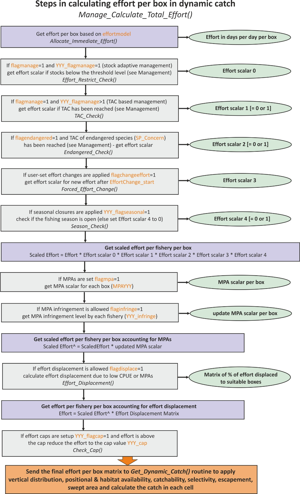

## **16.1. General introduction to management**

Fisheries management is an optional feature in Atlantis. Its role is to regulate the fishing effort according to a set list of rules and options, such as ensuring that stocks don't fall below a certain threshold, implementing total allowable catch (TAC) rules, or protecting endangered species. Management comprises various measures of effort reduction through limitation on fishing and spatial closures (temporal or permanent). The limitations on fishing typically start applying once a set trigger has been reached, for example total allowable catch (TAC) has been reached, stock is below a threshold biomass, a certain amount of engendered species biomass has been caught, and so on (see full list below). Annual management actions such as setting TACs or scaling the effort if stocks decline below a set level occur on the first timestep of each year and are typically in place for the entire year.

In some cases (stock adaptive management), the re-evaluation of the fishing restriction can be done earlier than the start of the next year.

The management options available to regulate fishing mortality depend on whether fishing is done through imposed catch, user defined fishing mortality or dynamic fishing.

For harvesting set through **imposed catch** the management options include

1)  ***Stock adaptive management*** (set with [YYY_flagmanage]{style="color: orange;"}=1). In this option the actual catch taken will be decreased if stocks fall below a set threshold (see below). Note that even though YYY_flagmanage]{style="color: orange;"} has many options, only [YYY_flagmanage]{style="color: orange;"}=1 can be applied to the imposed catch. If [YYY_flagmanage]{style="color: orange;"} \> 1, no management scalar will be applied to the imposed catch

2)  ***Spatial management*** through MPAs (set if [flagmpa]{style="color: orange;"}=1)

For harvesting set as a user defined **fishing mortality** the management options include

1)  ***Yearly and weekly catch limits*** set in [TAC_XXX]{style="color: orange;"} and [TripLimit_XXX]{style="color: orange;"} parameters and the [flag_stop_F_tac]{style="color: orange;"} parameter, which determines whether fishing is closed when limits are reached (see chapter 15.9.1).

2)  ***Spatial management*** through MPAs (set if [flagmpa]{style="color: orange;"}=1)

3)  Harvest control rules set as "***broken stick" scalar*** on the mFC value (see chapter 16.2.8)

4)  ***Frame based management***, where fishing is allowed once biomass has passed a threshold level (fishing level is set by [TAC_XXX]{style="color: orange;"} and the biomass threshold is set as a scalar on the initial biomass using [FC_high_thresh]{style="color: orange;"})

For **dynamic fishing** the management includes

1)  ***Stock adaptive management*** or ***TAC management*** (set with [YYY_flagmanage]{style="color: orange;"})

2)  ***Spatial management*** through MPAs (set if [flagmpa]{style="color: orange;"}=1)

3)  Seasonal closures (set in [YYY_flagseasonal]{style="color: orange;"})

4)  Control rules based on the bycatch of endangered species

5)  Extra options that come through the economic incentives if the Economics submodel is used

The adaptive or TAC based management, and management based on endangered species controls the overall effort or fishing intensity by the fishery, i.e. it is not spatial. In contrast, MPA applies spatial management, by closing a proportion of a box to fishing. Finally, seasonal closures are temporal management, which means that fishing effort is stopped for a set period of time within each calendar year.

:::{.callout-caution}
**Management, stock assessments and dynamic TACs**

A lot of management decisions are based on TACs -- when a fishery exceeds its TAC (counted in one of many different ways) it will be closed. It is important to understand that the TAC can be either set in the *harvest.prm* file or calculated dynamically during the simulation process. The dynamic calculation aims to simulate fisheries stock assessments and the TAC allocation process made in real life situations. Dynamic TACs require that one of three available stock assessment options are turned on:

1)  **Pseudo assessments** (done if [pseudo_assess]{style="color: orange;"}=1 in *harvest.prm*) are the simplest version of stock assessments. It uses Atlantis biomasses and a random error added to them as inputs into the fishing mortality estimator and harvest control rule calculations.

2)  **Full integrated assessment**, done in the **Assessment** submodel. This is done only if the *run.bat* file has a set --a parameter with *assessment.prm* parameter file. A number of assessment options are possible: Schafer production model, ADAPT , MSVPA Integrated assessment model (CAB) and R-based assessment calls (please see the [wiki](https://confluence.csiro.au/display/Atlantis/2022/12/22/Calling+R+from+Atlantis+-+Stock+Assessment+and+TAC+setting)).

3)  **Recommended biological catch based assessment** using tiered harvest control rules (applied if [useRBCTiers]{style="color: orange;"}=1 in *harvest.prm*). The tier based assessment follows the harvest control rule hierarchy used in Australia and is specified in the *CallTierAssessment()* routine. It includes a (i) full quantitative population model based (e.g. SS3), (ii) catch curves, (iii) CPUE, (iv) surplus production, (v), average length, (vi) trigger points, and (vii) catch composition. The parameters for these options are specified in *assessment.prm*.

The stock assessment options are not further described in the manual. For further details on the application of different assessment options see [Fulton et al 2007](https://confluence.csiro.au/display/Atlantis/Useful+Reading?preview=/43155606/43156986/AMS_Final_Report_v6.pdf) or Dichmont et al 2017.
:::

## **16.2. Stock adaptive and TAC-based management**

Stock adaptive and total allowable catch (TAC) based management is set through [flagmanage]{style="color: orange;"} flags. These settings limit, or completely stop, the fishing effort if stocks fall below a set threshold (stock adaptive management) or if the TAC has been reached. To allow for this management for each fishery select the specific management option with the [YYY_flagmanage]{style="color: orange;"} parameter.

### ***16.2.1. No management on effort or catch applied***

When [YYY_flagmanage]{style="color: orange;"} = 0, the fishery will not be affected by stock size related management actions or TACs. The effort of the fishery is set based on effortmodel options only (or imposed catch or user defined fishing mortality) and will stay in place regardless of the stock abundance or quotas.

### ***16.2.2. Adaptive management based on reference limits of stock biomass***

When [YYY_flagmanage]{style="color: orange;"} = 1, fishing effort is controlled by the stock abundance. The effort reduction is triggered when the stock falls below the level given by the [FC_threshold_XXX]{style="color: orange;"} -- a proportion of the "virgin" biomass. This virgin biomass can be either the biomass at the start of the run or after a burn-in period. To setup the burn-in period set the global [flagreinitpop]{style="color: orange;"}=1 and give the day (in the days of simulation run) which should be used as the point in the simulation to define virgin biomass in the [reinit_pop_day]{style="color: orange;"} parameter. The burn-in period might be useful if biomasses fluctuate a lot during the early years of the simulation and are not useful as a stock management reference point.

If the biomass of a species XXX falls below the FC_threshold_XXX proportion, the effort will be reduced by the FC_restrict_XXX scalar and reductions will take place over the XXX_FC_period number of days.

Remember, that the catch will be reduced via the mechanism of reducing effort (if using the effortmodel options) or the imposed catch. The assessment of the stock level is **done once per year** and the effort scalar is set and applied for the rest of the year. If more frequent assessments are desired, a user can set the second period after which the stock health will be assessed ([XXX_FC_period2]{style="color: orange;"}). If, after the time set in [XXX_FC_period2]{style="color: orange;"}, the biomass of a species XXX is above the [FC_high_threshold_XXX]{style="color: orange;"} proportion of the virgin biomass, the reduction in effort is lifted and the effort reverts to the original value before the restrictions. Note, the [FC_high_threshold_XXX]{style="color: orange;"} is often larger than the [FC_threshold_XXX]{style="color: orange;"}, which means that after a fishery has had effort restrictions imposed, a stock must recover to higher levels to allow for a return to the original effort.

### ***16.2.3. Overview of the TAC based management***

All other options of effort management involves some form of TAC or other catch constraint and apply complete closures of relevant fishery(ies) when it(they) exceed the allocated TAC. The management options are set through [YYY_flagmanage]{style="color: orange;"} = 2 to 8 and only apply when fishing mortality is set through dynamic fishing. Unlike the stock adaptive management, where stock status is evaluated once per year, assessment of whether a fishery has reached its TAC is done **at every time step** of the simulation. The original TACs for all relevant species and fishery combination are set in the TAC_XXX parameter. However, these values may be modified if TACs for a fishery are based on several species, such as in the case of companion species or basket species quota. Also, TACs can be updated dynamically if stock assessment options are included in the model (see NOTE! below).

The management response to reaching the quota will depend on whether the TACs are set on a global level or for different fisheries regions. The options for the allocation of a TAC to single or multiple species, and at global or regional levels, defines seven options for the [YYY_flagmanage]{style="color: orange;"} parameter, shown in Table 11.

The cumulative catch compared against the TAC can be calculated either based on landed catch only ([flagTACincludeDiscard]{style="color: orange;"} = 0) or based on both landed catch and discards ([flagTACincludeDiscard]{style="color: orange;"} = 1). Only the catch (and discards) accumulated in the current calendar year are used in the TAC comparison (i.e. the cumulative catch is zeroed at the start of each new calendar year in the simulation).

All groups for which TACs are to be applied should have a value 1 in the [isTAC]{style="color: orange;"} parameter in the *functional_groups.csv* file, or else the TAC routine for the species is skipped. Also, all functional groups which are to be managed with TACs should be identified as [isFished]{style="color: orange;"}=1 in the functional_groups.csv file; otherwise Atlantis overwrites their TACs with a very large number (10^12^) and considers them as non-quota species.

The TAC calculations are done by the *TAC_Check()* routine in **atManage.c**.

:::{.callout-caution}
**How are TACs set and how can they change during the simulation?** 

The TACs for set for each species and fishery combination. They are initially set in the [TACXXX]{style="color: orange;"} parameter. In the simplest version the TACs are static and remain the same throughout the simulation. However, it is also possible to have forced or dynamic changes in the TAC.

Forced changes are implemented in the same way as other forced changes in Atlantis parameters, where users have to set the dates and magnitude of the change. This is described in chapter 16.2.9.

Dynamic changes are applied if users have at least one of the three available stock assessment versions applied. This means that Atlantis will try to simulate the real-world situation where stocks are assessed at set time intervals (typically annually) and the TACs are updated dynamically based on the stock status, set stock biomass targets and harvest control rules (see Note! in chapter 16.1)
:::

[]{#_Toc498434981 .anchor}**Table 11.** Options for the [YYY_flagmanage]{style="color: orange;"} parameter

::: {.table-responsive}
|  | **Species level TAC allocation** |  |  | **Spatial TAC allocation** |  |
|:---|:---:|:---:|:---:|:---:|:---:|
| *[YYY_flagmanage]{style="color: orange;"} value and its "name" in the code* | *TAC: one species* | *TAC: companion species* | *TAC: basket quota* | *Global TAC* | *Regional TAC* |
| 2 TAC_mgmt | X |  |  | X |  |
| 3 basketTAC_mgmt |  |  | X | X |  |
| 4 regionalTAC_mgmt | X |  |  |  | X |
| 5 coTAC_mgmt |  | X |  | X |  |
| 6 coBTAC_mgmt |  | X | X | X |  |
| 7 RbasketTAC_mgmt |  |  | X |  | X |
| 8 coBRTAC_mgmt |  | X | X |  | X |
:::

The [YYY_flagmanage]{style="color: orange;"}=10 sets the USA-style management that was applied in the early 2000s (see Kaplan et al. 2013 for an example study). It involved cumulative trip limits based off TACs (often regional), and once the TAC was exhausted then spatial management actions were triggered. This system was deemed to be complicated and was replaced with transferable quotas in 2011. The option is not described here in further detail as it is specific to the historical fisheries management of the West Coast of the US. If its use is desired for historical hindcasts consult Kaplan et al. 2013 for explanations.

### ***16.2.4. Species level TAC allocation*** 

The TAC for each species XXX and fishery is given in the [TAC_XXX]{style="color: orange;"} array, which must have as many values as there are fisheries. However, the [TAC_XXX]{style="color: orange;"} parameter can be used differently depending on whether a species is managed through a single or multiple species TAC.

1)  **Single species based TAC ([YYY_flagmanage]{style="color: orange;"} =2 or 4)**

The TAC is set for one species and its TAC limits are assessed only against its cumulative catch (or only based on landings, if [flagTACincludeDiscard]{style="color: orange;"} = 0) for that year. If a fishery targets only one species XXX (set in [target_YYY]{style="color: orange;"} parameter), it will be closed when the TAC for the species XXX is reached. If a fishery targets several species, it will be closed when it exceeds the TAC for as many species as specified by the [YYY_num_max_sp]{style="color: orange;"} parameter (see other options below on how the TAC can still be modified); in this way multispecies fleet management can be mimicked.

:::{.callout-note}
**How to setup simple TAC management?** 

1)  Set [isTAC]{style="color: orange;"} to 1 in the *functional_groups.csv* file for the TAC managed species XXX 
2)  Set a fishery specific flag [YYY_flagmanage]{style="color: orange;"}=2 (or to another value, see Table 11) 
3)  Give TACs in the [TAC_XXX]{style="color: orange;"} parameter for the fisheries that catch species XXX and should be limited by its TAC (tons per year for the entire model domain)
4)  Set the number of species for which the TAC must be meet/exceeded before a multispecies fishery is closed ([YYY_max_num_sp]{style="color: orange;"})

Remember, the **management parameters apply to a fishery and not to a species**! If the user wants to apply a TAC for a given species and ensure that no fishing is conducted once the TAC for that species is exceeded, the species should only be targeted by one fishery and the [YYY_max_num_sp]{style="color: orange;"} for that fishery should be set to 1.
:::

2)  **Companion species based TAC ([YYY_flagmanage]{style="color: orange;"} =5, 6 or 8)**

This approach is used in situations where catch of one species result in bycatch of other species under management. In this case the original TACs, given in the [TAC_XXX]{style="color: orange;"} parameter (and presumably based on single species stock assessments) are modified based on the ratio of the companion species bycatch. For example, it is estimated that for each 100 tons of ling a fishery Y catches 20 tons of redfish, which is the ratio of 0.2. Let's say that based on single species assessments the TAC for ling is 200 tons, but for redfish it is only 10 tons. These values are then set in TAC_LIN as 200 and TAC_RED as 10. In the companion species TAC approach, Atlantis will recalculate the TAC for each species based on the ratio of bycatch and based on whether the TACs are marked as being based on the strongest or weakest (most vulnerable) species (set [coType_XXX]{style="color: orange;"} parameter, where =0 weakest, =1 strongest). So if [coType_LIN]{style="color: orange;"} = 0, it means that the TAC of ling will be decreased to 50 tons, since the co-catch ratio will lead to 10 tons of redfish catch, which is the TAC for redfish. If coType_LIN = 1, the TAC_RED will be increased from 10 to 40, because the fishery in fulfilling its 200 ton quota of ling and will also take 40 tons of redfish bycatch. See the box below for a step by step explanation on how to set the companion species management.

:::{.callout-note}
**How to setup companion TAC management?** 

1)  Set [isTAC]{style="color: orange;"} to 1 in the *functional_groups.csv* file for both target and companion species
2)  Set a fishery specific flag [YYY_flagmanage]{style="color: orange;"}=5 (or other value, see Table 11)
3)  Give TACs in the [TAC_XXX]{style="color: orange;"} parameter for each fishery for target and companion species
4)  Set the number of species for which the TAC must be meet/exceeded before a multispecies fishery is closed ([YYY_max_num_sp]{style="color: orange;"}) 
5)  Set the maximum number of companion species (i.e. highest number of companion species across all species in the model). This is a global parameter and applies to all fisheries ([K_max_co_sp]{style="color: orange;"}), it is often set to 2. This basically tells Atlantis whether to bother reading in any of the other parameters and the size of the arrays to initialise before read-in.
6)  For each species set their individual number of companion species [max_co_sp_XXX]{style="color: orange;"}. This needs to be less than or equal to [K_max_co_sp]{style="color: orange;"}. This controls the loops for the individual species so as to maximise speed of execution.
7)  For each target species give the ID numbers (in the *functional_groups.csv* order) of the companion species in the [co_sp_XXX]{style="color: orange;"} vector. This parameter can be seen as a representation of which species usually school or occur together and hence will be caught together (fisheries data is sometimes available on this, either from catch composition records or observers). These parameters are vectors and must have as many values as the number given by the [max_co_sp_XXX]{style="color: orange;"} parameter (it will actually tell you that it needs [K_max_co_sp]{style="color: orange;"} entries, but it only uses the first [max_co_sp_XXX]{style="color: orange;"}. If you want to play it safe enter [K_max_co_sp]{style="color: orange;"} and if [max_co_sp_XXX]{style="color: orange;"} is less than [K_max_co_sp]{style="color: orange;"} fill up the spare entries either with -1 or a number larger than the ID of the companion species with the largest ID. So for example, if you only had one companion species occurs for species XXX and [K_max_co_sp]{style="color: orange;"} is set to 2, then the second value in the parameter [co_sp_XXX]{style="color: orange;"} should be set to -1, e.g. 

[co_sp_XXX]{style="color: orange;"} 2 
2 -1 

shows that only species ID 2 is caught together with species XXX. Alternatively, if across all the species the highest ID of any companion species was (say) 46. Then you could put 

[co_sp_XXX]{style="color: orange;"} 2
2 48 

Either of these case will be treated in the same way -- the second entry will never execute on the code, only the companion species with ID 2 will be processed. 

8)  Indicate whether the TAC is dictated by the weakest or strongest link among the companion TAC species in the [coType_XXX]{style="color: orange;"} parameter (=0 weakest, =1 strongest). See main text above for the explanation.
9)  Give the assumed ratio of the catch of companion species accidentally caught by each fishery while targeting a species XXX in [XXX_co_sp_catchZZ]{style="color: orange;"} where ZZ is the number associated with the position of the companion species in the [co_sp_XXX]{style="color: orange;"} vector -- so for the first species (ID 2 in the example given under (7) above) it would be [XXX_co_sp_catch1]{style="color: orange;"}, for the second species [XXX_co_sp_catch2]{style="color: orange;"} etc. Due to the complexity involved in reading in multli-dimensional arrays [K_max_co_sp]{style="color: orange;"} vectors must be supplied for [XXX_co_sp_catch]{style="color: orange;"} -- that is if [K_max_co_sp]{style="color: orange;"} is 3 then [XXX_co_sp_catch1]{style="color: orange;"}, [XXX_co_sp_catch2]{style="color: orange;"} and [XXX_co_sp_catch3]{style="color: orange;"} must be given even if XXX has [max_co_sp_XXX]{style="color: orange;"} less than 3. Just fill the extra vectors with zeros. These vectors will never be used (as the code running the TAC setting only loops to [max_co_sp_XXX]{style="color: orange;"}) but it is too difficult to get the code to initially read only as many vectors out of the *harvest.prm* file as needed based on [max_co_sp_XXX]{style="color: orange;"}. Sorry for the inconvenience. Note that the values given fin the vector [XXX_co_sp_catchZZ]{style="color: orange;"} indicate how many kg of the companion species is taken for every 1 kg of the target species XXX taken. This vector must have as many values as there are fisheries. This means that different fisheries (gear, selectivity) will have a different ratio of companion species bycatch even when targeting the same species XXX.
10) The ratio of species cocatch given in the [co_sp_catch_XXX]{style="color: orange;"} parameter can stay fixed throughout the run or be updated dynamically according to the actual catches of the companion species by a fishery. If a dynamic value is wanted this is set with a global parameter [flagdyn_coupdate]{style="color: orange;"} = 1
:::

3)  **Basket species TAC ([YYY_flagmanage]{style="color: orange;"} =3, 6, 7 or 8)**

Basket species TACs are often issued for data poor species, where TACs are identified for different groups, such as demersal sharks or small pelagics. The user still provides a [TAC_XXX]{style="color: orange;"} for individual species and sets the routines as described in the box for individual species, but Atlantis will pool the TACs for all species listed as being in one basket into one large TAC and will only assess the overall catch of all species in the basket against this basket TAC. So for example if the basket TAC for three demersal sharks is 1000 tons, all three options below will give the same TAC (the example assumes only one fishery in the model)

+----------------------+----------------------+-----------------------+
| **Option 1:**        | **Option 2:**        | **Option 3:**         |
|                      |                      |                       |
| TAC_sharkA 1         | TAC_sharkA 1         | TAC_sharkA 1          |
|                      |                      |                       |
| 1000                 | 0                    | 0                     |
|                      |                      |                       |
| TAC_sharkB 1         | TAC_sharkB 1         | TAC_sharkB 1          |
|                      |                      |                       |
| 0                    | 500                  | 0                     |
|                      |                      |                       |
| TAC_sharkC 1         | TAC_sharkC 1         | TAC_sharkC 1          |
|                      |                      |                       |
| 0                    | 500                  | 1000                  |
+======================+======================+=======================+

Irrespective of how the basket is made up, if the cumulative catch of shark (i.e. the sum of the catch of sharkA, sharkB and sharkC) exceeds the basket then the fishery is closed even if the cumulative catch is made up of a single species and the other species are largely untouched.

:::{.callout-note}
**How to setup basket TAC management?** 

1)  Set the size of a basket quota (the maximum number of groups in the quota) using [K_num_basket]{style="color: orange;"} in *run.prm*. 
2)  Set isTAC to 1 in the *functional_groups.csv* file for all the basket TAC species
3)  Set a fishery specific flag [YYY_flagmanage]{style="color: orange;"}=3 (or 6, 7, or 8 if combined with other management options, see Table 11)
4)  Give TACs in the [TAC_XXX]{style="color: orange;"} parameter for each fishery for species 
5)  Set the number of species for which the TAC must be meet/exceeded before a multispecies fishery is closed ([YYY_max_num_sp]{style="color: orange;"})
6)  Indicate which species are members of the basket TAC with [basketSPXXX]{style="color: orange;"} set to 1.
7)  For each basket species XXX give the number of other species that are in the same basket using the [basket_sizeXXX]{style="color: orange;"} parameter.
8)  Then provide ID numbers of the species that are in the basket with species XXX. This is given in the parameter [basketTAC_XXX]{style="color: orange;"}. If a species is not in a basket with any other species, put the ID number larger than the ID of the last species in the *functional_groups.csv* file. This means that if there are 41 functional groups and the last ID number is 40 (since Atlantis counts from zero!), then for a single quota species [basketTAC_XXX]{style="color: orange;"} should say 41 (or 42 or any other number greater than 40).
9)  Make sure that the parameters above are consistent for all basket species, as currently Atlantis does not have internal checks for this. This means that if species A is in a basket with species B and C, the parameters for all three species should show that they are in the basket quota with each other.
:::

### ***16.2.5. Spatial TAC allocation: global or regional*** 

TAC based management also allows users to either use a basic global TAC applied to the entire model domain (e.g. [YYY_flagmanage]{style="color: orange;"}=2, see Table 11), or use regional TAC management (e.g. [YYY_flagmanage]{style="color: orange;"}=4, see Table 11). The **regions can be defined based on fisheries stocks** identified in the biology.prm file **or based on management areas** (see NOTE! below). Parameter [manage_reg]{style="color: orange;"} identifies whether regional fisheries management is done based on stocks ([manage_reg]{style="color: orange;"} =0) or based on regions ([manage_reg]{style="color: orange;"} =1).

In global TAC cases, a species TAC applies to its total catch (or landing) over the entire model domain. In the case of the regional management TACs are assessed for separate stocks or regions independently (see NOTE! below on how to set up different stocks or regions). In this case the TAC for a species/fishery is still set as usual for the entire domain in [TAC_XXX]{style="color: orange;"} parameter.

If **regions are defined by stocks,** then allocation of the TAC among stocks is simply based on proportional biomass of each stock and is done once per year. If the regional management option is chosen (e.g. [YYY_flagmanage]{style="color: orange;"}=4) for the fishery YYY, then Atlantis will automatically apply stock specific TACs to all species that are caught by fishery YYY that also have several stocks identified (see NOTE! below). Note this means regional management is used regardless of the [regionalSPXXX]{style="color: orange;"} setting.

Alternatively, if TACs are based on **management areas**, then users must identify whether species XXX should be managed by regional quotas in the parameter [regionalSPXXX]{style="color: orange;"} (where a value of 1 means regional management is in place). Then the TACs (in tons per year) for each region are given in the [RegTAC_XXX]{style="color: orange;"} parameter, which must have as many value as there are regions or management areas. Note, even if some regions are managed through a TAC, it does not mean that ALL regions must participate in the TAC management. Such situations exist in real life, where for example, different regions belong to different jurisdictions (countries or states). To allow for this situation, regions that do not have a quota should have a TAC value of 10^12^ in the [RegTAC_XXX]{style="color: orange;"} parameter. For example, for a species that is managed through 4 regions the parameter may look like:

[RegTAC_XXX]{style="color: orange;"}

500 1000 5000 10E+12

When regional management is in place, the TAC limit is assessed for each region separately. If the TAC in a region is exceeded, then any catch of species XXX taken in that region is discarded (remember, the discards can survive, and this setting will affect the final fishing mortality). However, the fishery itself is not closed at this point. The fishery is only closed when the overall TAC is exceeded and a **fishery is considered as over TAC only when it exceeds TAC in ALL regions** for the number of species given in the [YYY_max_num_sp]{style="color: orange;"} parameter. If fishing effort is distributed proportionally to biomass and relative box biomass of the species does not change through time, then regional TACs will lead to the same catch as the global TAC. However, this is not usually the case, which means that applying regional TACs can lead to higher fishing mortality than applying a global TAC depending on species and fleet movements. For instance, if the fishery is required to land all the catch rather than discard anything ([YYY_landallTAC_sp]{style="color: orange;"}=1), the landings for some regions will usually exceed that regional TACs.

The regional TACs are calculated in *Apply_Annual_Fisheries_Mgmt()* routine in **atImplementation Annual.**c

:::{.callout-caution}
**What is a stock and how to define it?** 

Each functional group can have different stocks. These stocks are not spatially overlapping and therefore must occur in different boxes or at least in different vertical layers (e.g. deep water and shallow water stock). The number of stocks for each species is given in [NumStocks]{style="color: orange;"} in the *functional_groups.csv* and the spatial distribution of the stocks in the *biology.prm*, where [XXX_stock_struct]{style="color: orange;"} indicates which stock lives in each of the model boxes and [XXX_vert_stock_struct]{style="color: orange;"} shows which stock lives in each vertical layer (with the same vertical stock structure assumed to apply in all boxes).

Stocks can have different biological parameters, such as predation vulnerability scalar ([pSTOCK_XXX]{style="color: orange;"}) and stock-specific recruitment scalar ([recSTOCK_XXX]{style="color: orange;"}). Stocks can also have stock specific fisheries catchability [qSTOCK_XXX]{style="color: orange;"}.

Setting up different stocks can have its pros and cons. Using stocks can better represent real-world population structure with a minimum of additional parameters. However, if different "stocks" have different biological characteristics, it might be better to define them as different functional groups. Although, setting stocks as different species will increase computation time.

Remember that even if one defines separate stocks, they can still be managed as one large stock, if they are targeted by one fishery and the management of that fishery is set to [YYY_flagmanage]{style="color: orange;"}=2 
:::

:::{.callout-caution}
**What is a management region and how to define it?**

The management regions are defined in the *biology.prm* in [regID]{style="color: orange;"} file where one box can be assigned only to one region. The management region can represent a separate TAC based region or other management unit. The biomass per group per region is output in the *BiomReg.txt* file.
:::

### ***16.2.6. Shared total allowable catch allocation across fisheries*** 

The [TAC_XXX]{style="color: orange;"} parameter is given for each species and fishery combination, and usually each fishery is only affected by its own TAC. However, it is possible to set up a shared TAC for several (or all) fisheries using [flagTACparticipate_YYY]{style="color: orange;"}=1 parameter. In that case only one common TAC pool is allowed, so a fishery can either participate in this pool or have its own independent TAC ([flagTACparticipate_YYY]{style="color: orange;"}=0). The shared TAC is independent of the [YYY_flagmanage]{style="color: orange;"} options discussed above.

Table 12 gives a hypothetical example of three fisheries participating in a common TAC pool. The TACs for each targeted species by each fishery are given in the first three rows. The total TAC for a given species across all participating fisheries is then just a sum of their individual TACs. It is likely that different fisheries have different efficiencies at catching a species, so a fishery with a small TAC can benefit by "stealing" some of the TAC from other fisheries. This is because the fishery will not be closed when it exceeds its own TAC, but only when the total TAC has been exceeded. The last row shows the total catch by the three fisheries; for species A, C and F the catch has reached the total TAC. The maximum number of species for which each fishery can exceed its TAC is set to 2 ([max_num_sp_YYY]{style="color: orange;"}=2) for all fisheries. The first two fisheries have reached the TAC for two species and will be closed, while the third fishery can still operate and catch both species C and D, even though the TAC for species C has been reached (because it will be closed only when it reaches its TAC for 2 species).

[]{#_Toc498434982 .anchor}**\**

**Table 12.** An example of how shared TACs among three fisheries might affect catch and fishery closures. Grey columns show species for which TAC has been reached. The three fisheries target different species but all participate in a shared common pool TAC.

::: {.table-responsive}
|  | SpecA | SpecB | SpecC | SpecD | SpecE | SpecF | SpecG | Species >TAC | Closed? |
|:---|:---:|:---:|:---:|:---:|:---:|:---:|:---:|:---:|:---:|
| TAC of fishery I | 100 | 200 | - | - | 200 | 50 | - | 2 | Yes |
| TAC of fishery II | 200 | - | - | 100 | 50 | 100 | 100 | 2 | Yes |
| TAC of fishery III | - | - | 1000 | 1000 | - | - | - | 1 | No |
| **Total TAC (sum)** | **300** | **200** | **1000** | **1100** | **250** | **150** | **100** |  |  |
| *Catch* | *320* | *180* | *1000* | *1000* | *200* | *160* | *20* |  |  |
:::

### **16.2.7. Multi-year TACs**

Typically TACs set a yearly catch limit and are re-assessed annually, but it is possible to also set multi-year TACs as well. The number of years for which the TACs are allocated are given in the [tac_resetperiodYYY]{style="color: orange;"} parameter. This value is most often set to 1, but could be any number of years.

The multi-year TAC can be applied in two cases:

1)  Fisheries are allocated a total catch over a several year period, set with a global parameter [bulkTAC]{style="color: orange;"} =1. For example, a 3-year bulk TAC can be set to 600 tons, which makes an average yearly TAC of 200. The [TAC_XXX]{style="color: orange;"} parameter should still give yearly values, as Atlantis resets them based on the [tac_resetperiodYYY]{style="color: orange;"} parameter for that species and fishery. However, if a fishery catches 300 or even 550 tons in the first year it will still not be closed, until the 3-year TAC quota has been reached. If the fishery catches all its multi-year TAC in the first year, it will remain closed for the rest of the [tac_resetperiod_YYY]{style="color: orange;"}.

2)  If some form of assessment model is used (see Note! in chapter 16.1) TACs are dynamic. In this case the multi year TAC option with [bulkTAC]{style="color: orange;"}=0 means that TACs are annual, as usual, but new assessments and new TACs are only done every few years, with the frequency given in the [tac_resetperiodYYY]{style="color: orange;"} parameter.

### ***16.2.8. Trading closure after exceeding TAC with MPAs***

When some form of assessment is used (see Note! in chapter 16.1) and TACs are dynamic, then a fishery might be given an option of imposed MPAs instead of reduction in TACs. This is based on the real-life situation where fishers prefer an imposition of MPAs instead of a reduction in TACs. To simulate this option in Atlantis, one must have dynamic TACs (and some form of stock assessment included) and set parameter [flagTradeTACvsMPA]{style="color: orange;"}=1. Further, to set up this option properly it is important to check that the correct options for [YYY_flagmpa]{style="color: orange;"} have been selected (see chapter 16.4).

### ***16.2.9. Temporal changes in TAC***

As with other harvest and management parameters, the user can allow for temporal changes in TACs. This can be done in a standard forced way ([YYY_TACchange]{style="color: orange;"}=2) or dynamically through the Assessment or pseudoassessment submodel ([YYY_TACchange]{style="color: orange;"}=1). The dynamic TAC change through the Assessment submodel aims to simulate real world assessment and decision making processes, where TACs are updated based on the stock assessments. The Assessment submodel is currently not covered in this version of the manual. Users are currently advised to consult the wiki, the Atlantis code and Atlantis developers for further details -- as assessment type, parameters, frequency of data collection and meta-rules around TAC setting (e.g. degree of political lobbying, buffers imposed at various decision steps) must also be set.

When changes in TAC are forced, the changes are implemented in the same way as with other temporal changes in a parameter. [XXX_TAC_changes]{style="color: orange;"} indicates the number of TAC changes for each fishery and species XXX. The start day of each change is given in [TACchange_start_XXX]{style="color: orange;"}, the period over which the change occurs is given in [TACchange_period_XXX]{style="color: orange;"} and the multiplier for the TAC change to be achieved by the end of the change period is given in [TACchange_mult_XXX]{style="color: orange;"}. **At the end of the change period, the new TAC scalar applies for the rest of the simulation (or until another change takes place).**

### ***16.2.10. Frame based TAC***

Some species are managed using biomass thresholds, if biomass is above a specific level then fishing is allowed. To represent that in Atlantis for fishery YYY:

1.  Set the species to be a TAC managed in the *functional_groups.csv* file

2.  Set [YYY_flag_framebased]{style="color: orange;"} to 1 for the fishery.

3.  Set up the period for which this form of management should apply for the fishery - using the [YYY_start_manage]{style="color: orange;"} and [YYY_end_manage]{style="color: orange;"} parameters (in days of the simulation run).

4.  Set the allowed level of fishing for when the fishery is active. To do this set the [TAC_XXX]{style="color: orange;"} parameter for each species in that fishery.

5.  To set the biomass level at which fishing is allowed for the fishery set the value for [FC_high_thresh_XXX]{style="color: orange;"} for each species in the fishery. This scalar will be applied to the initial biomass to give the threshold biomass. Above this threshold fishing will be allowed.

::: {.table-responsive}
| **Parameter** | **Description** |
|:--------------|:----------------|
| [YYY_flagmanage]{style="color: orange;"} | Fisheries management options (ranging from 0 to 8). |
| [flagreinitpop]{style="color: orange;"} | If set to 1, the virgin biomass for management and stock assessment will not be calculated from the initial conditions, but after a burn-in period given in [reinit_pop_day]{style="color: orange;"} parameter (in days of simulation run) |
| [FC_thresh_XXX]{style="color: orange;"} | Proportion of the population of species XXX when effort of ALL fisheries fishing of XXX is restricted. This is used in rule based stock management, set by [YYY_flagmanage]{style="color: orange;"} = 1 |
| [YYY_FC_restrict]{style="color: orange;"} | Proportion of effort allowed once restrictions begin |
| [YYY_FC_period]{style="color: orange;"} | Period of time over which effort reduction occurs |
| [YYY_FC_period2]{style="color: orange;"} | Period of time before stock status is re-checked. If the stock has recovered at this time restrictions are removed. If the stock remains depleted the time counter is reset (i.e. the restrictions are triggered afresh). |
| [FC_high_thresh_XXX]{style="color: orange;"} | This parameter can be used in two ways.  If frame-based fishing is **not** being used, this is the proportion of the population species XXX has to reach when existing fishing restrictions in place due to low stock biomass (set by [FC_thresh_XXX]{style="color: orange;"}) are lifted and original TAC levels are reinstituted.  If frame-based fishing is **allowed** then [FC_high_thresh_XXX]{style="color: orange;"} * initial_biomass gives the threshold biomass above which fishing is allowed to happen (set using [TAC_XXX]{style="color: orange;"}). |
| [TAC_XXX]{style="color: orange;"} | Total allowable catch (in tons per year) for species XXX by each fishery (must have as many values as there are fisheries). If set to 10^12^ then no TAC is applied for that species/fishery combination. |
| [flagTACincludeDiscard]{style="color: orange;"} | If set to 1, TAC calculations include all discarded biomass. |
| [YYY_landallTAC_sp]{style="color: orange;"} | If set to 1, fisheries YYY is not allowed to discard, but must land all catches. |
| [pseudo_assess]{style="color: orange;"} [useRBCTiers]{style="color: orange;"} | Flags determining which fisheries stock assessments are applied to calculated dynamic TACs (see Note! in chapter 16.1) |
| [YYY_max_num_sp]{style="color: orange;"} | A maximum number of species a multi-species fishery YYY can exceed its TAC for, before it is closed (when simple TACs are applied, see chapter 16) |
| [co_sp_XXX]{style="color: orange;"} vector [co_sp_catch_XXX]{style="color: orange;"} | Vectors giving the ID numbers and ratios of companion species (species that are caught together) caught with each biomass unit of species XXX. Used when [YYY_flagmanage]{style="color: orange;"}=5. See chapter 16.2.4 for further details and related parameters. |
| [basketSPXXX]{style="color: orange;"} | A vector of 0 or 1 values indicating which species are included in the basket TACs together with species XXX. Used when [YYY_flagmanage]{style="color: orange;"}=3 (or other value, see Table 11). See chapter 16.2.4 for further details and related parameters. |
| [manage_reg]{style="color: orange;"} | If set to 1, TACs management will be based on regional rather than global biomasses, with regional TACs given in [RegTAC_XXX]{style="color: orange;"} vector. See chapter 16.2.5 for further details and related parameters. |
| [flagTACparticipate_YYY]{style="color: orange;"} | If set to 1, a fishery YYY shares its TAC with other fisheries (see chapter 16.2.6 for further details) |
| [bulkTAC]{style="color: orange;"} | If set to 1, some fisheries can be allocated multi-year TACs rather than TACs set for each (see chapter 16.2.7) |
| [YYY_TACchange]{style="color: orange;"} | If >0 TACs can change during the simulation run. If [YYY_TACchange]{style="color: orange;"}=2 then forced changes are applied as described in chapter 15.10 and 16.2.9. If [YYY_TACchange]{style="color: orange;"}=1, then dynamic changes in TACs are used, but this option must have some form of the stock assessment applied (see Note! in chapter 16.1). |
:::

: []{#_Toc498434983 .anchor}**Table 13.** Parameters used in stock adaptive and TAC based management.

## **16.3. Broken stick harvest control rules and broken stick scalar** 

The "broken stick" scalar management is similar to the stock adaptive management option described in chapter 16.2.2. However, while the stock adaptive management is applied for the dynamic fishing option, the broken stick management is only available for the user defined fishing mortality option described in chapter 15.3. The setup of broken stick management is not affected by the YYY_flagmanage options used for dynamic fishing options described in chapter 16.2.

Broken stick management is based on a broadly applied fisheries concepts of maximum sustainable yield (MSY), maximum economic yield (MEY) and limit reference points. Usually, in fisheries management the stock biomass and consequently the fishing mortality that would result in the target biomass is calculated in different versions of stock assessments. The biomass and fishing mortality values that lead to MEY, MSY and critically low stock status are referred to as reference point A, reference point B and limit reference points. A very broad rule of thumb is that stock biomass required for MEY is 48% of the virgin biomass, for MSY is about 40% and limit reference point is close to 20% of the virgin biomass. The general idea is that once a stock falls below the target reference point(s), some management action to reduce fishing mortality is required. However, there is a lot of variation and controversies about these reference points, so here they are only given for general illustration! Not all countries use three reference points, and in fact the most conservative reference point A is often ignored and does not lead to any action. Currently, in Atlantis the MEY (reference point A) is considered the primary "target reference point", but effort reductions do not come in to place until stock sizes slip below MSY (reference point B) as that was the form of management rule in place in Australia at the time the code was developed.

{width="3.36875in" height="2.933333333333333in"}

[]{#_Toc498434138 .anchor}**Figure 11.** The shape of the broken stick harvest control rule with reference points marked on.

To set up the basic broken stick management in Atlantis, the user should provide parameters for the three target reference points (targ_refA, targ_refB and lim_ref). The user also should provide estimated fishing mortality that would lead to the biomass at the reference point A/B, and estimated virgin biomasses in estBo parameter. Note, that these estimated virgin biomasses are different from the way virgin biomasses are used in some harvest routines (through flagreinitpop=1 and reinit_pop_day parameters). The estBo virgin biomasses to be used in this option are provided in the *harvest.prm* file. In this way the users can explore what happens if estimated virgin biomasses used in assessments and decision making are very different from the actual virgin biomasses in the simulations. The parameters Frestart_scalar also needs to be set as this is the multiplier for mFC_XXX to use as the default starting F once the fishery is reopened.

::: {.callout-note}
**How to set up broken stick management?**

1)  Set the species as isFished=1 in the *functional_groups.csv* file
2)  Set fishing through the user defined fishing mortality as described in chapter 15.3
3)  Set parameter tierXXX to a value larger than 0. The tierXXX parameter tells Atlantis which assessment option to use. However, in the case of broken stick management, no specific assessment is necessary (as a pseudo assessment can be used). Setting up tierXXX\>0 just tells Atlantis that broken stick management option should be applied for the species if its fishing is done through a user defined fishing mortality.
4)  Set the limit, A and B reference points in targ_refA, targ_refB and lim_ref parameters. Note, that these are NOT species specific, which means that same reference points will be applied for all species managed under the broken stick management option.
5)  Give a list of virgin biomasses for the species in the estBo parameter. These biomasses can be the same as the initial biomasses in the simulation, or they can be completely different (if consequences in virgin biomass misspecification are to be explored)
6)  It is possible to have two sets of reference points. This was implemented to simulate the situation where fishing of forage species required different reference points. To set up the second set of reference points, give their values in forage_refA, forage_refB and forage_lim\_ ref parameters. Also in parameter whichref identify which of the two reference points should be applied to each species (0 -- forage reference points, 1 -- target reference points)
7)  Provide Atlantis with the annual fishing mortality rates Fref (F year^-1^) that would result in the stock biomass equilibrating to either targ_refA or targ_refB (this choice is up to the user, based on the specifics of the harvest strategy in their location, remember that currently there is no reduction in fishing pressure until biomasses drop below the level specified by refB). These values are typically estimated in stock assessments, and are independent of the fishing mortality values set in the mFC_XXX parameter (see chapter 15.3). If using tier8 then it is also necessary to supply the fishing mortality value to use at high biomass levels (when biomass is greater than targ_refA).
8)  The parameters Frestart_scalar also needs to be set as this is the multiplier for mFC_XXX to use as the default starting F once the fishery is reopened. 
9)  Set up the period for which the broken stick management of fishery YYY should apply in YYY_start_manage and YYY_end_manage parameters (in days of the simulation run). 
10) You can also provide reference points for byproduct and bycatch groups using byproduct_refA, byproduct_refB, byproduct_refC, byproduct_refD, byproduct_lim_ref, bycatch_refA, bycatch_refB, bycatch_refC, bycatch_refD, bycatch_lim_ref -- all of which have the same definition as for target and forage groups, but applied to byproduct and bycatch groups. You can also provide discardTAC, which is used once B \< Blim for TAC managed groups (this is currently only used for tiered management options). 

**Note:** If do_sumB_HCR is set to 0 then the Broken Stick is applied per species. If do_sumB_HCR is set to 1 then the harvest control rule will be applied at the guild level. The guild is defined by co_sp_XXX.
:::

The broken stick management routine is run once per year and implemented in the routine *Check_F\_ Harvest_Control_Rules()* in **atManageAnnual.c**. It assesses the current stock biomass against the reference points. The routine **assumes perfect knowledge about the stock** and uses actual biomasses in the model domain as the current assessed biomass (use of stock assessment processes and assessment biomasses can be implemented upon request).

In both cases, to drive F to the desired levels the new *F~current~* (calculated as defined below) is found by rescaling the base F (mFC_XXX) appropriately, as noted below (as it is slightly different in each option).

***[Australian option -- usually triggered using tierXXX set to 1 (tier1)]{.underline}***

While biomasses are above reference point B the target fishing mortality *F~target~* is used so that the currently implemented fishing mortality rate (*F~current~*) is given by:

$$F_{current} = F_{ref}\ \ \ \ \ \ \ \ \ \ \ \ \ \ \ \ \ \ \ \ \ \ \ \ \ \ \ \ \ \ \ \ \ \ \ \ \ \ \ \ \ \ \ \ \ \ \ ,\ if\ B_{cur} > B_{ref\mathbf{B}}$$

where *B~cur~* is the current stock biomass (assuming perfect knowledge); *B~refB~* is the stock biomass at reference point B (estimated as targ_refB \* virgin biomass); and *F~ref~* is the fishing mortality that should lead to the biomass at the reference point B (Fref parameter).

If the stock biomass falls below the reference point B, management kicks-in and the fishing mortality provided in the mFC_XXX parameter is overwritten so that the current fishing mortality is given by:

$$F_{current} = F_{ref} \cdot \frac{B_{cur} - B_{\lim}}{B_{ref\mathbf{B}} - B_{\lim}}\ \ \ \ \ \ \ \ \ \ \ \ ,\ if\ B_{\lim} \leq B_{cur} < B_{ref\mathbf{B}}\ $$

$$F_{current} = 0\ \ \ \ \ \ \ \ \ \ \ \ \ \ \ \ \ \ \ \ \ \ \ \ \ \ \ \ \ \ \ \ \ \ \ \ \ \ \ \ \ \ \ \ \ \ \ ,\ if\ B_{cur} < B_{\lim}$$

Here *B~lim~* is the stock biomass at the limit reference point (estimated as targ_lim \* virgin biomass). These equations show that if, for example, current stock biomass is half way between the target and limit reference points, the fishing mortality will be set to half of the reference fishing mortality *Fref* given in the parameter file (note that this reference fishing mortality is NOT the same as the user defined fishing mortality given in mFC_XXX parameter). If the stock biomass falls below the limit reference point, then fishing mortality is set to 0.

In the harvest code this is implemented as

$$F_{realised} = mFC \cdot \frac{F_{current}}{F_{\max}}$$

***[US and Norwegian option -- usually triggered using tierXXX set to 8 (tier8) or 9 (tier 9)]{.underline}***

While biomasses are above reference point A the target fishing mortality *F~target_high~* is used so that the currently implemented fishing mortality rate (*F~current~*) is given by:

$$F_{current} = F_{ref\_ high}\ \ \ \ \ \ \ \ \ \ \ \ \ \ \ \ \ \ \ \ \ \ \ \ \ \ \ \ \ \ \ \ \ \ \ \ \ \ \ \ \ \ \ \ \ \ \ ,\ if\ B_{cur} > B_{ref\mathbf{A}}$$

where *B~cur~* is the current stock biomass (assuming perfect knowledge); *B~refA~* is the stock biomass at reference point A (estimated as targ_refA \* virgin biomass); and *F~ref_high~* is the fishing mortality that is applied at high biomass levels (Fref_high parameter).

When biomasses are below reference point A but above reference point B the target fishing mortality *F~target~* is used so that *F~current~* is given by:

$$F_{current} = F_{ref}\ \ \ \ \ \ \ \ \ \ \ \ \ \ \ \ \ \ \ \ \ \ \ \ \ \ \ \ \ \ \ \ \ \ \ \ \ \ \ \ \ \ \ \ \ \ \ ,\ if\ B_{ref\mathbf{B}} \leq B_{cur} < B_{ref\mathbf{A}}$$

where *B~refB~* is the stock biomass at reference point B (estimated as targ_refB \* virgin biomass); and *F~ref~* is the fishing mortality that should lead to the biomass at the reference point B (Fref parameter).

If the stock biomass falls below the reference point B, management kicks-in and the fishing mortality provided in the mFC_XXX parameter is overwritten so that the current fishing mortality is given by:

$$F_{current} = {F_{ref\_ lim} \cdot \left( B_{ref\mathbf{B}} - B_{cur} \right) + F}_{ref} \cdot \frac{B_{cur} - B_{\lim}}{B_{ref\mathbf{B}} - B_{\lim}}\ \ \ \ \ \ \ \ \ \ \ \ ,\ if\ B_{\lim} \leq B_{cur} < B_{ref\mathbf{B}}\ $$

$$F_{current} = \ \ F_{ref\_ lim}\ \ \ \ \ \ \ \ \ \ \ \ \ \ \ \ \ \ \ \ \ \ \ \ \ \ \ \ \ \ \ \ \ \ \ \ \ \ \ \ \ \ \ \ \ \ ,\ if\ B_{cur} < B_{\lim}$$

Here *B~lim~* is the stock biomass at the limit reference point (estimated as targ_lim \* virgin biomass). These equations show that if, for example, current stock biomass is half way between the target and limit reference points, the fishing mortality will be set to half of the reference fishing mortality *Fref* given in the parameter file (note that this reference fishing mortality is NOT the same as the user defined fishing mortality given in mFC_XXX parameter!). If the stock biomass falls below the limit reference point, then fishing mortality is set to 0. Note in the *harvest.prm* the parameters *Fref and FrefLim* are entered as a vector with one value per group.

If tierXXX is set to 8 then in the harvest code this is implemented as

$$F_{realised} = mFC \cdot \frac{F_{current}}{F_{\max}}$$

whereas if tierXXX is set to 9 then it is

$$F_{realised} = mFC \cdot \frac{F_{t - 1}}{F_{\max}} \cdot \frac{F_{current}}{F_{ref}}$$

***[Escapement option --triggered using tierXXX set to 13 (tier13)]{.underline}***

This escapement based method comes from Iceland. It is calculated as:

$$F_{current} = 1 - \frac{B_{\lim}}{B_{ref\mathbf{B}}}\ \ \ \ \ \ \ \ \ \ \ \ \ \ \ \ \ \ \ \ \ \ \ \ \ \ \ \ \ \ ,\ if\ B_{\lim} < B_{cur}\ $$

$$F_{current} = 0\ \ \ \ \ \ \ \ \ \ \ \ \ \ \ \ \ \ \ \ \ \ \ \ \ \ \ \ \ \ \ \ \ \ \ \ \ \ \ \ \ \ \ \ \ \ \ ,\ if\ B_{cur} \leq B_{\lim}$$

In the harvest code this is also implemented as

$$F_{realised} = mFC \cdot \frac{F_{current}}{F_{\max}}$$

***[Adding error]{.underline}***

The broken stick case can be applied with perfect knowledge or with error (noise) added. The parameters for setting this up are added to *harvest.prm* file. There are three error options -- set using estError (a vector with one entry per functional group): uniform (0), normal (1), lognormal (2). The specification of the error is set using estCV (the variance of the error as a proportion of the true value) and estBias (also as a proportion of the true value). Both of these parameters are entered as a vector, with one value per functional group.

If the error is uniform then the biomass used in the broken stick calculations is given by:

$$B_{est} = B_{true} + \mathcal{B}_{error}$$

where $\mathcal{B}_{error}$ is a uniform random number drawn from $\lbrack - B_{estCV},B_{estCV}\rbrack$. Whereas if the biomass is of the normal type then the biomass used in the broken stick calculations is given by:

$$B_{est} = \sqrt{- 2*log\left( \beta_{1} \right)} \cdot cos\left( 2\pi \cdot \beta_{2} \right) \cdot \sqrt{estCV} + {estBias \cdot B}_{true}$$

where both the *β* are random numbers drawn form \[0,1\]. Lastly, if the lognormal form is chosen then the biomass is of the normal type then the biomass used in the broken stick calculations is given by:

$${B_{est} = B_{true} \cdot estBias \cdot e}^{\sqrt{- 2 \cdot log\left( \beta_{1} \right)} \cdot cos\left( 2\pi \cdot \beta_{2} \right) \cdot \sqrt{estCV} - \frac{estCV}{2}}$$

## **16.4. Spatial management through MPAs**

Marine protected areas (MPAs) allow permanent or temporary closures of some model spatial domains to fishing. They are set as a proportion of the box that is covered by the MPA, which is treated as a scalar on box-specific effort, fishing mortality or imposed catch. The MPA scalar is fishery specific and is given in the MPAYYY parameter, listing scalars for each box of the model domain -- this scalar represents the proportion of the fishable habitat within the box that remains **open** to fishing.

Note, that even though MPA scalar is usually \<1 (which means that MPAs reduces the fishing pressure in the box), it is possible to set it to values \>1. This would mean that the presence of MPA in a box (or perhaps an adjacent box) actually attracts fishing to the areas just outside the MPA and the end result is that the presence of the MPA increases local fishing pressure. This is a very simplified representation of real-world fisher behaviour that can see concentration of effort around MPAs (attracted by "spill-over" from within the MPA). This simplest representation is used because the exact location of fish within a box is not tracked, rather functional groups are assumed to be uniformly distributed within all suitable habitat within a box and the MPA parameter simply acts as a scalar on the box biomass available to fishing. In reality, even if MPAs attract increased fishing effort to its perimeter, the actual fishing mortality will depend on the movement of a species. If movements are slow and a species stays mostly within the MPA, increased effort around the MPA perimeter will not result in the total increases in fishing mortality. As Atlantis does not explicitly represent these fine scale interactions they must be kept in mind by the modeller when setting the MPA parameter values.

To activate MPAs in your simulations, set the global flagmpa = 1 and then select the MPA option for each fishery in the YYY_flagmpa parameter. Currently there are 15 different ways to set up MPAs, which include different combinations of the following options for setting MPAs:

1)  MPA scalar set in MPAYYY parameter, indicating the proportion of the box open to fishing or more specifically a scalar on the available species biomass. These MPAs can be set for the entire model run or the MPA implementation can start and end at different times during the simulation run. If the latter option is wanted, set flagSimpleStartStopMPA=1, and give the year number (NOT day number!) for when MPAs start and end (All_MPAstartyr and All_MPAendyr). Note, this option only allows for the start and end years to be set for **ALL MPAs at the same time**.

2)  For more complex MPAs scalars are provided through an external TS forcing file. This option is useful when MPAs change through time. To use this option the user needs to provide time series files for desired model boxes, indicating an MPA scalar value through time. To indicate that external MPA forcing is provided, set nMPAts to value \>0 in the *force.prm* file (see Chapter 8 on the general format of forcing files) and the correct MPA option is set in the YYY_flagmpa parameter (see Table 14 for the available options).

3)  MPAs are set up when the biomass of endangered species drops below a set level. These MPAs act in the same way as other MPAs, but their box-specific scalars are provided in a separate MPAendangeredYYY parameter. This means that users can specifically target boxes that are important for endangered species. Also, unlike fixed MPAs, the endangered species triggered MPAs will only be in place when biomasses of endangered species are below a set level. To identify which species will be used to trigger such species set the SP_Concern parameter to 1 for that species (with the order of the species assumed to match that in the *functional_groups.csv* file). See chapter 16.5 on how the endangered species are assessed.

4)  The MPA scalars supplied through either MPAYYY or external TS forcing files, but applied only when stocks fall below a set level. This is done in case where YYY_flagmanage=2 and stock adaptive management is used and an appropriate selection for YYY_flagmpa is done (see Table 14 below).

5)  Closure of fisheries during the spawning season -- applied in any spawning area -- and set using YYY_flagmpa = 13.

6)  The partial or complete closure of spawning areas traded in exchange for reduced TAC. This is only applied in cases where dynamic TACs are used and set through some sort of stock assessment process. This is used to imitate a situation (indeed applied in some fisheries management cases), where instead of reductions in TAC when stock levels are low, fishing is closed during the spawning season. For further details on setting this option see chapter 16.2.8.

7)  MPAs defined in the MPAoverfishedYYY parameter are triggered when trip limits are exceeded for target species and YYY_flagmpa is set to 11.

8)  In any one year, once the total catch taken exceeds the value set in TripLimit_XXX that box is closed -- this option is set using YYY_flagmpa = 14.

These seven options for setting up MPAs can be used separately or in combination in one of the 13 currently available options of the YYY_flagmpa parameter. Because the YYY_flagmpa parameter is fishery specific, different fisheries can be affected by different spatial management (MPA) routines.

[]{#_Toc498434984 .anchor}**Table 14.** Options for the YYY_flagmpa parameter showing which of the five available MPA varieties are included.

::: {.table-responsive}
| YYY_flagmpa parameter option (and name of the option used in the Atlantis code) | Fixed MPA applied all the time | Time-series box-specific MPA read from forcing files | Special MPAs applied only if endangered species fall below a threshold | Fixed or time-series MPA applied only if stocks fall below a threshold | Spawning closures; including trading TAC reductions for spawning closures | Closures once catch exceeds values set in the TripLimit parameter |
|:---|:---:|:---:|:---:|:---:|:---:|:---:|
| 0 no mpas |  |  |  |  |  |  |
| 1 fix_mpa | X |  |  |  |  |  |
| 2 cycle_mpa |  | X |  |  |  |  |
| 3 stock_mpa | X |  |  |  | X |  |
| 4 pet_mpa |  |  | X |  |  |  |
| 5 stock_pet_mpa | X |  | X |  | X |  |
| 6 cycle_stock_mpa |  | X |  |  | X |  |
| 7 cycle_pet_mpa |  | X | X |  |  |  |
| 8 cycle_stock_pet_mpa |  | X | X |  | X |  |
| 9 mix_fix_rolling_mpa | X | X |  |  |  |  |
| 10 mix_f_r-spawn_mpa | X | X |  |  |  | X |
| 11 depth_stock_mpa |  |  |  |  | X* |  |
| 12 council_stock_mpa |  |  |  |  | X* |  |
| 13 spawn_closure |  |  |  |  |  | X |
| 14 catch_mpa |  |  |  |  |  | X |
:::

\* These options are currently only available if using historical west coast US management processes (i.e. generally not used, but can be made available if required).

The MPAs are setup in the routine *Setup_MPA_Lists()* in **atManageMPATS.c** which creates a calendar of any fixed or time specific closures that is refered to throughout the course of the run. The list of active mpas is updated at each time step in the *Check_for_active_MPA()* routine in **atManage.c**. The *Check_for_active_MPA()* routine is called at each time step from *Manage_Calculate_Total_Effort()* routine, which scales down the effort according to the different management scalars.

It is possible to **allow for infringement of MPAs**. See chapter 15.3.3. and the NOTE! in it on how to set the infringement up.

## **16.5. Management through seasonal closures**

Another management leaver can be applied through seasonal closures. This management is independent of the stock adaptive or TAC management set with YYY_flagmanage parameter or spatial management through MPAs. Seasonal closures refer to a complete halt of fishing activity for a set period of time every calendar year. Such seasonal closures are used to protect stocks during spawning seasons or to limit fishing effort for other reasons.

In Atlantis it is best to think of seasonal closures as the length of a fishing season. This means that a fishery's season opens and closes at a set day of the year. Also the length of the fishing season can change through time.

To activate seasonal fishing for a given fishery set YYY_flagseasonal =1. Then indicate the day of the year when the fishing season opens and closes (YYY_seasonopen and YYY_seasonclose). Remember that Atlantis counts from 0, so the first day of the calendar year is 0 and the last day is 364.

If a fishery operates through several management regions (see chapter 16.2.5 on how to set up management regions), users should also indicate whether seasonal closures apply to each management region. This is set with parameter RegSeason which must have as many entries as there are management regions, and where entries of 1 indicate that seasonal closures apply.

If the length of the fishing season changes during the simulation set YYY_changeseason = 1. However, unlike the other temporal changes in the harvest parameter file, the user does not provide specific scalars to set the new length of the fishing season, but the scalars are taken from the effort scalar used for the stock adaptive management (see chapter 16.2.2) or the management of endangered species (chapter 16.6). If both scalars are available, then the smaller scalar is used. This basically means that if YYY_changeseason=1 then season will be REDUCED in length when stocks of fished species or endangered species fall below threshold levels. This is because stock adaptive management scalar or endangered species is scalar is set to the value \<1 when the trigger is tripped (biomasses go below threshold levels). This option will only be applied when either stock adaptive (YYY_flagmanage =1) or endangered species (flagendangered=1) management is used. This handling of the changing season link is because this is how fisheries using season length to control effort operate. If more direct control is required over fishing season please contact the Atlantis developers.

## **16.6. Management of endangered species** 

Management of endangered species means that fishing effort will be reduced when stocks of endangered species fall below a set threshold level. The procedure is very similar to stock adaptive management described in chapter 16.2.1. This management option is independent of other management options, such as MPAs, seasonal closures, stock adaptive or TAC based management.

To apply the endangered species management option set the global flagendangered =1. The list of endangered species is given in the SP_Concern parameter, which has as many entries as there are groups in the *functional_groups.csv* file and where the value of 1 indicates that a group is endangered.

The threshold level of endangered species (compared to virgin biomasses) below which the trigger is started is given in the same FC_thresh_XXX parameter that is used for stock adaptive management. This parameter gives threshold values of species XXX abundance for each fishery -- if a species XXX is harvested then the parameter is used for stock adaptive management, if it is endangered it is used for endangered species management.

When the abundance of endangered species XXX falls below the threshold given in the FC_thresh_XXX, the fishery effort will be reduced to the proportion of the original effort given in the YYY_FC_restrict_endangered parameter (the value is set between 0 and 1). The period over which reductions take place is given in the YYY_FC_endanger_period, which means that the effort is not reduced in one time step but gradually.

{width="6.035416666666666in" height="9.921527777777778in"}

## **16.7. Closing fisheries due to contaminants**

If contaminants are functional in the model then fisheries closures can be triggered. To activate such closures set flag_contam_fisheries_mgmt to 1 for closures to be triggered on a set day (contam_fishery_closure_day) and last a set period (contam_fishery_closure_period in days) -- the location of the closure is defined in the vector ContamClosed. This vector is nbox long. If the box is closed due to the contaminant set the value for the cell to 1.0, leave it as 0.0 if the box remains open.

If flag_contam_fisheries_mgmt is set to 2 then the closure is based on contaminants in the cells of groups in the model -- any cohort of any group with contaminant content greater than ZZZZ_fishery_thresh_level (where ZZZZ is the contaminant name) will trigger a closure. If contam_fishery_closure_option is set to 0 only the immediate box is closed, if set to 1 then adjacent boxes are also closed.